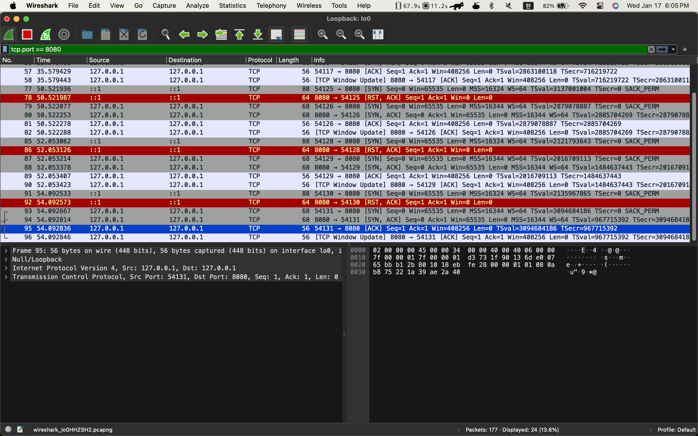
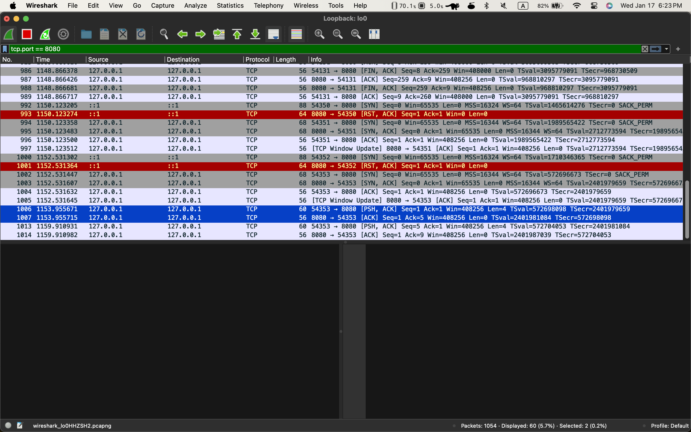
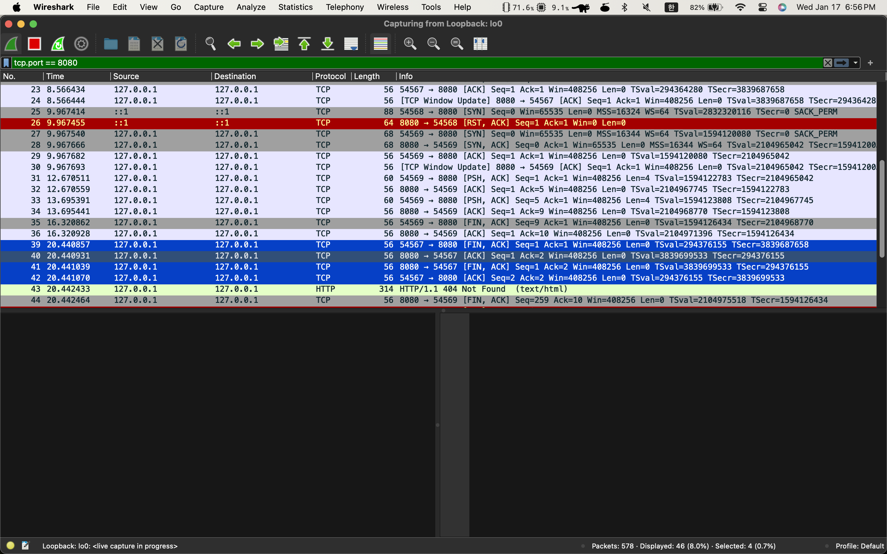
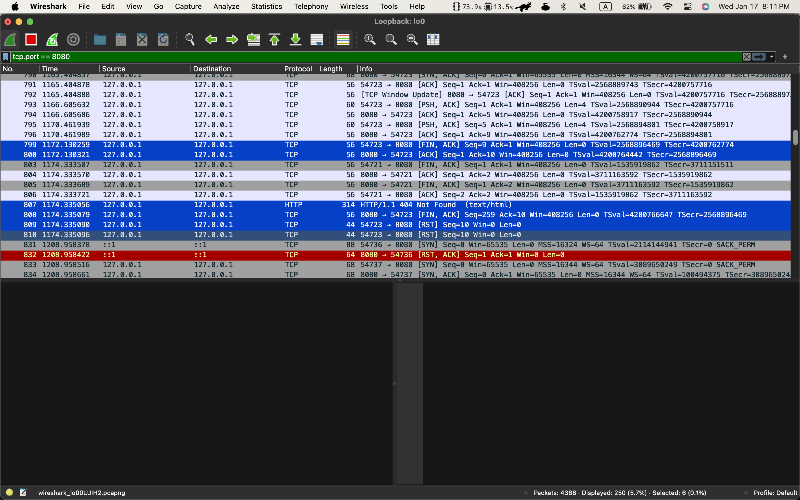
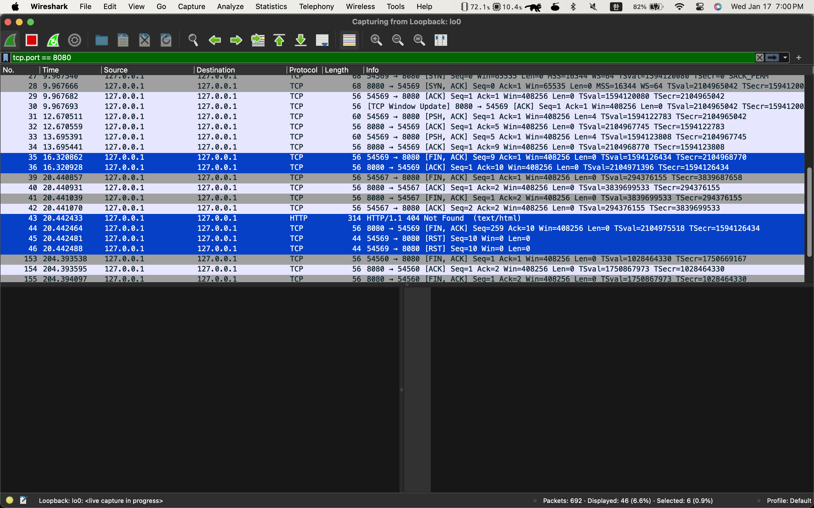
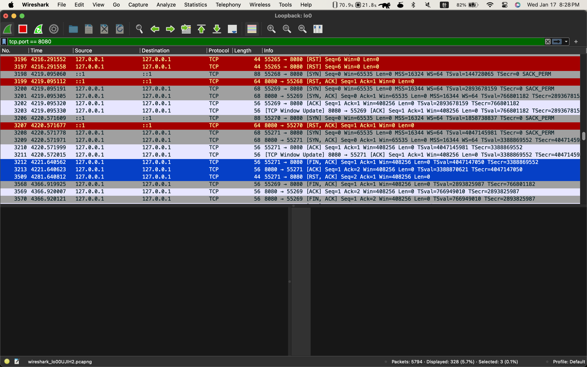

Socket API를 단순히 시스템 콜로만 생각하기에 (네트워크 측면에서) 간과하는 것들이 많다.
예를 들어, 서버에서 `send()`를 호출한다고 했을 때 "클라이언트가 연결되었는지 아닌지는" 애플리케이션 레벨에서 알 수가 없다.
- 애플리케이션 계층에서는 트랜스포트 계층과 소통할 수 있는 수단만 있을 뿐이다. => 소켓 FD(파일 디스크립터)
- 따라서 트랜스포트 계층에 클라이언트로 보내고자 하는 메시지를 넘겨줄 뿐이고, 실질적인 전송은 트랜스포트 계층이 담당한다.
애플리케이션 계층이 하는 일과 트랜스포트 계층이 하는 일을 구분하지 않는다면, 지나치게 단순하게 될 뿐더러 어떤 부분에서 문제가 발생했는지 정확하게 파악할 수 없기 때문에 해결하는데 더 오래 걸릴 수 있다.

`accept()` 시스템 콜 또한 마찬가지이다.
```shell
$> nc localhost 8080
```
- 서버 포트로 클라이언트가 TCP 연결을 요청한다면(`connect`)
	- 클라이언트와 서버 사이에 트랜스포트 계층끼리는 연결이 된 상태이다.
	- 하지만 서버 측면에서 트랜스포트 계층 <-> 애플리케이션 계층의 연결은 연결이 되지 않은 상태이다
	- 서버에서 `accept`를 호출해야지만 비로소 애플리케이션 계층은 트랜스포트 계층과 소통할 수 있는 수단(FD)을 얻는다.
	- 이 수단을 이용하여 트랜스포트 계층에 있는 소켓 버퍼로부터 `recv`, `send`를 직접적으로 할 수 있는 것이다.
	- 클라이언트에서 TCP를 요청하는 `connect`도 마찬가지로 클라이언트 측면에서 애플리케이션 계층 <-> 트랜스포트 계층 간에 소통할 수 있는 수단을 얻기 위한 것이다.

- TCP 연결하는 시나리오
	1. `socket`
		- 클라이언트의 애플리케이션 계층 <-> 트랜스포트 계층 간에 소통할 수 있는 수단(FD)을 얻는다.
		-                    <클라이언트>                                                                <서버>
		-               o ----------- o ~~~~~~~~~~~~~~~~~~~~~~~~~ o                   o
		- (애플리케이션)      (트랜스포트)                                            (트랜스포트)  (애플리케이션)
	2. `connect`
		- 클라이언트가 먼저 TCP 연결을 요청한다.
		- 서버의 트랜스포트 계층까지는 네트워크로 연결되어 있는 것을 가정한다(존재하지 않는 주소 또는 사용할 수 없는 트랜스포트 계층 포트로 연결하지 않는다.)
		- 해당 서버 트랜스포트 계층이 TCP 연결 요청을 받고, 해당 포트와 연결되어 있는 애플리케이션에 해당 요청을 전달한다.
		- 서버에서도 마찬가지로 요청을 전달받기 위해서는 트랜스포트 계층과 소통할 수 있는 무언가(FD)가 필요하다. 즉, 서버에서 먼저 `socket` 시스템 콜을 통해 두 계층을 연결해야 한다.
			-                    <클라이언트>                                                          <서버>
			-                o ---------- o ~~~~~~~~~~~~~~~~~~~~~~ o ----------- o
			- (애플리케이션)      (트랜스포트)                                   (트랜스포트)  (애플리케이션)
		- WireShark를 이용하여 확인해보면, (서버가 `socket` -> `bind` -> `listen` 시스템 콜을 이미 호출했다는 가정 하에) `accept`를 하지 않아도 트랜스포트 계층끼리는 TCP 연결이 완료되었다.
				- SYN / ACK / ACK의 3 방향 핸드쉐이크를 모두 완료한다.
			
		- 현재 파란색으로 선택되어 있는 묶음이 아직 `accept`를 받지 않은 상태이지만, 그 위의 묶음과 비교하면 다른 것이 없다.
			- 즉, 클라이언트의 애플리케이션 계층과 서버의 트랜스포트 계층까지는 연결되었다는 뜻이다.
				-                    <클라이언트>                                                     <서버>
				-                o ~~~~~~~ o ~~~~~~~~~~~~~~~~~~~~~ o ----------- o
				- (애플리케이션)      (트랜스포트)                                 (트랜스포트)  (애플리케이션)
	3. `accept`
		- 서버 트랜스포트 계층으로부터 전달받은 TCP 요청을 확립하고, 트랜스포트 계층과 소통할 수 있는 새로운 수단(FD)을 얻는다.
		- 이 수단은 트랜스포트 계층 즉, 클라이언트로부터 받은 메시지를 저장하는 소켓 버퍼와 애플리케이션을 연결해주는 역할을 한다.
	4. 클라이언트 `send`
		- 클라이언트는 연결된 트랜스포트 계층에 메시지를 보낼 수 있다.
		- 서버의 애플리케이션 계층과 트랜스포트 계층이 연결되어 있지 않더라도 가능하다.
			
			- 서버 트랜스포트 계층에 있는 소켓 버퍼에 `send`를 하였고, 서버 트랜스포트 계층에서도 잘 받았다고 ACK 패킷을 보내준 것을 확인할 수 있다.
			- 서버가 해당 클라이언트를 `accept` 했다면, 바로 kqueue 에 해당 이벤트가 전달될 것이고 `accept`를 하지 않았더라도 소켓 버퍼에는 남아있으니 `accept`를 한 이후에 해당 이벤트를 처리할 수 있다.
	5. `close`
		- `close`를 호출하는 쪽에서 FIN,ACK 패킷을 전달한다.
		- FIN, ACK 패킷을 전달받았다면 상대방에게 ACK를 보낸다.
		- `close`는 양방향이어야 하기 때문에 이번에는 ACK 패킷을 보낸 쪽에서 `close`를 호출해야 한다.
		- 반대쪽에서도 `close`를 호출하면 FIN, ACK 패킷을 전달하고, 전달받은 처음 `close`를 호출한 쪽에서 마지막으로 ACK 패킷을 보내면 정상적으로 TCP 연결이 해제된다.
			
		- 만약 서버에서 `accept`를 호출하기 이전에 클라이언트가 `close`를 호출하는 상황을 살펴보자
			- 서버는 연결 개수가 꽉 찼기 때문에, `accept`를 하지 못하고 누군가 `close`를 호출하여 연결을 끊기만을 기다린다. 서버를 끊을 때, 연결하지 못한 클라이언트의 `accept` 이벤트를 처리하는 상황이다.
			- 서버는 해당 클라이언트와 연결되기 이전이기 때문에 `close`할 FD가 없다. 즉, `close` 호출이 불가능한 상태이다.
			- 클라이언트는 요청을 보낸다.
				- 이후 클라이언트에서는 `close`를 호출하여 FIN, ACK를 보냈다. 서버 측에서는 해당 패킷을 처리할 수 있기 때문에 ACK 패킷으로 답장한다.
				- 하지만 서버 측에서 `close`는 할 수 없기에 CLOSE_WAIT 상태로 소켓 상태를 바꾼다.
				- 서버는 기다리고 있던 `accept`를 처리하고 해당 클라이언트에 연결된 트랜스포트 계층 소켓 버퍼에서 읽을 것이 있기 때문에 `read` 이벤트를 진행하고, `write` 이벤트를 처리한 후 `close`를 한다.(로직이 그렇다)
				- `write` 이벤트와 `close` 이벤트로 보내는 패킷을 보내고 클라이언트로부터 RST 패킷을 받는다.
				- 어떤 이유에서 RST 패킷을 받는 것일까?
				
			- 클라이언트는 요청을 보내지 않는다.
				- 클라이언트에서는 바로 `close`를 호출하여 FIN, ACK를 보냈다. 서버 측에서는 해당 패킷을 처리할 수 있기 때문에 ACK 패킷으로 답장한다.
				- 이후 다른 클라이언트가 연결을 해제하면, 기다리고 있던 `accept` 이벤트가 실행된다. 그리고 빈 문자열을 받아 `close`를 실행하면 클라이언트 측에서 ACK를 보내주며 정상적으로 TCP 연결이 종료된다.
				- 이 때, 처음에 종료한 클라이언트가 보낸 FIN, ACK는 서버의 FIN, ACK를 기다리는데 시간 내에 오지 않으면 RST 패킷을 다시 서버에 보내며 연결을 끊는다.
				
				