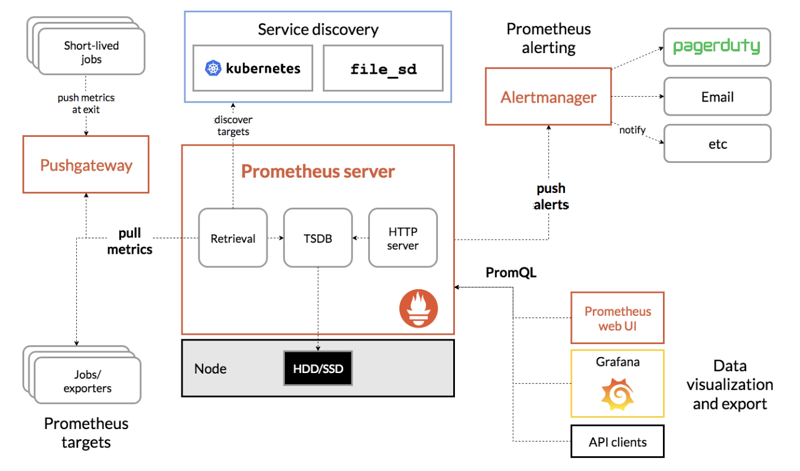

## (1) vm에서 nginx 모니터링 구축하기

### prometheus 설치

```shell
# prometheus 설치
sudo apt-get update
sudo apt-get install prometheus
```

```yaml
# prometheus.yml
# Sample config for Prometheus.

global:
  scrape_interval:     15s # Set the scrape interval to every 15 seconds. Default is every 1 minute.
  evaluation_interval: 15s # Evaluate rules every 15 seconds. The default is every 1 minute.
  # scrape_timeout is set to the global default (10s).

  # Attach these labels to any time series or alerts when communicating with
  # external systems (federation, remote storage, Alertmanager).
  external_labels:
      monitor: 'example'

# Alertmanager configuration
alerting:
  alertmanagers:
  - static_configs:
    - targets: ['localhost:9093']

# Load rules once and periodically evaluate them according to the global 'evaluation_interval'.
rule_files:
  # - "first_rules.yml"
  # - "second_rules.yml"

# A scrape configuration containing exactly one endpoint to scrape:
# Here it's Prometheus itself.
scrape_configs:
  # The job name is added as a label `job=<job_name>` to any timeseries scraped from this config.
  - job_name: 'prometheus'

    # Override the global default and scrape targets from this job every 5 seconds.
    scrape_interval: 5s
    scrape_timeout: 5s

    # metrics_path defaults to '/metrics'
    # scheme defaults to 'http'.

    static_configs:
      - targets: ['localhost:9090']

  - job_name: node
    # If prometheus-node-exporter is installed, grab stats about the local
    # machine by default.
    static_configs:
      - targets: ['localhost:9100']
```
- job_name
	- prometheus : prometheus 프로세스 자체의 메트릭 정보를 수집
	- node : node-exporter 프로세스를 통해 host 시스템 메트릭 정보 수집

```shell
sudo systemctl restart prometheus
```
### Architecture


- prometheus server는 설정 파일에 선언된 targets의 특정 url(default : /metric)으로부터 pull 해온 메트릭 정보를 저장
- 
### 헬스 체크

```shell
curl http://localhost:9090/graph # 1)

curl http://localhost:9090/metrics # 2)
curl http://localhost:9100/metrics # 3)
```
1) prometheus가 수집한 메트릭 정보를 간단하게 조회할 수 있는 서버(EXPRESSION BROWSER)
2) prometheus의 내부 정보를 export
3) host 시스템 메트릭 정보를 export

### nginx 모니터링

- nginx의 stub module 정보를 prometheus에서 요구하는 양식으로 변환하여 expose하는 nginx-prometheus-exporter 모듈이 필요함
- http://localhost:80/metrics (nginx) => http://localhost:9113/metrics (nginx-prometheus-exporter) => (prometheus)
```shell
# nginx-prometheus-exporter 설치
wget https://github.com/nginxinc/nginx-prometheus-exporter/releases/download/v0.10.0/nginx-prometheus-exporter_0.10.0_linux_arm64.tar.gz -P /tmp/nginx-prometheus-exporter

tar -xvf /tmp/nginx-prometheus-exporter/nginx-prometheus-exporter_0.10.0_linux_arm64.tar.gz -C /tmp/nginx-prometheus-exporter

# nginx-prometheus-exporter 실행
./tmp/nginx-prometheus-exporter/nginx-prometheus-exporter -nginx.scrape-uri=http://localhost:80/metrics &
```
- nginx-prometheus-exporter 프로세스는 9113번 포트로 열림
- `-nginx.scrape-uri` 옵션을 통해 nginx stub module url 지정
- TODO : systemctl을 이용하여 데몬화 하는 방법 알아보기

```config
# /etc/nginx/conf.d/default.conf

# 추가
location = /metrics {
	stub_status on; # stub_status 활성화
	allow all; # allow 접근을 허용할 주소 설정
	# deny 접근을 허용하지 않을 주소 설정
}
```
- (nginx) => (nginx-prometheus-exporter) 연결

```yaml
# prometheus.yml

# 추가
- job_name: nginx
  static_configs:
    - targets: ['localhost:9113']
```
- (nginx-prometheus-exporter) => (prometheus) 연결
- nginx : nginx-prometheus-exporter 프로세스를 통해 nginx stub module 정보 수집

### grafana 설치

```shell
# grafana 설치
sudo apt-get install -y apt-transport-https software-properties-common wget
sudo mkdir -p /etc/apt/keyrings/
wget -q -O - https://apt.grafana.com/gpg.key | gpg --dearmor | sudo tee /etc/apt/keyrings/grafana.gpg > /dev/null
echo "deb [signed-by=/etc/apt/keyrings/grafana.gpg] https://apt.grafana.com stable main" | sudo tee -a /etc/apt/sources.list.d/grafana.list
echo "deb [signed-by=/etc/apt/keyrings/grafana.gpg] https://apt.grafana.com beta main" | sudo tee -a /etc/apt/sources.list.d/grafana.list
# Updates the list of available packages
sudo apt-get update
# Installs the latest OSS release:
sudo apt-get install grafana

sudo systemctl daemon-reload
sudo systemctl start grafana-server
sudo systemctl status grafana-server

# To configure the Grafana server to start at boot
sudo systemctl enable grafana-server.service
```
- https://grafana.com/docs/grafana/latest/setup-grafana/installation/debian/

### grafana provisioning

```yaml
# /etc/grafana/provisioning/datasources/sample.yaml

# # config file version
apiVersion: 1

# # list of datasources that should be deleted from the database
#deleteDatasources:
#   - name: Graphite
#     orgId: 1

# # list of datasources to insert/update depending
# # on what's available in the database
datasources:
#   # <string, required> name of the datasource. Required
 - name: prometheus
#   # <string, required> datasource type. Required
   type: prometheus
#   # <string, required> access mode. direct or proxy. Required
   access: proxy
#   # <int> org id. will default to orgId 1 if not specified
#   orgId: 1
#   # <string> url
   url: http://localhost:9090
#   # <string> database user, if used
#   user:
#   # <string> database name, if used
#   database:
#   # <bool> enable/disable basic auth
#   basicAuth:
#   # <string> basic auth username
#   basicAuthUser:
#   # <bool> enable/disable with credentials headers
#   withCredentials:
#   # <bool> mark as default datasource. Max one per org
   isDefault: true
#   # <map> fields that will be converted to json and stored in json_data
#   jsonData:
#      httpMethod: POST
#      graphiteVersion: "1.1"
#      tlsAuth: true
#      tlsAuthWithCACert: true
#      httpHeaderName1: "Authorization"
#   # <string> json object of data that will be encrypted.
#   secureJsonData:
#     tlsCACert: "..."
#     tlsClientCert: "..."
#     tlsClientKey: "..."
#     # <openshift\kubernetes token example>
#     httpHeaderValue1: "Bearer xf5yhfkpsnmgo"
#   version: 1
#   # <bool> allow users to edit datasources from the UI.
   editable: false
```
- datasources(prometheus) 프로비저닝

```yaml
# /etc/grafana/provisioning/dashboards/sample.yaml

apiVersion: 1

providers:
 - name: 'default'
   orgId: 1
   folder: ''
   folderUid: ''
   type: file
   disableDeletion: false
   updateIntervalSeconds: 10
   options:
     path: /var/lib/grafana/dashboards
```
- `path` 디렉토리 안에 있는 모든 JSON 형식의 파일을 프로비저닝

```json
// /var/lib/grafana/dashboards/example.json

{
  "id": null,
  "uid": "example_dashboard_uid",
  "title": "Example Dashboard",
  "timezone": "browser",
  "schemaVersion": 22,
  "version": 0,
  "panels": [
    {
      "title": "CPU Usage",
      "type": "graph",
      "datasource": "Prometheus",
      "targets": [
        {
          "expr": "rate(node_cpu_seconds_total{mode=\"user\"}[5m]) * 100",
          "legendFormat": "{{mode}}"
        }
      ],
      "xaxis": {
        "show": true
      },
      "yaxes": [
        {
          "format": "percent",
          "label": "CPU Usage"
        },
        {
          "format": "short"
        }
      ],
      "gridPos": {
        "h": 8,
        "w": 12,
        "x": 0,
        "y": 0
      }
    }
  ],
  "refresh": "10s"
}
```
- dashboard 프로비저닝
- https://grafana.com/docs/grafana/latest/dashboards/build-dashboards/view-dashboard-json-model/

```shell
sudo systemctl daemon-reload
sudo systemctl restart grafana-server
```

### grafana internal metrics(optional)

```ini
# /etc/grafana/grafana.ini

# Metrics available at HTTP URL /metrics and /metrics/plugins/:pluginId
[metrics]
# Disable / Enable internal metrics
enabled           = true

# Disable total stats (stat_totals_*) metrics to be generated
disable_total_stats = false
```
- 세미콜론 제거
- https://grafana.com/docs/grafana/latest/setup-grafana/set-up-grafana-monitoring/

```shell
sudo systemctl restart grafana-server
```

```yml
# prometheus.yml

# 추가
- job_name: 'grafana_metrics'

   scrape_interval: 15s
   scrape_timeout: 5s

   static_configs:
     - targets: ['localhost:3000']
```

```shell
sudo systemctl restart prometheus
```

```
http://localhost:3000
```
- id : admin / pw : admin

## (2) k8s에서 nginx 모니터링 구축하기

### nginx

```yaml
# /root/prometheus/nginx/nginx-deployment.yaml

apiVersion: v1
kind: ConfigMap
metadata:
  name: nginx-config
  labels:
    app: nginx
data:
  default.conf: |-
    server {
        listen       80;
        server_name  localhost;

        location / {
            root   /usr/share/nginx/html;
            index  index.html index.htm;
        }

        location = /metrics {
            stub_status on; # stub_status 활성화
        }

        error_page   500 502 503 504  /50x.html;
        location = /50x.html {
            root   /usr/share/nginx/html;
        }
    }
---
apiVersion: apps/v1
kind: Deployment
metadata:
  name: nginx-deployment
  labels:
    app: nginx
spec:
  replicas: 1
  selector:
    matchLabels:
      app: nginx
  template:
    metadata:
      labels:
        app: nginx
    spec:
      containers:
      - name: nginx
        image: nginx:latest
        env:
        - name: name
          value: value
        ports:
        - containerPort: 80
        volumeMounts:
        - name: nginx-volume
          mountPath: /etc/nginx/conf.d/default.conf
          subPath: default.conf
      volumes:
      - name: nginx-volume
        configMap:
          name: nginx-config
---
apiVersion: v1
kind: Service
metadata:
  name: nginx-service
spec:
  selector:
    app: nginx
  ports:
    - protocol: TCP
      name: nginx-port
      port: 80
      targetPort: 80
  type: NodePort
```

```shell
k delete cm nginx-config
k delete svc nginx-service
k delete deploy nginx-deployment

k create -f nginx-deployment.yaml
```

### prometheus

```yaml
# /root/prometheus/prometheus/prometheus-deployment.yaml

apiVersion: v1
kind: ConfigMap
metadata:
  name: prometheus-config
  labels:
    app: prometheus
data:
  prometheus.yml: |-
    global:
      scrape_interval: 15s
      evaluation_interval: 15s
      external_labels:
        monitor: 'example'

    alerting:
      alertmanagers:
      - static_configs:
        - targets: ["localhost:9093"]

    rule_files:

    scrape_configs:
    - job_name: 'nginx'
      scrape_interval: 5s
      scrape_timeout: 5s
      static_configs:
      - targets: ["nginx-prometheus-exporter-service.default.svc.cluster.local:9113"]
---
apiVersion: apps/v1
kind: Deployment
metadata:
  name: prometheus-deployment
  labels:
    app: prometheus
spec:
  replicas: 1
  selector:
    matchLabels:
      app: prometheus
  template:
    metadata:
      labels:
        app: prometheus
    spec:
      containers:
      - name: prometheus
        image: bitnami/prometheus:latest
        env:
        - name: key
          value: value
        ports:
        - containerPort: 9090
        volumeMounts:
        - name: config-volume
          mountPath: /opt/bitnami/prometheus/conf/prometheus.yml
          subPath: prometheus.yml
      volumes:
      - name: config-volume
        configMap:
          name: prometheus-config
---
apiVersion: v1
kind: Service
metadata:
  name: prometheus-service
spec:
  selector:
    app: prometheus
  ports:
    - protocol: TCP
      name: prometheus-port
      port: 9090
      targetPort: 9090
  type: NodePort
```

```shell
k delete cm prometheus-config
k delete cm prometheus-rule
k delete svc prometheus-service
k delete deploy prometheus-deployment

k create -f prometheus-deployment.yaml
```
- `nginx-prometheus-exporter-service.default.svc.cluster.local` : `kube-dns` pod을 통해서 다른 서비스의 IP를 알 수 있음
- https://anggeum.tistory.com/entry/Kubernetes-%EC%BF%A0%EB%B2%84%EB%84%A4%ED%8B%B0%EC%8A%A4-%EC%84%9C%EB%B9%84%EC%8A%A4Service-Deep-Dive-Cluster-DNS
- 해당 서비스를 등록할 필요가 있음
	- ClusterIP : default
	- NodePort : 외부로 expose 해야 할 경우가 있는 경우
### nginx-prometheus-exporter

```yaml
# /root/prometheus/module.d/nginx-prometheus-exporter-deployment.yaml

apiVersion: apps/v1
kind: Deployment
metadata:
  name: nginx-prometheus-exporter-deployment
  labels:
    app: nginx-prometheus-exporter
spec:
  replicas: 1
  selector:
    matchLabels:
      app: nginx-prometheus-exporter
  template:
    metadata:
      labels:
        app: nginx-prometheus-exporter
    spec:
      containers:
      - name: nginx-prometheus-exporter
        image: nginx/nginx-prometheus-exporter:latest
        args:
        - "--nginx.scrape-uri=http://nginx-service.default.svc.cluster.local/metrics"
        ports:
        - containerPort: 9113
---
apiVersion: v1
kind: Service
metadata:
  name: nginx-prometheus-exporter-service
spec:
  selector:
    app: nginx-prometheus-exporter
  ports:
    - protocol: TCP
      name: nginx-prometheus-exporter-port
      port: 9113
      targetPort: 9113
  type: ClusterIP
```

```shell
k delete svc nginx-prometheus-exporter-service
k delete deploy nginx-prometheus-exporter-deployment

k create -f nginx-prometheus-exporter-deployment.yaml
```
- `nginx`와 `prometheus`를 연결해주는 `nginx-prometheus-exporter`
- `nginx` port 80  => `nginx-prometheus-exporter` port 9113 => `prometheus` port 9090
- `nginx` pod이 새로 띄워지면 같이 띄워져야 하는 듯?
	- 내려갔다가 다시 올라와도 인식하지 
- 이외에도 mysql, postgres 등 다양한 third-party exporter가 존재
	- node : system metric
	- node.js : `prom-client`
	- redis
	- jms(jvm)
	- spring : spring boot application에서 spring-boot-actuator 활성화
- https://prometheus.io/docs/instrumenting/exporters/
- https://yjkim97.tistory.com/53
- https://hudi.blog/spring-boot-actuator-prometheus-grafana-set-up/

### apache-exporter

```yaml
# /root/prometheus/module.d/apache-exporter-deployment.yaml

apiVersion: apps/v1
kind: Deployment
metadata:
  name: apache-exporter-deployment
  labels:
    app: apache-exporter
spec:
  replicas: 1
  selector:
    matchLabels:
      app: apache-exporter
  template:
    metadata:
      labels:
        app: apache-exporter
    spec:
      containers:
      - name: apache-exporter
        image: bitnami/apache-exporter:latest
        args:
        - "--scrape_uri=http://springboot-helloworld.default.svc.cluster.local:8082"
        ports:
        - containerPort: 9117
---
apiVersion: v1
kind: Service
metadata:
  name: apache-exporter-service
spec:
  selector:
    app: apache-exporter
  ports:
    - protocol: TCP
      name: apache-exporter-port
      port: 9117
      targetPort: 9117
  type: ClusterIP
```

```yaml
# /root/prometheus/prometheus/prometheus-deployment.yaml

...
# 추가
- job_name: 'apache'
  kubernetes_sd_configs:
  - role: pod
  relabel_configs:
  - source_labels: [__meta_kubernetes_pod_label_app]
	action: keep
	regex: apache-exporter
...
```

```shell
k delete svc apache-exporter-service
k delete deploy apache-exporter-deployment

k create -f apache-exporter-deployment.yaml
```
- 서비스마다 위처럼 yaml 파일을 미리 구비해놓으면 될 듯?
- prometheus를 한 pod에 할지? 여러 pod에 할지? 이야기 필요
### grafana

```yaml
# /root/prometheus/grafana/grafana-deployment.yaml

apiVersion: v1
kind: ConfigMap
metadata:
  name: grafana-provisioning-datasource
  labels:
    app: grafana
data:
  datasource-sample.yaml: |-
    apiVersion: 1

    deleteDatasources:
    - name: prometheus

    datasources:
    - name: prometheus
      type: prometheus
      access: proxy
      url: http://prometheus-service.default.svc.cluster.local:9090
      isDefault: true
      version: 1
      editable: false
  dashboard-sample.yaml: |-
    apiVersion: 1

    providers:
    - name: 'default'
      orgId: 1
      folder: ''
      folderUid: ''
      type: file
      disableDeletion: false
      updateIntervalSeconds: 10
      options:
        path: /var/lib/grafana/dashboards
  dashboard.json: |-
    {
      "id": null,
      "uid": "example_dashboard_uid",
      "title": "Example Dashboard",
      "timezone": "browser",
      "schemaVersion": 22,
      "version": 0,
      "panels": [
        {
          "title": "nginx connection accepted",
          "type": "timeseries",
          "datasource": "prometheus",
          "fieldConfig": {
            "defaults": {
              "custom": {
                "drawStyle": "line",
                "lineInterpolation": "linear",
                "barAlignment": 0,
                "lineWidth": 1,
                "fillOpacity": 0,
                "gradientMode": "none",
                "spanNulls": false,
                "insertNulls": false,
                "showPoints": "auto",
                "pointSize": 5,
                "stacking": {
                  "mode": "none",
                  "group": "A"
                },
                "axisPlacement": "auto",
                "axisLabel": "",
                "axisColorMode": "text",
                "axisBorderShow": false,
                "scaleDistribution": {
                  "type": "linear"
                },
                "axisCenteredZero": false,
                "hideFrom": {
                  "tooltip": false,
                  "viz": false,
                  "legend": false
                },
                "thresholdsStyle": {
                  "mode": "off"
                }
              },
              "unitScale": true,
              "color": {
                "mode": "palette-classic"
              },
              "mappings": [],
              "thresholds": {
                "mode": "absolute",
                "steps": [
                  {
                    "color": "green",
                    "value": null
                  },
                  {
                    "color": "red",
                    "value": 80
                  }
                ]
              }
            },
            "overrides": []
          },
          "targets": [
            {
              "datasource": "prometheus",
              "disableTextWrap": false,
              "editorMode": "builder",
              "expr": "nginx_connections_accepted",
              "fullMetaSearch": false,
              "includeNullMetadata": true,
              "instant": false,
              "legendFormat": "__auto",
              "range": true,
              "refId": "A",
              "useBackend": false
            }
          ],
          "options": {
            "tooltip": {
              "mode": "single",
              "sort": "none"
            },
            "legend": {
              "showLegend": true,
              "displayMode": "list",
              "placement": "bottom",
              "calcs": []
            }
          },
          "id": 1,
          "gridPos": {
            "h": 8,
            "w": 12,
            "x": 0,
            "y": 0
          }
        }
      ],
      "refresh": "10s"
    }
---
apiVersion: apps/v1
kind: Deployment
metadata:
  name: grafana-deployment
  labels:
    app: grafana
spec:
  replicas: 1
  selector:
    matchLabels:
      app: grafana
  template:
    metadata:
      labels:
        app: grafana
    spec:
      containers:
      - name: grafana
        image: grafana/grafana:latest
        env:
        - name: name
          value: value
        ports:
        - containerPort: 3000
        volumeMounts:
        - name: grafana-provisioning-datasource
          mountPath: /etc/grafana/provisioning/datasources/datasource-sample.yaml
          subPath: datasource-sample.yaml
        - name: grafana-provisioning-datasource
          mountPath: /etc/grafana/provisioning/dashboards/dashboard-sample.yaml
          subPath: dashboard-sample.yaml
        - name: grafana-provisioning-datasource
          mountPath: /var/lib/grafana/dashboards/dashboard.json
          subPath: dashboard.json
      volumes:
      - name: grafana-provisioning-datasource
        configMap:
          name: grafana-provisioning-datasource
---
apiVersion: v1
kind: Service
metadata:
  name: grafana-service
spec:
  selector:
    app: grafana
  ports:
    - protocol: TCP
      name: grafana-port
      port: 3000
      targetPort: 3000
  type: NodePort
```

```shell
k delete svc grafana-service
k delete cm grafana-provisioning-datasource
k delete deploy grafana-deployment

k create -f grafana-deployment.yaml
```
-   하나의 ConfigMap에서 여러 파일을 마운트하여 각각 다른 경로로 파일을 사용하려면, `subPath`를 사용하여 파일을 개별적으로 마운트할 수 있음
- 컨테이너 프로세스가 어떤 path에서 provisioning file을 include하는지 확인하는 방법
	- `k logs <pod 이름>`을 통해 자세한 로그를 확인

## (3) k8s에서 특정 프로세스 모니터링하기

- 
## (4) nginx scale-out

### 첫 번째 시도

```shell
# 먼저 있던 pod
k logs nginx-deployment-5dc477f87-m2twv

# 추가된 pod
k logs nginx-deployment-5dc477f87-jlb98
```
- replicaset을 2개로 늘렸을 때
	- `siege -b http://192.168.64.17:32577` 는 두 개의 pod으로 나눠져 요청됨(로드 밸런싱)
	- 먼저 있던 `m2twv` pod에만 prometheus-exporter가 모니터링하는 상황
- 두 deployment(nginx , exporter)의 replicaset 모두 2개로 늘렸을 때도
	- nginx - exporter 첫 번째 짝만 제대로 동작하고, 두 번째 짝은 동작하지 않음
	- 로드 밸런서는 제대로 동작하는데, 두 번째 exporter가 두 번째 nginx pod을 감지하지 못하는 것 같음
	- 그렇다고 첫 번째 exporter가 두 pod의 정보를 수집하는 것은 또 아님
- `HorizontalPodAutoscaler`

### 두 번째 시도 : service discovery

```yaml
# /root/prometheus/prometheus/prometheus-deployment.yaml
# before

scrape_configs:
    - job_name: 'nginx'
      scrape_interval: 5s
      scrape_timeout: 5s
      static_configs:
      - targets: ["nginx-prometheus-exporter-service.default.svc.cluster.local:9113"]
```
- 정적으로 특정 서버를 탐지하는 기능

```yaml
# /root/prometheus/prometheus/prometheus-deployment.yaml
# after

scrape_configs:
    - job_name: 'nginx'
      kubernetes_sd_configs:
      - role: pod
      relabel_configs:
      - source_labels: [__meta_kubernetes_pod_label_app]
        action: keep
        regex: nginx-prometheus-exporter
```
- 동적으로 prometheus가 모니터링할 대상(pod)을 주기적으로 수집하는 service discovery 기능
- `kubernetes_sd_configs`
	- pod selector로 label이 'nginx'인 pod을 찾음
- `file_sd_configs`
	- aws s3에서 읽어오는 것이 가능
- `ec2_sd_configs` 등 확장 가능
- https://prometheus.io/docs/prometheus/latest/configuration/configuration/

## (5) alertmanager
```yaml
# /root/prometheus/alertmanager/alertmanager-deployment.yaml

apiVersion: v1
kind: ConfigMap
metadata:
  name: alertmanager-config
  labels:
    app: alertmanager
data:
  default.conf: |-
    global:

    templates:

    route:

---
apiVersion: apps/v1
kind: Deployment
metadata:
  name: alertmanager-deployment
  labels:
    app: alertmanager
spec:
  replicas: 1
  selector:
    matchLabels:
      app: alertmanager
  template:
    metadata:
      labels:
        app: alertmanager
    spec:
      containers:
      - name: alertmanager
        image: bitnami/alertmanager:latest
        env:
        - name: name
          value: value
        ports:
        - containerPort: 9093
        volumeMounts:
        - name: alertmanager-volume
          mountPath: /etc/tmp/conf.d/default.conf
          subPath: default.conf
      volumes:
      - name: alertmanager-volume
        configMap:
          name: alertmanager-config
---
apiVersion: v1
kind: Service
metadata:
  name: alertmanager-service
spec:
  selector:
    app: alertmanager
  ports:
    - protocol: TCP
      name: alertmanager-port
      port: 9093
      targetPort: 9093
  type: NodePort
```

```yaml
# /root/prometheus/prometheus/prometheus-deployment.yaml

# 추가
apiVersion: v1
kind: ConfigMap
metadata:
  name: prometheus-rule
  labels:
    app: prometheus
data:
  nginx_down.rules: |-
    groups:
    - name: nginx_down
      rules:
      - alert: NginxDown
        expr: up{job="nginx"} == 0  # nginx job의 up 메트릭이 0인 경우에 경보를 발생시킵니다.
        for: 1m  # 경보가 지속되는 시간을 지정합니다.
        labels:
          severity: critical
        annotations:
          summary: "Nginx Pod is down"
          description: "Nginx Pod is down and needs attention"
          
...
		volumeMounts:
        - name: config-volume
          mountPath: /opt/bitnami/prometheus/conf/prometheus.yml
          subPath: prometheus.yml
        - name: rule-volume # 추가
          mountPath: /etc/prometheus/rules/nginx_down.rules
          subPath: nginx_down.rules
      volumes:
      - name: config-volume
        configMap:
          name: prometheus-config
      - name: rule-volume # 추가
        configMap:
          name: prometheus-rule
...
```

```shell
k delete svc alertmanager-service
k delete cm alertmanager-config
k delete deploy alertmanager-deployment

k create -f alertmanager-deployment.yaml
```
- prometheus에서 rule을 설정
- prometheus가 정보를 pull하면서 rule에 맞지 않으면 alert manager에게 alert event를 전송
- alert manager가 다른 매체로 전송하는 역할을 함
- https://prometheus.io/docs/prometheus/latest/configuration/alerting_rules/
- k8s custom resource(CRD) : https://blog.naver.com/alice_k106/221910045964
- https://jerryljh.tistory.com/25
- https://kschoi728.tistory.com/73

## (6) helm을 이용한 설치

```shell
curl -fsSL -o get_helm.sh https://raw.githubusercontent.com/helm/helm/main/scripts/get-helm-3
chmod 700 get_helm.sh
./get_helm.sh

helm repo add prometheus-community https://prometheus-community.github.io/helm-charts
helm search repo prometheus-community
```

```shell
# 설치
kubectl create ns monitoring
helm repo add prometheus-community https://prometheus-community.github.io/helm-charts
helm repo update
helm upgrade --install prom prometheus-community/kube-prometheus-stack -n monitoring --values values.yaml
```

```yaml
# values.yaml
prometheus:
  prometheusSpec:
    serviceMonitorSelectorNilUsesHelmValues: false
    serviceMonitorSelector: {}
    serviceMonitorNamespaceSelector: {}
```

```shell
# 조회
helm list -n monitoring

# 삭제
helm delete prom -n monitoring
```
- utm 문제로 인해 일부 엔드포인트에서 오류 발생

## etc

- 초기 grafana 비밀번호
	- admin / prom-operator
- grafana admin 비밀번호 초기화
```shell
# 1. grafana pod 접속
k exec -it prom-grafana-6c6dbfbcf8-xtjwx -n monitoring -- bash
# 2. grafana-cli를 이용하여 변경
grafana-cli admin reset-admin-password admin
```

- 
## TODO

- [x] vm에서 nginx 모니터링 구축하기
- [x] k8s에서 nginx 모니터링 구축하기
- [x] datasource, dashboard 프로비저닝
- [ ] k8s에서 특정 프로세스 모니터링 구축하기
- [ ] prometheus 외부 volume 설정
- [x] scale-out 시에 어떻게 동적으로 모니터링할 것인가?
- [ ] 어떤 데이터를 모니터링할 것인가?
	- [ ] 모듈 별로 다른 데이터를 수집하는가?
	- [ ] 다른 서비스도 찾아보기 => example dashboard
- [ ] 모듈 별 각각 다른지와 yaml 파일 양식을 만들 것인가?
	- 고객들이 3 tier architecture에서 아래와 같은 모듈을 선택할 수 있도록
		- 사용하지 않음
	- 대신 cAdvisor를 사용
		- 서비스에 대한 구체적인 정보를 알고 싶은 것이 아니라 기본적인 cpu/memory/disk 등에 관한 "공통적인" 메트릭을 보여줌
	- [x] nginx
	- [x] apache
	- [ ] AWS S3
	- [ ] AWS DNS
	- [ ] MySQL
	- [ ] Oracle
	- [ ] PostgresQL 등...
- [ ] prometheus architecture 공부하기
	- [x] alarm : when? scale out 등...
	- [ ] short-lived job
- [ ] AWS와의 연계성
- [ ] Security
- [x] prometheus pod를 여러 개 띄울 경우 => X
	- [x] thanos 사용 여부
- [ ] helm으로 관리하는 방법 : prometheus community
	- [ ] https://github.com/prometheus-community
- [ ] grafana customizing