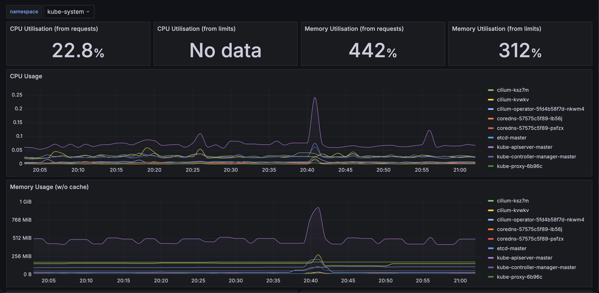

## 1. Cluster & Node


```json
{
  "annotations": {
    "list": [
      {
        "builtIn": 1,
        "datasource": {
          "type": "grafana",
          "uid": "-- Grafana --"
        },
        "enable": true,
        "hide": true,
        "iconColor": "rgba(0, 211, 255, 1)",
        "name": "Annotations & Alerts",
        "type": "dashboard"
      }
    ]
  },
  "editable": true,
  "fiscalYearStartMonth": 0,
  "graphTooltip": 0,
  "id": 1,
  "links": [],
  "liveNow": false,
  "panels": [
    {
      "collapsed": false,
      "datasource": {
        "type": "prometheus",
        "uid": "prometheus"
      },
      "gridPos": {
        "h": 1,
        "w": 24,
        "x": 0,
        "y": 0
      },
      "id": 23,
      "panels": [],
      "targets": [
        {
          "datasource": {
            "type": "prometheus",
            "uid": "prometheus"
          },
          "refId": "A"
        }
      ],
      "title": "Cluster",
      "type": "row"
    },
    {
      "datasource": {
        "uid": "prometheus"
      },
      "fieldConfig": {
        "defaults": {
          "color": {
            "mode": "thresholds"
          },
          "mappings": [],
          "thresholds": {
            "mode": "absolute",
            "steps": [
              {
                "color": "green",
                "value": null
              },
              {
                "color": "red",
                "value": 80
              }
            ]
          },
          "unit": "percentunit"
        },
        "overrides": []
      },
      "gridPos": {
        "h": 3,
        "w": 4,
        "x": 0,
        "y": 1
      },
      "id": 1,
      "interval": "1m",
      "options": {
        "colorMode": "none",
        "graphMode": "none",
        "justifyMode": "auto",
        "orientation": "horizontal",
        "reduceOptions": {
          "calcs": ["mean"],
          "fields": "",
          "values": false
        },
        "showPercentChange": false,
        "textMode": "auto",
        "wideLayout": true
      },
      "pluginVersion": "10.4.1",
      "targets": [
        {
          "datasource": {
            "uid": "prometheus"
          },
          "expr": "cluster:node_cpu:ratio_rate5m{cluster=\"\"}",
          "format": "time_series",
          "instant": true,
          "refId": "A"
        }
      ],
      "title": "CPU Utilisation",
      "type": "stat"
    },
    {
      "datasource": {
        "uid": "prometheus"
      },
      "fieldConfig": {
        "defaults": {
          "color": {
            "mode": "thresholds"
          },
          "mappings": [],
          "thresholds": {
            "mode": "absolute",
            "steps": [
              {
                "color": "green",
                "value": null
              },
              {
                "color": "red",
                "value": 80
              }
            ]
          },
          "unit": "percentunit"
        },
        "overrides": []
      },
      "gridPos": {
        "h": 3,
        "w": 4,
        "x": 4,
        "y": 1
      },
      "id": 2,
      "interval": "1m",
      "options": {
        "colorMode": "none",
        "graphMode": "none",
        "justifyMode": "auto",
        "orientation": "horizontal",
        "reduceOptions": {
          "calcs": ["mean"],
          "fields": "",
          "values": false
        },
        "showPercentChange": false,
        "textMode": "auto",
        "wideLayout": true
      },
      "pluginVersion": "10.4.1",
      "targets": [
        {
          "datasource": {
            "uid": "prometheus"
          },
          "expr": "sum(namespace_cpu:kube_pod_container_resource_requests:sum{cluster=\"\"}) / sum(kube_node_status_allocatable{job=\"kube-state-metrics\",resource=\"cpu\",cluster=\"\"})",
          "format": "time_series",
          "instant": true,
          "refId": "A"
        }
      ],
      "title": "CPU Requests Commitment",
      "type": "stat"
    },
    {
      "datasource": {
        "uid": "prometheus"
      },
      "fieldConfig": {
        "defaults": {
          "color": {
            "mode": "thresholds"
          },
          "mappings": [],
          "thresholds": {
            "mode": "absolute",
            "steps": [
              {
                "color": "green",
                "value": null
              },
              {
                "color": "red",
                "value": 80
              }
            ]
          },
          "unit": "percentunit"
        },
        "overrides": []
      },
      "gridPos": {
        "h": 3,
        "w": 4,
        "x": 8,
        "y": 1
      },
      "id": 3,
      "interval": "1m",
      "options": {
        "colorMode": "none",
        "graphMode": "none",
        "justifyMode": "auto",
        "orientation": "horizontal",
        "reduceOptions": {
          "calcs": ["mean"],
          "fields": "",
          "values": false
        },
        "showPercentChange": false,
        "textMode": "auto",
        "wideLayout": true
      },
      "pluginVersion": "10.4.1",
      "targets": [
        {
          "datasource": {
            "uid": "prometheus"
          },
          "expr": "sum(namespace_cpu:kube_pod_container_resource_limits:sum{cluster=\"\"}) / sum(kube_node_status_allocatable{job=\"kube-state-metrics\",resource=\"cpu\",cluster=\"\"})",
          "format": "time_series",
          "instant": true,
          "refId": "A"
        }
      ],
      "title": "CPU Limits Commitment",
      "type": "stat"
    },
    {
      "datasource": {
        "uid": "prometheus"
      },
      "fieldConfig": {
        "defaults": {
          "color": {
            "mode": "thresholds"
          },
          "mappings": [],
          "thresholds": {
            "mode": "absolute",
            "steps": [
              {
                "color": "green",
                "value": null
              },
              {
                "color": "red",
                "value": 80
              }
            ]
          },
          "unit": "percentunit"
        },
        "overrides": []
      },
      "gridPos": {
        "h": 3,
        "w": 4,
        "x": 12,
        "y": 1
      },
      "id": 4,
      "interval": "1m",
      "options": {
        "colorMode": "none",
        "graphMode": "none",
        "justifyMode": "auto",
        "orientation": "horizontal",
        "reduceOptions": {
          "calcs": ["mean"],
          "fields": "",
          "values": false
        },
        "showPercentChange": false,
        "textMode": "auto",
        "wideLayout": true
      },
      "pluginVersion": "10.4.1",
      "targets": [
        {
          "datasource": {
            "uid": "prometheus"
          },
          "expr": "1 - sum(:node_memory_MemAvailable_bytes:sum{cluster=\"\"}) / sum(node_memory_MemTotal_bytes{job=\"node-exporter\",cluster=\"\"})",
          "format": "time_series",
          "instant": true,
          "refId": "A"
        }
      ],
      "title": "Memory Utilisation",
      "type": "stat"
    },
    {
      "datasource": {
        "uid": "prometheus"
      },
      "fieldConfig": {
        "defaults": {
          "color": {
            "mode": "thresholds"
          },
          "mappings": [],
          "thresholds": {
            "mode": "absolute",
            "steps": [
              {
                "color": "green",
                "value": null
              },
              {
                "color": "red",
                "value": 80
              }
            ]
          },
          "unit": "percentunit"
        },
        "overrides": []
      },
      "gridPos": {
        "h": 3,
        "w": 4,
        "x": 16,
        "y": 1
      },
      "id": 5,
      "interval": "1m",
      "options": {
        "colorMode": "none",
        "graphMode": "none",
        "justifyMode": "auto",
        "orientation": "horizontal",
        "reduceOptions": {
          "calcs": ["mean"],
          "fields": "",
          "values": false
        },
        "showPercentChange": false,
        "textMode": "auto",
        "wideLayout": true
      },
      "pluginVersion": "10.4.1",
      "targets": [
        {
          "datasource": {
            "uid": "prometheus"
          },
          "expr": "sum(namespace_memory:kube_pod_container_resource_requests:sum{cluster=\"\"}) / sum(kube_node_status_allocatable{job=\"kube-state-metrics\",resource=\"memory\",cluster=\"\"})",
          "format": "time_series",
          "instant": true,
          "refId": "A"
        }
      ],
      "title": "Memory Requests Commitment",
      "type": "stat"
    },
    {
      "datasource": {
        "uid": "prometheus"
      },
      "fieldConfig": {
        "defaults": {
          "color": {
            "mode": "thresholds"
          },
          "mappings": [],
          "thresholds": {
            "mode": "absolute",
            "steps": [
              {
                "color": "green",
                "value": null
              },
              {
                "color": "red",
                "value": 80
              }
            ]
          },
          "unit": "percentunit"
        },
        "overrides": []
      },
      "gridPos": {
        "h": 3,
        "w": 4,
        "x": 20,
        "y": 1
      },
      "id": 6,
      "interval": "1m",
      "options": {
        "colorMode": "none",
        "graphMode": "none",
        "justifyMode": "auto",
        "orientation": "horizontal",
        "reduceOptions": {
          "calcs": ["mean"],
          "fields": "",
          "values": false
        },
        "showPercentChange": false,
        "textMode": "auto",
        "wideLayout": true
      },
      "pluginVersion": "10.4.1",
      "targets": [
        {
          "datasource": {
            "uid": "prometheus"
          },
          "expr": "sum(namespace_memory:kube_pod_container_resource_limits:sum{cluster=\"\"}) / sum(kube_node_status_allocatable{job=\"kube-state-metrics\",resource=\"memory\",cluster=\"\"})",
          "format": "time_series",
          "instant": true,
          "refId": "A"
        }
      ],
      "title": "Memory Limits Commitment",
      "type": "stat"
    },
    {
      "collapsed": false,
      "datasource": {
        "type": "prometheus",
        "uid": "prometheus"
      },
      "gridPos": {
        "h": 1,
        "w": 24,
        "x": 0,
        "y": 4
      },
      "id": 35,
      "panels": [],
      "targets": [
        {
          "datasource": {
            "type": "prometheus",
            "uid": "prometheus"
          },
          "refId": "A"
        }
      ],
      "title": "Node",
      "type": "row"
    },
    {
      "datasource": {
        "uid": "prometheus"
      },
      "fieldConfig": {
        "defaults": {
          "color": {
            "mode": "palette-classic"
          },
          "custom": {
            "axisBorderShow": false,
            "axisCenteredZero": false,
            "axisColorMode": "text",
            "axisLabel": "",
            "axisPlacement": "auto",
            "barAlignment": 0,
            "drawStyle": "line",
            "fillOpacity": 10,
            "gradientMode": "none",
            "hideFrom": {
              "legend": false,
              "tooltip": false,
              "viz": false
            },
            "insertNulls": false,
            "lineInterpolation": "smooth",
            "lineWidth": 1,
            "pointSize": 5,
            "scaleDistribution": {
              "type": "linear"
            },
            "showPoints": "never",
            "spanNulls": false,
            "stacking": {
              "group": "A",
              "mode": "none"
            },
            "thresholdsStyle": {
              "mode": "off"
            }
          },
          "mappings": [],
          "thresholds": {
            "mode": "absolute",
            "steps": [
              {
                "color": "green",
                "value": null
              },
              {
                "color": "red",
                "value": 80
              }
            ]
          },
          "unit": "short"
        },
        "overrides": []
      },
      "gridPos": {
        "h": 7,
        "w": 12,
        "x": 0,
        "y": 5
      },
      "id": 24,
      "options": {
        "legend": {
          "calcs": [],
          "displayMode": "list",
          "placement": "bottom",
          "showLegend": true
        },
        "tooltip": {
          "mode": "multi",
          "sort": "none"
        }
      },
      "pluginVersion": "10.4.1",
      "targets": [
        {
          "datasource": {
            "uid": "prometheus"
          },
          "expr": "rate(process_cpu_seconds_total{cluster=\"\",job=\"kubelet\", metrics_path=\"/metrics\",node=~\"$node\"}[$__rate_interval])",
          "format": "time_series",
          "intervalFactor": 2,
          "legendFormat": "{{node}}",
          "refId": "A"
        }
      ],
      "title": "CPU usage",
      "type": "timeseries"
    },
    {
      "datasource": {
        "type": "prometheus",
        "uid": "prometheus"
      },
      "fieldConfig": {
        "defaults": {
          "color": {
            "fixedColor": "blue",
            "mode": "fixed"
          },
          "custom": {
            "axisBorderShow": false,
            "axisCenteredZero": false,
            "axisColorMode": "text",
            "axisLabel": "",
            "axisPlacement": "auto",
            "barAlignment": 0,
            "drawStyle": "line",
            "fillOpacity": 10,
            "gradientMode": "none",
            "hideFrom": {
              "legend": false,
              "tooltip": false,
              "viz": false
            },
            "insertNulls": false,
            "lineInterpolation": "smooth",
            "lineWidth": 1,
            "pointSize": 5,
            "scaleDistribution": {
              "type": "linear"
            },
            "showPoints": "never",
            "spanNulls": false,
            "stacking": {
              "group": "A",
              "mode": "none"
            },
            "thresholdsStyle": {
              "mode": "off"
            }
          },
          "mappings": [],
          "thresholds": {
            "mode": "absolute",
            "steps": [
              {
                "color": "green",
                "value": null
              },
              {
                "color": "red",
                "value": 80
              }
            ]
          },
          "unit": "bytes"
        },
        "overrides": []
      },
      "gridPos": {
        "h": 7,
        "w": 12,
        "x": 12,
        "y": 5
      },
      "id": 34,
      "options": {
        "legend": {
          "calcs": [],
          "displayMode": "list",
          "placement": "bottom",
          "showLegend": true
        },
        "tooltip": {
          "mode": "multi",
          "sort": "none"
        }
      },
      "pluginVersion": "10.4.1",
      "targets": [
        {
          "datasource": {
            "uid": "prometheus"
          },
          "editorMode": "code",
          "expr": "process_resident_memory_bytes{cluster=\"\",job=\"kubelet\", metrics_path=\"/metrics\",node=~\"$node\"}",
          "format": "time_series",
          "intervalFactor": 2,
          "legendFormat": "{{node}}",
          "range": true,
          "refId": "A"
        }
      ],
      "title": "Memory",
      "type": "timeseries"
    },
    {
      "datasource": {
        "uid": "prometheus"
      },
      "fieldConfig": {
        "defaults": {
          "links": [],
          "mappings": [],
          "thresholds": {
            "mode": "absolute",
            "steps": []
          },
          "unit": "none"
        },
        "overrides": []
      },
      "gridPos": {
        "h": 7,
        "w": 6,
        "x": 0,
        "y": 12
      },
      "id": 30,
      "options": {
        "colorMode": "value",
        "graphMode": "area",
        "justifyMode": "auto",
        "orientation": "auto",
        "reduceOptions": {
          "calcs": ["lastNotNull"],
          "fields": "",
          "values": false
        },
        "showPercentChange": false,
        "textMode": "auto",
        "wideLayout": true
      },
      "pluginVersion": "10.4.1",
      "targets": [
        {
          "datasource": {
            "uid": "prometheus"
          },
          "expr": "sum(kubelet_running_pods{cluster=\"\", job=\"kubelet\", metrics_path=\"/metrics\", node=~\"$node\"}) OR sum(kubelet_running_pod_count{cluster=\"\", job=\"kubelet\", metrics_path=\"/metrics\", node=~\"$node\"})",
          "format": "time_series",
          "intervalFactor": 2,
          "legendFormat": "{{node}}",
          "refId": "A"
        }
      ],
      "title": "Running Pods",
      "type": "stat"
    },
    {
      "datasource": {
        "uid": "prometheus"
      },
      "fieldConfig": {
        "defaults": {
          "links": [],
          "mappings": [],
          "thresholds": {
            "mode": "absolute",
            "steps": []
          },
          "unit": "none"
        },
        "overrides": []
      },
      "gridPos": {
        "h": 7,
        "w": 6,
        "x": 6,
        "y": 12
      },
      "id": 31,
      "options": {
        "colorMode": "value",
        "graphMode": "area",
        "justifyMode": "auto",
        "orientation": "auto",
        "reduceOptions": {
          "calcs": ["lastNotNull"],
          "fields": "",
          "values": false
        },
        "showPercentChange": false,
        "textMode": "auto",
        "wideLayout": true
      },
      "pluginVersion": "10.4.1",
      "targets": [
        {
          "datasource": {
            "uid": "prometheus"
          },
          "expr": "sum(kubelet_running_containers{cluster=\"\", job=\"kubelet\", metrics_path=\"/metrics\", node=~\"$node\"}) OR sum(kubelet_running_container_count{cluster=\"\", job=\"kubelet\", metrics_path=\"/metrics\", node=~\"$node\"})",
          "format": "time_series",
          "intervalFactor": 2,
          "legendFormat": "{{node}}",
          "refId": "A"
        }
      ],
      "title": "Running Containers",
      "type": "stat"
    },
    {
      "datasource": {
        "uid": "prometheus"
      },
      "fieldConfig": {
        "defaults": {
          "links": [],
          "mappings": [],
          "thresholds": {
            "mode": "absolute",
            "steps": []
          },
          "unit": "none"
        },
        "overrides": []
      },
      "gridPos": {
        "h": 7,
        "w": 6,
        "x": 12,
        "y": 12
      },
      "id": 32,
      "options": {
        "colorMode": "value",
        "graphMode": "area",
        "justifyMode": "auto",
        "orientation": "auto",
        "reduceOptions": {
          "calcs": ["lastNotNull"],
          "fields": "",
          "values": false
        },
        "showPercentChange": false,
        "textMode": "auto",
        "wideLayout": true
      },
      "pluginVersion": "10.4.1",
      "targets": [
        {
          "datasource": {
            "uid": "prometheus"
          },
          "expr": "sum(volume_manager_total_volumes{cluster=\"\", job=\"kubelet\", metrics_path=\"/metrics\", node=~\"$node\", state=\"actual_state_of_world\"})",
          "format": "time_series",
          "intervalFactor": 2,
          "legendFormat": "{{node}}",
          "refId": "A"
        }
      ],
      "title": "Actual Volume Count",
      "type": "stat"
    },
    {
      "datasource": {
        "uid": "prometheus"
      },
      "fieldConfig": {
        "defaults": {
          "links": [],
          "mappings": [],
          "thresholds": {
            "mode": "absolute",
            "steps": []
          },
          "unit": "none"
        },
        "overrides": []
      },
      "gridPos": {
        "h": 7,
        "w": 6,
        "x": 18,
        "y": 12
      },
      "id": 33,
      "options": {
        "colorMode": "value",
        "graphMode": "area",
        "justifyMode": "auto",
        "orientation": "auto",
        "reduceOptions": {
          "calcs": ["lastNotNull"],
          "fields": "",
          "values": false
        },
        "showPercentChange": false,
        "textMode": "auto",
        "wideLayout": true
      },
      "pluginVersion": "10.4.1",
      "targets": [
        {
          "datasource": {
            "uid": "prometheus"
          },
          "expr": "sum(volume_manager_total_volumes{cluster=\"\", job=\"kubelet\", metrics_path=\"/metrics\", node=~\"$node\",state=\"desired_state_of_world\"})",
          "format": "time_series",
          "intervalFactor": 2,
          "legendFormat": "{{node}}",
          "refId": "A"
        }
      ],
      "title": "Desired Volume Count",
      "type": "stat"
    },
    {
      "datasource": {},
      "fieldConfig": {
        "defaults": {
          "color": {
            "mode": "palette-classic"
          },
          "custom": {
            "axisBorderShow": false,
            "axisCenteredZero": false,
            "axisColorMode": "text",
            "axisLabel": "",
            "axisPlacement": "auto",
            "barAlignment": 0,
            "drawStyle": "line",
            "fillOpacity": 10,
            "gradientMode": "opacity",
            "hideFrom": {
              "legend": false,
              "tooltip": false,
              "viz": false
            },
            "insertNulls": false,
            "lineInterpolation": "smooth",
            "lineWidth": 1,
            "pointSize": 5,
            "scaleDistribution": {
              "type": "linear"
            },
            "showPoints": "never",
            "spanNulls": false,
            "stacking": {
              "group": "A",
              "mode": "none"
            },
            "thresholdsStyle": {
              "mode": "off"
            }
          },
          "mappings": [],
          "thresholds": {
            "mode": "absolute",
            "steps": [
              {
                "color": "green",
                "value": null
              },
              {
                "color": "red",
                "value": 80
              }
            ]
          }
        },
        "overrides": []
      },
      "gridPos": {
        "h": 7,
        "w": 24,
        "x": 0,
        "y": 19
      },
      "id": 25,
      "interval": "1m",
      "options": {
        "legend": {
          "calcs": [],
          "displayMode": "table",
          "placement": "right",
          "showLegend": true
        },
        "timezone": ["browser"],
        "tooltip": {
          "mode": "single",
          "sort": "none"
        }
      },
      "pluginVersion": "10.4.1",
      "targets": [
        {
          "datasource": {
            "uid": "prometheus"
          },
          "expr": "sum(node_namespace_pod_container:container_cpu_usage_seconds_total:sum_irate{cluster=\"\", node=~\"$node\"}) by (pod)",
          "format": "time_series",
          "legendFormat": "{{pod}}",
          "refId": "B"
        }
      ],
      "title": "CPU Usage",
      "type": "timeseries"
    },
    {
      "aliasColors": {},
      "bars": false,
      "columns": [],
      "dashLength": 10,
      "dashes": false,
      "datasource": {
        "uid": "prometheus"
      },
      "fill": 1,
      "fontSize": "100%",
      "gridPos": {
        "h": 7,
        "w": 24,
        "x": 0,
        "y": 26
      },
      "id": 27,
      "interval": "1m",
      "legend": {
        "alignAsTable": true,
        "avg": false,
        "current": false,
        "max": false,
        "min": false,
        "rightSide": true,
        "show": true,
        "total": false,
        "values": false
      },
      "lines": true,
      "linewidth": 1,
      "nullPointMode": "null as zero",
      "percentage": false,
      "pointradius": 5,
      "points": false,
      "renderer": "flot",
      "seriesOverrides": [],
      "showHeader": true,
      "sort": {
        "col": 0,
        "desc": true
      },
      "spaceLength": 10,
      "stack": false,
      "steppedLine": false,
      "styles": [
        {
          "alias": "Time",
          "align": "auto",
          "dateFormat": "YYYY-MM-DD HH:mm:ss",
          "pattern": "Time",
          "type": "hidden"
        },
        {
          "alias": "CPU Usage",
          "align": "auto",
          "colors": [],
          "dateFormat": "YYYY-MM-DD HH:mm:ss",
          "decimals": 2,
          "link": false,
          "linkTargetBlank": false,
          "linkTooltip": "Drill down",
          "linkUrl": "",
          "pattern": "Value #A",
          "thresholds": [],
          "type": "number",
          "unit": "short"
        },
        {
          "alias": "CPU Requests",
          "align": "auto",
          "colors": [],
          "dateFormat": "YYYY-MM-DD HH:mm:ss",
          "decimals": 2,
          "link": false,
          "linkTargetBlank": false,
          "linkTooltip": "Drill down",
          "linkUrl": "",
          "pattern": "Value #B",
          "thresholds": [],
          "type": "number",
          "unit": "short"
        },
        {
          "alias": "CPU Requests %",
          "align": "auto",
          "colors": [],
          "dateFormat": "YYYY-MM-DD HH:mm:ss",
          "decimals": 2,
          "link": false,
          "linkTargetBlank": false,
          "linkTooltip": "Drill down",
          "linkUrl": "",
          "pattern": "Value #C",
          "thresholds": [],
          "type": "number",
          "unit": "percentunit"
        },
        {
          "alias": "CPU Limits",
          "align": "auto",
          "colors": [],
          "dateFormat": "YYYY-MM-DD HH:mm:ss",
          "decimals": 2,
          "link": false,
          "linkTargetBlank": false,
          "linkTooltip": "Drill down",
          "linkUrl": "",
          "pattern": "Value #D",
          "thresholds": [],
          "type": "number",
          "unit": "short"
        },
        {
          "alias": "CPU Limits %",
          "align": "auto",
          "colors": [],
          "dateFormat": "YYYY-MM-DD HH:mm:ss",
          "decimals": 2,
          "link": false,
          "linkTargetBlank": false,
          "linkTooltip": "Drill down",
          "linkUrl": "",
          "pattern": "Value #E",
          "thresholds": [],
          "type": "number",
          "unit": "percentunit"
        },
        {
          "alias": "Pod",
          "align": "auto",
          "colors": [],
          "dateFormat": "YYYY-MM-DD HH:mm:ss",
          "decimals": 2,
          "link": false,
          "linkTargetBlank": false,
          "linkTooltip": "Drill down",
          "linkUrl": "",
          "pattern": "pod",
          "thresholds": [],
          "type": "number",
          "unit": "short"
        },
        {
          "alias": "",
          "align": "auto",
          "colors": [],
          "dateFormat": "YYYY-MM-DD HH:mm:ss",
          "decimals": 2,
          "pattern": "/.*/",
          "thresholds": [],
          "type": "string",
          "unit": "short"
        }
      ],
      "targets": [
        {
          "datasource": {
            "uid": "prometheus"
          },
          "expr": "sum(node_namespace_pod_container:container_cpu_usage_seconds_total:sum_irate{cluster=\"\", node=~\"$node\"}) by (pod)",
          "format": "table",
          "instant": true,
          "legendFormat": "",
          "refId": "A"
        },
        {
          "datasource": {
            "uid": "prometheus"
          },
          "expr": "sum(cluster:namespace:pod_cpu:active:kube_pod_container_resource_requests{cluster=\"\", node=~\"$node\"}) by (pod)",
          "format": "table",
          "instant": true,
          "legendFormat": "",
          "refId": "B"
        },
        {
          "datasource": {
            "uid": "prometheus"
          },
          "expr": "sum(node_namespace_pod_container:container_cpu_usage_seconds_total:sum_irate{cluster=\"\", node=~\"$node\"}) by (pod) / sum(cluster:namespace:pod_cpu:active:kube_pod_container_resource_requests{cluster=\"\", node=~\"$node\"}) by (pod)",
          "format": "table",
          "instant": true,
          "legendFormat": "",
          "refId": "C"
        },
        {
          "datasource": {
            "uid": "prometheus"
          },
          "expr": "sum(cluster:namespace:pod_cpu:active:kube_pod_container_resource_limits{cluster=\"\", node=~\"$node\"}) by (pod)",
          "format": "table",
          "instant": true,
          "legendFormat": "",
          "refId": "D"
        },
        {
          "datasource": {
            "uid": "prometheus"
          },
          "expr": "sum(node_namespace_pod_container:container_cpu_usage_seconds_total:sum_irate{cluster=\"\", node=~\"$node\"}) by (pod) / sum(cluster:namespace:pod_cpu:active:kube_pod_container_resource_limits{cluster=\"\", node=~\"$node\"}) by (pod)",
          "format": "table",
          "instant": true,
          "legendFormat": "",
          "refId": "E"
        }
      ],
      "thresholds": [],
      "title": "CPU Quota",
      "tooltip": {
        "shared": false,
        "sort": 2,
        "value_type": "individual"
      },
      "transform": "table",
      "type": "table-old",
      "xaxis": {
        "mode": "time",
        "show": true,
        "values": []
      },
      "yaxes": [
        {
          "format": "short",
          "logBase": 1,
          "min": 0,
          "show": true
        },
        {
          "format": "short",
          "logBase": 1,
          "show": false
        }
      ]
    },
    {
      "datasource": {
        "type": "prometheus",
        "uid": "P1809F7CD0C75ACF3"
      },
      "fieldConfig": {
        "defaults": {
          "color": {
            "mode": "palette-classic"
          },
          "custom": {
            "axisBorderShow": false,
            "axisCenteredZero": false,
            "axisColorMode": "text",
            "axisLabel": "",
            "axisPlacement": "auto",
            "barAlignment": 0,
            "drawStyle": "line",
            "fillOpacity": 10,
            "gradientMode": "opacity",
            "hideFrom": {
              "legend": false,
              "tooltip": false,
              "viz": false
            },
            "insertNulls": false,
            "lineInterpolation": "smooth",
            "lineWidth": 1,
            "pointSize": 5,
            "scaleDistribution": {
              "type": "linear"
            },
            "showPoints": "never",
            "spanNulls": false,
            "stacking": {
              "group": "A",
              "mode": "none"
            },
            "thresholdsStyle": {
              "mode": "off"
            }
          },
          "mappings": [],
          "min": 0,
          "thresholds": {
            "mode": "absolute",
            "steps": [
              {
                "color": "green",
                "value": null
              },
              {
                "color": "red",
                "value": 80
              }
            ]
          },
          "unit": "bytes"
        },
        "overrides": []
      },
      "gridPos": {
        "h": 7,
        "w": 24,
        "x": 0,
        "y": 33
      },
      "id": 28,
      "interval": "1m",
      "options": {
        "legend": {
          "calcs": [],
          "displayMode": "table",
          "placement": "right",
          "showLegend": true
        },
        "tooltip": {
          "mode": "single",
          "sort": "none"
        }
      },
      "pluginVersion": "10.4.1",
      "targets": [
        {
          "datasource": {
            "uid": "prometheus"
          },
          "expr": "sum(node_namespace_pod_container:container_memory_working_set_bytes{cluster=\"\", node=~\"$node\", container!=\"\"}) by (pod)",
          "format": "time_series",
          "legendFormat": "{{pod}}",
          "refId": "B"
        }
      ],
      "title": "Memory Usage (w/o cache)",
      "type": "timeseries"
    },
    {
      "aliasColors": {},
      "bars": false,
      "columns": [],
      "dashLength": 10,
      "dashes": false,
      "datasource": {
        "uid": "prometheus"
      },
      "fill": 1,
      "fontSize": "100%",
      "gridPos": {
        "h": 7,
        "w": 24,
        "x": 0,
        "y": 40
      },
      "id": 29,
      "interval": "1m",
      "legend": {
        "alignAsTable": true,
        "avg": false,
        "current": false,
        "max": false,
        "min": false,
        "rightSide": true,
        "show": true,
        "total": false,
        "values": false
      },
      "lines": true,
      "linewidth": 1,
      "nullPointMode": "null as zero",
      "percentage": false,
      "pointradius": 5,
      "points": false,
      "renderer": "flot",
      "seriesOverrides": [],
      "showHeader": true,
      "sort": {
        "col": 0,
        "desc": true
      },
      "spaceLength": 10,
      "stack": false,
      "steppedLine": false,
      "styles": [
        {
          "alias": "Time",
          "align": "auto",
          "dateFormat": "YYYY-MM-DD HH:mm:ss",
          "pattern": "Time",
          "type": "hidden"
        },
        {
          "alias": "Memory Usage",
          "align": "auto",
          "colors": [],
          "dateFormat": "YYYY-MM-DD HH:mm:ss",
          "decimals": 2,
          "link": false,
          "linkTargetBlank": false,
          "linkTooltip": "Drill down",
          "linkUrl": "",
          "pattern": "Value #A",
          "thresholds": [],
          "type": "number",
          "unit": "bytes"
        },
        {
          "alias": "Memory Requests",
          "align": "auto",
          "colors": [],
          "dateFormat": "YYYY-MM-DD HH:mm:ss",
          "decimals": 2,
          "link": false,
          "linkTargetBlank": false,
          "linkTooltip": "Drill down",
          "linkUrl": "",
          "pattern": "Value #B",
          "thresholds": [],
          "type": "number",
          "unit": "bytes"
        },
        {
          "alias": "Memory Requests %",
          "align": "auto",
          "colors": [],
          "dateFormat": "YYYY-MM-DD HH:mm:ss",
          "decimals": 2,
          "link": false,
          "linkTargetBlank": false,
          "linkTooltip": "Drill down",
          "linkUrl": "",
          "pattern": "Value #C",
          "thresholds": [],
          "type": "number",
          "unit": "percentunit"
        },
        {
          "alias": "Memory Limits",
          "align": "auto",
          "colors": [],
          "dateFormat": "YYYY-MM-DD HH:mm:ss",
          "decimals": 2,
          "link": false,
          "linkTargetBlank": false,
          "linkTooltip": "Drill down",
          "linkUrl": "",
          "pattern": "Value #D",
          "thresholds": [],
          "type": "number",
          "unit": "bytes"
        },
        {
          "alias": "Memory Limits %",
          "align": "auto",
          "colors": [],
          "dateFormat": "YYYY-MM-DD HH:mm:ss",
          "decimals": 2,
          "link": false,
          "linkTargetBlank": false,
          "linkTooltip": "Drill down",
          "linkUrl": "",
          "pattern": "Value #E",
          "thresholds": [],
          "type": "number",
          "unit": "percentunit"
        },
        {
          "alias": "Memory Usage (RSS)",
          "align": "auto",
          "colors": [],
          "dateFormat": "YYYY-MM-DD HH:mm:ss",
          "decimals": 2,
          "link": false,
          "linkTargetBlank": false,
          "linkTooltip": "Drill down",
          "linkUrl": "",
          "pattern": "Value #F",
          "thresholds": [],
          "type": "number",
          "unit": "bytes"
        },
        {
          "alias": "Memory Usage (Cache)",
          "align": "auto",
          "colors": [],
          "dateFormat": "YYYY-MM-DD HH:mm:ss",
          "decimals": 2,
          "link": false,
          "linkTargetBlank": false,
          "linkTooltip": "Drill down",
          "linkUrl": "",
          "pattern": "Value #G",
          "thresholds": [],
          "type": "number",
          "unit": "bytes"
        },
        {
          "alias": "Memory Usage (Swap)",
          "align": "auto",
          "colors": [],
          "dateFormat": "YYYY-MM-DD HH:mm:ss",
          "decimals": 2,
          "link": false,
          "linkTargetBlank": false,
          "linkTooltip": "Drill down",
          "linkUrl": "",
          "pattern": "Value #H",
          "thresholds": [],
          "type": "number",
          "unit": "bytes"
        },
        {
          "alias": "Pod",
          "align": "auto",
          "colors": [],
          "dateFormat": "YYYY-MM-DD HH:mm:ss",
          "decimals": 2,
          "link": false,
          "linkTargetBlank": false,
          "linkTooltip": "Drill down",
          "linkUrl": "",
          "pattern": "pod",
          "thresholds": [],
          "type": "number",
          "unit": "short"
        },
        {
          "alias": "",
          "align": "auto",
          "colors": [],
          "dateFormat": "YYYY-MM-DD HH:mm:ss",
          "decimals": 2,
          "pattern": "/.*/",
          "thresholds": [],
          "type": "string",
          "unit": "short"
        }
      ],
      "targets": [
        {
          "datasource": {
            "uid": "prometheus"
          },
          "expr": "sum(node_namespace_pod_container:container_memory_working_set_bytes{cluster=\"\", node=~\"$node\",container!=\"\"}) by (pod)",
          "format": "table",
          "instant": true,
          "legendFormat": "",
          "refId": "A"
        },
        {
          "datasource": {
            "uid": "prometheus"
          },
          "expr": "sum(cluster:namespace:pod_memory:active:kube_pod_container_resource_requests{cluster=\"\", node=~\"$node\"}) by (pod)",
          "format": "table",
          "instant": true,
          "legendFormat": "",
          "refId": "B"
        },
        {
          "datasource": {
            "uid": "prometheus"
          },
          "expr": "sum(node_namespace_pod_container:container_memory_working_set_bytes{cluster=\"\", node=~\"$node\",container!=\"\"}) by (pod) / sum(cluster:namespace:pod_memory:active:kube_pod_container_resource_requests{cluster=\"\", node=~\"$node\"}) by (pod)",
          "format": "table",
          "instant": true,
          "legendFormat": "",
          "refId": "C"
        },
        {
          "datasource": {
            "uid": "prometheus"
          },
          "expr": "sum(cluster:namespace:pod_memory:active:kube_pod_container_resource_limits{cluster=\"\", node=~\"$node\"}) by (pod)",
          "format": "table",
          "instant": true,
          "legendFormat": "",
          "refId": "D"
        },
        {
          "datasource": {
            "uid": "prometheus"
          },
          "expr": "sum(node_namespace_pod_container:container_memory_working_set_bytes{cluster=\"\", node=~\"$node\",container!=\"\"}) by (pod) / sum(cluster:namespace:pod_memory:active:kube_pod_container_resource_limits{cluster=\"\", node=~\"$node\"}) by (pod)",
          "format": "table",
          "instant": true,
          "legendFormat": "",
          "refId": "E"
        },
        {
          "datasource": {
            "uid": "prometheus"
          },
          "expr": "sum(node_namespace_pod_container:container_memory_rss{cluster=\"\", node=~\"$node\",container!=\"\"}) by (pod)",
          "format": "table",
          "instant": true,
          "legendFormat": "",
          "refId": "F"
        },
        {
          "datasource": {
            "uid": "prometheus"
          },
          "expr": "sum(node_namespace_pod_container:container_memory_cache{cluster=\"\", node=~\"$node\",container!=\"\"}) by (pod)",
          "format": "table",
          "instant": true,
          "legendFormat": "",
          "refId": "G"
        },
        {
          "datasource": {
            "uid": "prometheus"
          },
          "expr": "sum(node_namespace_pod_container:container_memory_swap{cluster=\"\", node=~\"$node\",container!=\"\"}) by (pod)",
          "format": "table",
          "instant": true,
          "legendFormat": "",
          "refId": "H"
        }
      ],
      "thresholds": [],
      "title": "Memory Quota",
      "tooltip": {
        "shared": false,
        "sort": 2,
        "value_type": "individual"
      },
      "transform": "table",
      "type": "table-old",
      "xaxis": {
        "mode": "time",
        "show": true,
        "values": []
      },
      "yaxes": [
        {
          "format": "short",
          "logBase": 1,
          "min": 0,
          "show": true
        },
        {
          "format": "short",
          "logBase": 1,
          "show": false
        }
      ]
    }
  ],
  "refresh": "10s",
  "schemaVersion": 39,
  "tags": ["kubernetes-mixin"],
  "templating": {
    "list": [
      {
        "current": {
          "selected": true,
          "text": ["master"],
          "value": ["master"]
        },
        "datasource": {
          "type": "prometheus",
          "uid": "prometheus"
        },
        "definition": "",
        "hide": 0,
        "includeAll": false,
        "multi": false,
        "name": "node",
        "options": [],
        "query": "label_values(kube_node_info, node)",
        "refresh": 2,
        "regex": "",
        "skipUrlSync": false,
        "sort": 1,
        "tagValuesQuery": "",
        "tagsQuery": "",
        "type": "query",
        "useTags": false
      }
    ]
  },
  "time": {
    "from": "now-1h",
    "to": "now"
  },
  "timepicker": {
    "refresh_intervals": [
      "5s",
      "10s",
      "30s",
      "1m",
      "5m",
      "15m",
      "30m",
      "1h",
      "2h",
      "1d"
    ],
    "time_options": ["5m", "15m", "1h", "6h", "12h", "24h", "2d", "7d", "30d"]
  },
  "timezone": "utc",
  "title": "Cluster & Node",
  "uid": "efa86fd1d0c121a26444b636a3f509a8",
  "version": 1,
  "weekStart": ""
}
```
- `${__cell}` 이 동작하지 않을 때는 `${__data.fields[0]}`를 사용

## 2. namespace 종합


```json
{
  "annotations": {
    "list": [
      {
        "builtIn": 1,
        "datasource": {
          "type": "grafana",
          "uid": "-- Grafana --"
        },
        "enable": true,
        "hide": true,
        "iconColor": "rgba(0, 211, 255, 1)",
        "name": "Annotations & Alerts",
        "type": "dashboard"
      }
    ]
  },
  "editable": true,
  "fiscalYearStartMonth": 0,
  "graphTooltip": 0,
  "id": 2,
  "links": [],
  "liveNow": false,
  "panels": [
    {
      "datasource": {
        "type": "prometheus",
        "uid": "P1809F7CD0C75ACF3"
      },
      "fieldConfig": {
        "defaults": {
          "color": {
            "mode": "thresholds"
          },
          "custom": {
            "align": "auto",
            "cellOptions": {
              "type": "auto"
            },
            "inspect": false
          },
          "decimals": 2,
          "displayName": "",
          "mappings": [],
          "thresholds": {
            "mode": "absolute",
            "steps": [
              {
                "color": "green",
                "value": null
              },
              {
                "color": "red",
                "value": 80
              }
            ]
          },
          "unit": "short"
        },
        "overrides": [
          {
            "matcher": {
              "id": "byName",
              "options": "Time"
            },
            "properties": [
              {
                "id": "displayName",
                "value": "Time"
              },
              {
                "id": "custom.hidden",
                "value": true
              }
            ]
          },
          {
            "matcher": {
              "id": "byName",
              "options": "Value #B"
            },
            "properties": [
              {
                "id": "displayName",
                "value": "Pod"
              },
              {
                "id": "unit",
                "value": "short"
              },
              {
                "id": "links",
                "value": [
                  {
                    "targetBlank": false,
                    "title": "Drill down to workloads",
                    "url": "/d/a87fb0d919ec0ea5f6543124e16c42a5/Pod?var-datasource=prometheus&var-cluster=&var-namespace=${__data.fields[1]}"
                  }
                ]
              },
              {
                "id": "custom.align"
              }
            ]
          },
          {
            "matcher": {
              "id": "byName",
              "options": "Value"
            },
            "properties": [
              {
                "id": "displayName",
                "value": "Pod"
              },
              {
                "id": "decimals",
                "value": 0
              },
              {
                "id": "custom.align"
              }
            ]
          },
          {
            "matcher": {
              "id": "byName",
              "options": "namespace"
            },
            "properties": [
              {
                "id": "displayName",
                "value": "Namespace"
              },
              {
                "id": "unit",
                "value": "short"
              },
              {
                "id": "decimals",
                "value": 2
              },
              {
                "id": "links",
                "value": [
                  {
                    "targetBlank": false,
                    "title": "Drill down to pods",
                    "url": "/d/85a562078cdf77779eaa1add43ccec1e/Pod?var-datasource=prometheus&var-cluster=&var-namespace=${__data.fields[1]}"
                  }
                ]
              },
              {
                "id": "custom.align"
              }
            ]
          }
        ]
      },
      "gridPos": {
        "h": 7,
        "w": 24,
        "x": 0,
        "y": 0
      },
      "id": 8,
      "interval": "1m",
      "options": {
        "cellHeight": "sm",
        "footer": {
          "countRows": false,
          "fields": "",
          "reducer": ["sum"],
          "show": false
        },
        "showHeader": true
      },
      "pluginVersion": "10.4.1",
      "targets": [
        {
          "datasource": {
            "uid": "prometheus"
          },
          "editorMode": "code",
          "exemplar": false,
          "expr": "sum(kube_pod_owner{job=\"kube-state-metrics\", cluster=\"\"}) by (namespace)",
          "format": "table",
          "hide": false,
          "instant": true,
          "legendFormat": "{{label_name}}",
          "range": false,
          "refId": "A"
        }
      ],
      "title": "Pod Count",
      "transformations": [
        {
          "id": "merge",
          "options": {
            "reducers": []
          }
        }
      ],
      "type": "table"
    },
    {
      "datasource": {
        "uid": "prometheus"
      },
      "fieldConfig": {
        "defaults": {
          "color": {
            "mode": "palette-classic"
          },
          "custom": {
            "axisBorderShow": false,
            "axisCenteredZero": false,
            "axisColorMode": "text",
            "axisLabel": "",
            "axisPlacement": "auto",
            "barAlignment": 0,
            "drawStyle": "line",
            "fillOpacity": 11,
            "gradientMode": "opacity",
            "hideFrom": {
              "legend": false,
              "tooltip": false,
              "viz": false
            },
            "insertNulls": false,
            "lineInterpolation": "smooth",
            "lineWidth": 1,
            "pointSize": 5,
            "scaleDistribution": {
              "type": "linear"
            },
            "showPoints": "never",
            "spanNulls": false,
            "stacking": {
              "group": "A",
              "mode": "none"
            },
            "thresholdsStyle": {
              "mode": "off"
            }
          },
          "mappings": [],
          "min": 0,
          "thresholds": {
            "mode": "absolute",
            "steps": [
              {
                "color": "green",
                "value": null
              },
              {
                "color": "red",
                "value": 80
              }
            ]
          },
          "unit": "short"
        },
        "overrides": []
      },
      "gridPos": {
        "h": 7,
        "w": 12,
        "x": 0,
        "y": 7
      },
      "id": 7,
      "interval": "1m",
      "options": {
        "legend": {
          "calcs": [],
          "displayMode": "list",
          "placement": "right",
          "showLegend": true
        },
        "timezone": ["browser"],
        "tooltip": {
          "mode": "single",
          "sort": "none"
        }
      },
      "pluginVersion": "10.4.1",
      "targets": [
        {
          "datasource": {
            "uid": "prometheus"
          },
          "expr": "sum(node_namespace_pod_container:container_cpu_usage_seconds_total:sum_irate{cluster=\"\"}) by (namespace)",
          "format": "time_series",
          "legendFormat": "{{namespace}}",
          "refId": "A"
        }
      ],
      "title": "CPU Usage",
      "type": "timeseries"
    },
    {
      "datasource": {
        "uid": "prometheus"
      },
      "fieldConfig": {
        "defaults": {
          "color": {
            "mode": "palette-classic"
          },
          "custom": {
            "axisBorderShow": false,
            "axisCenteredZero": false,
            "axisColorMode": "text",
            "axisLabel": "",
            "axisPlacement": "auto",
            "barAlignment": 0,
            "drawStyle": "line",
            "fillOpacity": 10,
            "gradientMode": "opacity",
            "hideFrom": {
              "legend": false,
              "tooltip": false,
              "viz": false
            },
            "insertNulls": false,
            "lineInterpolation": "smooth",
            "lineWidth": 1,
            "pointSize": 5,
            "scaleDistribution": {
              "type": "linear"
            },
            "showPoints": "never",
            "spanNulls": false,
            "stacking": {
              "group": "A",
              "mode": "none"
            },
            "thresholdsStyle": {
              "mode": "off"
            }
          },
          "mappings": [],
          "min": 0,
          "thresholds": {
            "mode": "absolute",
            "steps": [
              {
                "color": "green",
                "value": null
              },
              {
                "color": "red",
                "value": 80
              }
            ]
          },
          "unit": "bytes"
        },
        "overrides": []
      },
      "gridPos": {
        "h": 7,
        "w": 12,
        "x": 12,
        "y": 7
      },
      "id": 9,
      "interval": "1m",
      "options": {
        "legend": {
          "calcs": [],
          "displayMode": "list",
          "placement": "right",
          "showLegend": true
        },
        "timezone": ["browser"],
        "tooltip": {
          "mode": "single",
          "sort": "none"
        }
      },
      "pluginVersion": "10.4.1",
      "targets": [
        {
          "datasource": {
            "uid": "prometheus"
          },
          "expr": "sum(container_memory_rss{job=\"kubelet\", metrics_path=\"/metrics/cadvisor\", cluster=\"\", container!=\"\"}) by (namespace)",
          "format": "time_series",
          "legendFormat": "{{namespace}}",
          "refId": "A"
        }
      ],
      "title": "Memory Usage (w/o cache)",
      "type": "timeseries"
    },
    {
      "datasource": {
        "uid": "prometheus"
      },
      "fieldConfig": {
        "defaults": {
          "color": {
            "mode": "continuous-GrYlRd"
          },
          "mappings": [],
          "thresholds": {
            "mode": "absolute",
            "steps": [
              {
                "color": "green",
                "value": null
              },
              {
                "color": "red",
                "value": 80
              }
            ]
          },
          "unit": "binBps"
        },
        "overrides": []
      },
      "gridPos": {
        "h": 8,
        "w": 6,
        "x": 0,
        "y": 14
      },
      "id": 12,
      "interval": "1m",
      "options": {
        "displayMode": "lcd",
        "maxVizHeight": 300,
        "minVizHeight": 16,
        "minVizWidth": 8,
        "namePlacement": "auto",
        "orientation": "horizontal",
        "reduceOptions": {
          "calcs": ["lastNotNull"],
          "fields": "",
          "values": false
        },
        "showUnfilled": true,
        "sizing": "auto",
        "valueMode": "color"
      },
      "pluginVersion": "10.4.1",
      "targets": [
        {
          "datasource": {
            "uid": "prometheus"
          },
          "expr": "sum(irate(container_network_receive_bytes_total{job=\"kubelet\", metrics_path=\"/metrics/cadvisor\", cluster=\"\", namespace=~\".+\"}[$__rate_interval])) by (namespace)",
          "format": "time_series",
          "legendFormat": "{{namespace}}",
          "refId": "A"
        }
      ],
      "title": "Receive Bandwidth",
      "type": "bargauge"
    },
    {
      "datasource": {
        "uid": "prometheus"
      },
      "fieldConfig": {
        "defaults": {
          "color": {
            "mode": "continuous-GrYlRd"
          },
          "mappings": [],
          "thresholds": {
            "mode": "absolute",
            "steps": [
              {
                "color": "green",
                "value": null
              },
              {
                "color": "red",
                "value": 80
              }
            ]
          },
          "unit": "binBps"
        },
        "overrides": []
      },
      "gridPos": {
        "h": 8,
        "w": 6,
        "x": 6,
        "y": 14
      },
      "id": 13,
      "interval": "1m",
      "options": {
        "displayMode": "lcd",
        "maxVizHeight": 300,
        "minVizHeight": 16,
        "minVizWidth": 8,
        "namePlacement": "auto",
        "orientation": "horizontal",
        "reduceOptions": {
          "calcs": ["lastNotNull"],
          "fields": "",
          "values": false
        },
        "showUnfilled": true,
        "sizing": "auto",
        "valueMode": "color"
      },
      "pluginVersion": "10.4.1",
      "targets": [
        {
          "datasource": {
            "uid": "prometheus"
          },
          "expr": "sum(irate(container_network_transmit_bytes_total{job=\"kubelet\", metrics_path=\"/metrics/cadvisor\", cluster=\"\", namespace=~\".+\"}[$__rate_interval])) by (namespace)",
          "format": "time_series",
          "legendFormat": "{{namespace}}",
          "refId": "A"
        }
      ],
      "title": "Transmit Bandwidth",
      "type": "bargauge"
    },
    {
      "datasource": {
        "uid": "prometheus"
      },
      "fieldConfig": {
        "defaults": {
          "color": {
            "mode": "continuous-GrYlRd"
          },
          "mappings": [],
          "thresholds": {
            "mode": "absolute",
            "steps": [
              {
                "color": "green",
                "value": null
              },
              {
                "color": "red",
                "value": 80
              }
            ]
          },
          "unit": "binBps"
        },
        "overrides": []
      },
      "gridPos": {
        "h": 8,
        "w": 6,
        "x": 12,
        "y": 14
      },
      "id": 14,
      "interval": "1m",
      "options": {
        "displayMode": "lcd",
        "maxVizHeight": 300,
        "minVizHeight": 16,
        "minVizWidth": 8,
        "namePlacement": "auto",
        "orientation": "horizontal",
        "reduceOptions": {
          "calcs": ["lastNotNull"],
          "fields": "",
          "values": false
        },
        "showUnfilled": true,
        "sizing": "auto",
        "valueMode": "color"
      },
      "pluginVersion": "10.4.1",
      "targets": [
        {
          "datasource": {
            "uid": "prometheus"
          },
          "expr": "avg(irate(container_network_receive_bytes_total{job=\"kubelet\", metrics_path=\"/metrics/cadvisor\", cluster=\"\", namespace=~\".+\"}[$__rate_interval])) by (namespace)",
          "format": "time_series",
          "legendFormat": "{{namespace}}",
          "refId": "A"
        }
      ],
      "title": "Average Container Bandwidth by Namespace: Received",
      "type": "bargauge"
    },
    {
      "datasource": {
        "uid": "prometheus"
      },
      "fieldConfig": {
        "defaults": {
          "color": {
            "mode": "continuous-GrYlRd"
          },
          "mappings": [],
          "thresholds": {
            "mode": "absolute",
            "steps": [
              {
                "color": "green",
                "value": null
              },
              {
                "color": "red",
                "value": 80
              }
            ]
          },
          "unit": "binBps"
        },
        "overrides": []
      },
      "gridPos": {
        "h": 8,
        "w": 6,
        "x": 18,
        "y": 14
      },
      "id": 15,
      "interval": "1m",
      "options": {
        "displayMode": "lcd",
        "maxVizHeight": 300,
        "minVizHeight": 16,
        "minVizWidth": 8,
        "namePlacement": "auto",
        "orientation": "horizontal",
        "reduceOptions": {
          "calcs": ["lastNotNull"],
          "fields": "",
          "values": false
        },
        "showUnfilled": true,
        "sizing": "auto",
        "valueMode": "color"
      },
      "pluginVersion": "10.4.1",
      "targets": [
        {
          "datasource": {
            "uid": "prometheus"
          },
          "expr": "avg(irate(container_network_transmit_bytes_total{job=\"kubelet\", metrics_path=\"/metrics/cadvisor\", cluster=\"\", namespace=~\".+\"}[$__rate_interval])) by (namespace)",
          "format": "time_series",
          "legendFormat": "{{namespace}}",
          "refId": "A"
        }
      ],
      "title": "Average Container Bandwidth by Namespace: Transmitted",
      "type": "bargauge"
    },
    {
      "datasource": {
        "uid": "prometheus"
      },
      "fieldConfig": {
        "defaults": {
          "color": {
            "mode": "palette-classic"
          },
          "custom": {
            "axisBorderShow": false,
            "axisCenteredZero": false,
            "axisColorMode": "text",
            "axisLabel": "",
            "axisPlacement": "auto",
            "barAlignment": 0,
            "drawStyle": "points",
            "fillOpacity": 0,
            "gradientMode": "none",
            "hideFrom": {
              "legend": false,
              "tooltip": false,
              "viz": false
            },
            "insertNulls": false,
            "lineInterpolation": "smooth",
            "lineWidth": 1,
            "pointSize": 5,
            "scaleDistribution": {
              "type": "linear"
            },
            "showPoints": "auto",
            "spanNulls": false,
            "stacking": {
              "group": "A",
              "mode": "none"
            },
            "thresholdsStyle": {
              "mode": "off"
            }
          },
          "mappings": [],
          "thresholds": {
            "mode": "absolute",
            "steps": [
              {
                "color": "green",
                "value": null
              },
              {
                "color": "red",
                "value": 80
              }
            ]
          },
          "unit": "pps"
        },
        "overrides": []
      },
      "gridPos": {
        "h": 7,
        "w": 12,
        "x": 0,
        "y": 22
      },
      "id": 16,
      "interval": "1m",
      "options": {
        "legend": {
          "calcs": [],
          "displayMode": "list",
          "placement": "right",
          "showLegend": true
        },
        "timezone": ["browser"],
        "tooltip": {
          "mode": "single",
          "sort": "none"
        }
      },
      "pluginVersion": "10.4.1",
      "targets": [
        {
          "datasource": {
            "uid": "prometheus"
          },
          "expr": "sum(irate(container_network_receive_packets_total{job=\"kubelet\", metrics_path=\"/metrics/cadvisor\", cluster=\"\", namespace=~\".+\"}[$__rate_interval])) by (namespace)",
          "format": "time_series",
          "legendFormat": "{{namespace}}",
          "refId": "A"
        }
      ],
      "title": "Rate of Received Packets",
      "type": "timeseries"
    },
    {
      "datasource": {
        "uid": "prometheus"
      },
      "fieldConfig": {
        "defaults": {
          "color": {
            "mode": "palette-classic"
          },
          "custom": {
            "axisBorderShow": false,
            "axisCenteredZero": false,
            "axisColorMode": "text",
            "axisLabel": "",
            "axisPlacement": "auto",
            "barAlignment": 0,
            "drawStyle": "points",
            "fillOpacity": 0,
            "gradientMode": "none",
            "hideFrom": {
              "legend": false,
              "tooltip": false,
              "viz": false
            },
            "insertNulls": false,
            "lineInterpolation": "smooth",
            "lineWidth": 1,
            "pointSize": 5,
            "scaleDistribution": {
              "type": "linear"
            },
            "showPoints": "auto",
            "spanNulls": false,
            "stacking": {
              "group": "A",
              "mode": "none"
            },
            "thresholdsStyle": {
              "mode": "off"
            }
          },
          "mappings": [],
          "thresholds": {
            "mode": "absolute",
            "steps": [
              {
                "color": "green",
                "value": null
              },
              {
                "color": "red",
                "value": 80
              }
            ]
          },
          "unit": "pps"
        },
        "overrides": []
      },
      "gridPos": {
        "h": 7,
        "w": 12,
        "x": 12,
        "y": 22
      },
      "id": 17,
      "interval": "1m",
      "options": {
        "legend": {
          "calcs": [],
          "displayMode": "list",
          "placement": "right",
          "showLegend": true
        },
        "timezone": ["browser"],
        "tooltip": {
          "mode": "single",
          "sort": "none"
        }
      },
      "pluginVersion": "10.4.1",
      "targets": [
        {
          "datasource": {
            "uid": "prometheus"
          },
          "expr": "sum(irate(container_network_transmit_packets_total{job=\"kubelet\", metrics_path=\"/metrics/cadvisor\", cluster=\"\", namespace=~\".+\"}[$__rate_interval])) by (namespace)",
          "format": "time_series",
          "legendFormat": "{{namespace}}",
          "refId": "A"
        }
      ],
      "title": "Rate of Transmitted Packets",
      "type": "timeseries"
    },
    {
      "datasource": {
        "uid": "prometheus"
      },
      "fieldConfig": {
        "defaults": {
          "color": {
            "mode": "palette-classic"
          },
          "custom": {
            "axisBorderShow": false,
            "axisCenteredZero": false,
            "axisColorMode": "text",
            "axisLabel": "",
            "axisPlacement": "auto",
            "barAlignment": 0,
            "drawStyle": "points",
            "fillOpacity": 10,
            "gradientMode": "none",
            "hideFrom": {
              "legend": false,
              "tooltip": false,
              "viz": false
            },
            "insertNulls": false,
            "lineInterpolation": "linear",
            "lineWidth": 1,
            "pointSize": 5,
            "scaleDistribution": {
              "type": "linear"
            },
            "showPoints": "auto",
            "spanNulls": false,
            "stacking": {
              "group": "A",
              "mode": "none"
            },
            "thresholdsStyle": {
              "mode": "off"
            }
          },
          "mappings": [],
          "thresholds": {
            "mode": "absolute",
            "steps": [
              {
                "color": "green",
                "value": null
              },
              {
                "color": "red",
                "value": 80
              }
            ]
          },
          "unit": "pps"
        },
        "overrides": []
      },
      "gridPos": {
        "h": 7,
        "w": 12,
        "x": 0,
        "y": 29
      },
      "id": 18,
      "interval": "1m",
      "options": {
        "legend": {
          "calcs": [],
          "displayMode": "list",
          "placement": "right",
          "showLegend": true
        },
        "timezone": ["browser"],
        "tooltip": {
          "mode": "single",
          "sort": "none"
        }
      },
      "pluginVersion": "10.4.1",
      "targets": [
        {
          "datasource": {
            "uid": "prometheus"
          },
          "expr": "sum(irate(container_network_receive_packets_dropped_total{job=\"kubelet\", metrics_path=\"/metrics/cadvisor\", cluster=\"\", namespace=~\".+\"}[$__rate_interval])) by (namespace)",
          "format": "time_series",
          "legendFormat": "{{namespace}}",
          "refId": "A"
        }
      ],
      "title": "Rate of Received Packets Dropped",
      "type": "timeseries"
    },
    {
      "datasource": {
        "uid": "prometheus"
      },
      "fieldConfig": {
        "defaults": {
          "color": {
            "mode": "palette-classic"
          },
          "custom": {
            "axisBorderShow": false,
            "axisCenteredZero": false,
            "axisColorMode": "text",
            "axisLabel": "",
            "axisPlacement": "auto",
            "barAlignment": 0,
            "drawStyle": "points",
            "fillOpacity": 10,
            "gradientMode": "none",
            "hideFrom": {
              "legend": false,
              "tooltip": false,
              "viz": false
            },
            "insertNulls": false,
            "lineInterpolation": "linear",
            "lineWidth": 1,
            "pointSize": 5,
            "scaleDistribution": {
              "type": "linear"
            },
            "showPoints": "auto",
            "spanNulls": false,
            "stacking": {
              "group": "A",
              "mode": "none"
            },
            "thresholdsStyle": {
              "mode": "off"
            }
          },
          "mappings": [],
          "thresholds": {
            "mode": "absolute",
            "steps": [
              {
                "color": "green",
                "value": null
              },
              {
                "color": "red",
                "value": 80
              }
            ]
          },
          "unit": "pps"
        },
        "overrides": []
      },
      "gridPos": {
        "h": 7,
        "w": 12,
        "x": 12,
        "y": 29
      },
      "id": 19,
      "interval": "1m",
      "options": {
        "legend": {
          "calcs": [],
          "displayMode": "list",
          "placement": "right",
          "showLegend": true
        },
        "timezone": ["browser"],
        "tooltip": {
          "mode": "single",
          "sort": "none"
        }
      },
      "pluginVersion": "10.4.1",
      "targets": [
        {
          "datasource": {
            "uid": "prometheus"
          },
          "expr": "sum(irate(container_network_transmit_packets_dropped_total{job=\"kubelet\", metrics_path=\"/metrics/cadvisor\", cluster=\"\", namespace=~\".+\"}[$__rate_interval])) by (namespace)",
          "format": "time_series",
          "legendFormat": "{{namespace}}",
          "refId": "A"
        }
      ],
      "title": "Rate of Transmitted Packets Dropped",
      "type": "timeseries"
    },
    {
      "datasource": {
        "uid": "prometheus"
      },
      "fieldConfig": {
        "defaults": {
          "color": {
            "mode": "palette-classic"
          },
          "custom": {
            "axisBorderShow": false,
            "axisCenteredZero": false,
            "axisColorMode": "text",
            "axisLabel": "",
            "axisPlacement": "auto",
            "barAlignment": 0,
            "drawStyle": "line",
            "fillOpacity": 0,
            "gradientMode": "none",
            "hideFrom": {
              "legend": false,
              "tooltip": false,
              "viz": false
            },
            "insertNulls": false,
            "lineInterpolation": "smooth",
            "lineWidth": 1,
            "pointSize": 5,
            "scaleDistribution": {
              "type": "linear"
            },
            "showPoints": "auto",
            "spanNulls": false,
            "stacking": {
              "group": "A",
              "mode": "none"
            },
            "thresholdsStyle": {
              "mode": "off"
            }
          },
          "mappings": [],
          "thresholds": {
            "mode": "absolute",
            "steps": [
              {
                "color": "green",
                "value": null
              },
              {
                "color": "red",
                "value": 80
              }
            ]
          },
          "unit": "ops"
        },
        "overrides": []
      },
      "gridPos": {
        "h": 7,
        "w": 12,
        "x": 0,
        "y": 36
      },
      "id": 20,
      "interval": "1m",
      "options": {
        "legend": {
          "calcs": [],
          "displayMode": "list",
          "placement": "right",
          "showLegend": true
        },
        "timezone": ["browser"],
        "tooltip": {
          "mode": "single",
          "sort": "none"
        }
      },
      "pluginVersion": "10.4.1",
      "targets": [
        {
          "datasource": {
            "uid": "prometheus"
          },
          "expr": "ceil(sum by(namespace) (rate(container_fs_reads_total{job=\"kubelet\", metrics_path=\"/metrics/cadvisor\", container!=\"\", device=~\"(/dev/)?(mmcblk.p.+|nvme.+|rbd.+|sd.+|vd.+|xvd.+|dm-.+|md.+|dasd.+)\", cluster=\"\", namespace!=\"\"}[$__rate_interval]) + rate(container_fs_writes_total{job=\"kubelet\", metrics_path=\"/metrics/cadvisor\", container!=\"\", cluster=\"\", namespace!=\"\"}[$__rate_interval])))",
          "format": "time_series",
          "legendFormat": "{{namespace}}",
          "refId": "A"
        }
      ],
      "title": "IOPS(Reads+Writes)",
      "type": "timeseries"
    },
    {
      "datasource": {
        "uid": "prometheus"
      },
      "fieldConfig": {
        "defaults": {
          "color": {
            "mode": "palette-classic"
          },
          "custom": {
            "axisBorderShow": false,
            "axisCenteredZero": false,
            "axisColorMode": "text",
            "axisLabel": "",
            "axisPlacement": "auto",
            "barAlignment": 0,
            "drawStyle": "line",
            "fillOpacity": 0,
            "gradientMode": "none",
            "hideFrom": {
              "legend": false,
              "tooltip": false,
              "viz": false
            },
            "insertNulls": false,
            "lineInterpolation": "linear",
            "lineWidth": 1,
            "pointSize": 5,
            "scaleDistribution": {
              "type": "linear"
            },
            "showPoints": "auto",
            "spanNulls": false,
            "stacking": {
              "group": "A",
              "mode": "none"
            },
            "thresholdsStyle": {
              "mode": "off"
            }
          },
          "mappings": [],
          "thresholds": {
            "mode": "absolute",
            "steps": [
              {
                "color": "green",
                "value": null
              },
              {
                "color": "red",
                "value": 80
              }
            ]
          },
          "unit": "binBps"
        },
        "overrides": []
      },
      "gridPos": {
        "h": 7,
        "w": 12,
        "x": 12,
        "y": 36
      },
      "id": 21,
      "interval": "1m",
      "options": {
        "legend": {
          "calcs": [],
          "displayMode": "list",
          "placement": "right",
          "showLegend": true
        },
        "timezone": ["browser"],
        "tooltip": {
          "mode": "single",
          "sort": "none"
        }
      },
      "pluginVersion": "10.4.1",
      "targets": [
        {
          "datasource": {
            "uid": "prometheus"
          },
          "expr": "sum by(namespace) (rate(container_fs_reads_bytes_total{job=\"kubelet\", metrics_path=\"/metrics/cadvisor\", container!=\"\", device=~\"(/dev/)?(mmcblk.p.+|nvme.+|rbd.+|sd.+|vd.+|xvd.+|dm-.+|md.+|dasd.+)\", cluster=\"\", namespace!=\"\"}[$__rate_interval]) + rate(container_fs_writes_bytes_total{job=\"kubelet\", metrics_path=\"/metrics/cadvisor\", container!=\"\", cluster=\"\", namespace!=\"\"}[$__rate_interval]))",
          "format": "time_series",
          "legendFormat": "{{namespace}}",
          "refId": "A"
        }
      ],
      "title": "ThroughPut(Read+Write)",
      "type": "timeseries"
    }
  ],
  "refresh": "10s",
  "schemaVersion": 39,
  "tags": ["kubernetes-mixin"],
  "templating": {
    "list": []
  },
  "time": {
    "from": "now-1h",
    "to": "now"
  },
  "timepicker": {
    "refresh_intervals": [
      "5s",
      "10s",
      "30s",
      "1m",
      "5m",
      "15m",
      "30m",
      "1h",
      "2h",
      "1d"
    ],
    "time_options": ["5m", "15m", "1h", "6h", "12h", "24h", "2d", "7d", "30d"]
  },
  "timezone": "utc",
  "title": "Namespace",
  "uid": "d0c121a26444b636a3f509a8efa86fd1",
  "version": 1,
  "weekStart": ""
}
```

## 3. service 별


```json
{
  "annotations": {
    "list": [
      {
        "builtIn": 1,
        "datasource": {
          "type": "grafana",
          "uid": "-- Grafana --"
        },
        "enable": true,
        "hide": true,
        "iconColor": "rgba(0, 211, 255, 1)",
        "name": "Annotations & Alerts",
        "type": "dashboard"
      }
    ]
  },
  "editable": true,
  "fiscalYearStartMonth": 0,
  "graphTooltip": 0,
  "id": 3,
  "links": [],
  "liveNow": false,
  "panels": [
    {
      "collapsed": false,
      "datasource": {
        "type": "prometheus",
        "uid": "prometheus"
      },
      "gridPos": {
        "h": 1,
        "w": 24,
        "x": 0,
        "y": 0
      },
      "id": 14,
      "panels": [],
      "targets": [
        {
          "datasource": {
            "type": "prometheus",
            "uid": "prometheus"
          },
          "refId": "A"
        }
      ],
      "title": "42 Morning glory",
      "type": "row"
    },
    {
      "datasource": {
        "uid": "prometheus"
      },
      "fieldConfig": {
        "defaults": {
          "color": {
            "mode": "thresholds",
            "seriesBy": "last"
          },
          "custom": {
            "axisBorderShow": false,
            "axisCenteredZero": false,
            "axisColorMode": "text",
            "axisLabel": "",
            "axisPlacement": "auto",
            "barAlignment": 0,
            "drawStyle": "line",
            "fillOpacity": 50,
            "gradientMode": "opacity",
            "hideFrom": {
              "legend": false,
              "tooltip": false,
              "viz": false
            },
            "insertNulls": false,
            "lineInterpolation": "smooth",
            "lineStyle": {
              "fill": "solid"
            },
            "lineWidth": 2,
            "pointSize": 1,
            "scaleDistribution": {
              "type": "linear"
            },
            "showPoints": "auto",
            "spanNulls": false,
            "stacking": {
              "group": "A",
              "mode": "none"
            },
            "thresholdsStyle": {
              "mode": "dashed"
            }
          },
          "mappings": [],
          "thresholds": {
            "mode": "absolute",
            "steps": [
              {
                "color": "green",
                "value": null
              },
              {
                "color": "red",
                "value": 70
              }
            ]
          }
        },
        "overrides": []
      },
      "gridPos": {
        "h": 5,
        "w": 6,
        "x": 0,
        "y": 1
      },
      "id": 1,
      "interval": "1m",
      "options": {
        "legend": {
          "calcs": [],
          "displayMode": "hidden",
          "placement": "right",
          "showLegend": false
        },
        "timezone": ["browser"],
        "tooltip": {
          "mode": "single",
          "sort": "none"
        }
      },
      "pluginVersion": "10.4.1",
      "targets": [
        {
          "datasource": {
            "uid": "prometheus"
          },
          "expr": "sum(node_namespace_pod_container:container_cpu_usage_seconds_total:sum_irate{namespace=\"42-morning-glory\"})",
          "format": "time_series",
          "legendFormat": "42-morning-glory",
          "refId": "A"
        },
        {
          "datasource": {
            "uid": "prometheus"
          },
          "expr": "scalar(kube_resourcequota{namespace=\"42-morning-glory\", type=\"hard\",resource=\"requests.cpu\"})",
          "format": "time_series",
          "legendFormat": "quota - requests",
          "refId": "B"
        },
        {
          "datasource": {
            "uid": "prometheus"
          },
          "expr": "scalar(kube_resourcequota{namespace=\"42-morning-glory\", type=\"hard\",resource=\"limits.cpu\"})",
          "format": "time_series",
          "legendFormat": "quota - limits",
          "refId": "C"
        }
      ],
      "title": "CPU 사용량",
      "type": "timeseries"
    },
    {
      "datasource": {
        "uid": "prometheus"
      },
      "fieldConfig": {
        "defaults": {
          "color": {
            "fixedColor": "orange",
            "mode": "thresholds",
            "seriesBy": "last"
          },
          "custom": {
            "axisBorderShow": false,
            "axisCenteredZero": false,
            "axisColorMode": "text",
            "axisLabel": "",
            "axisPlacement": "auto",
            "barAlignment": 0,
            "drawStyle": "line",
            "fillOpacity": 50,
            "gradientMode": "opacity",
            "hideFrom": {
              "legend": false,
              "tooltip": false,
              "viz": false
            },
            "insertNulls": false,
            "lineInterpolation": "smooth",
            "lineStyle": {
              "fill": "solid"
            },
            "lineWidth": 2,
            "pointSize": 1,
            "scaleDistribution": {
              "type": "linear"
            },
            "showPoints": "auto",
            "spanNulls": true,
            "stacking": {
              "group": "A",
              "mode": "none"
            },
            "thresholdsStyle": {
              "mode": "dashed"
            }
          },
          "fieldMinMax": false,
          "mappings": [],
          "thresholds": {
            "mode": "absolute",
            "steps": [
              {
                "color": "blue",
                "value": null
              },
              {
                "color": "red",
                "value": 20000000
              }
            ]
          },
          "unit": "bytes"
        },
        "overrides": []
      },
      "gridPos": {
        "h": 5,
        "w": 6,
        "x": 6,
        "y": 1
      },
      "id": 3,
      "interval": "1m",
      "options": {
        "legend": {
          "calcs": [],
          "displayMode": "hidden",
          "placement": "right",
          "showLegend": false
        },
        "timezone": ["browser"],
        "tooltip": {
          "mode": "single",
          "sort": "none"
        }
      },
      "pluginVersion": "10.4.1",
      "targets": [
        {
          "datasource": {
            "uid": "prometheus"
          },
          "expr": "sum(container_memory_working_set_bytes{job=\"kubelet\", metrics_path=\"/metrics/cadvisor\", namespace=\"42-morning-glory\", container!=\"\", image!=\"\"})",
          "format": "time_series",
          "legendFormat": "42-morning-glory",
          "refId": "A"
        },
        {
          "datasource": {
            "uid": "prometheus"
          },
          "expr": "scalar(kube_resourcequota{namespace=\"42-morning-glory\", type=\"hard\",resource=\"requests.memory\"})",
          "format": "time_series",
          "legendFormat": "quota - requests",
          "refId": "B"
        },
        {
          "datasource": {
            "uid": "prometheus"
          },
          "expr": "scalar(kube_resourcequota{namespace=\"42-morning-glory\", type=\"hard\",resource=\"limits.memory\"})",
          "format": "time_series",
          "legendFormat": "quota - limits",
          "refId": "C"
        }
      ],
      "title": "메모리 사용량",
      "type": "timeseries"
    },
    {
      "datasource": {
        "type": "prometheus",
        "uid": "P1809F7CD0C75ACF3"
      },
      "fieldConfig": {
        "defaults": {
          "color": {
            "fixedColor": "light-yellow",
            "mode": "fixed",
            "seriesBy": "last"
          },
          "custom": {
            "axisBorderShow": false,
            "axisCenteredZero": false,
            "axisColorMode": "text",
            "axisLabel": "",
            "axisPlacement": "auto",
            "barAlignment": 0,
            "drawStyle": "points",
            "fillOpacity": 20,
            "gradientMode": "hue",
            "hideFrom": {
              "legend": false,
              "tooltip": false,
              "viz": false
            },
            "insertNulls": false,
            "lineInterpolation": "smooth",
            "lineStyle": {
              "fill": "solid"
            },
            "lineWidth": 2,
            "pointSize": 5,
            "scaleDistribution": {
              "type": "linear"
            },
            "showPoints": "auto",
            "spanNulls": false,
            "stacking": {
              "group": "A",
              "mode": "none"
            },
            "thresholdsStyle": {
              "mode": "off"
            }
          },
          "fieldMinMax": false,
          "mappings": [],
          "thresholds": {
            "mode": "absolute",
            "steps": [
              {
                "color": "green",
                "value": null
              },
              {
                "color": "red",
                "value": ""
              }
            ]
          },
          "unit": "pps"
        },
        "overrides": []
      },
      "gridPos": {
        "h": 5,
        "w": 6,
        "x": 12,
        "y": 1
      },
      "id": 10,
      "interval": "1m",
      "options": {
        "legend": {
          "calcs": [],
          "displayMode": "hidden",
          "placement": "right",
          "showLegend": false
        },
        "timezone": ["browser"],
        "tooltip": {
          "mode": "single",
          "sort": "none"
        }
      },
      "pluginVersion": "10.4.1",
      "targets": [
        {
          "datasource": {
            "uid": "prometheus"
          },
          "editorMode": "code",
          "expr": "sum(irate(container_network_receive_packets_total{job=\"kubelet\", metrics_path=\"/metrics/cadvisor\", namespace=\"42-morning-glory\"}[$__rate_interval]))",
          "format": "time_series",
          "legendFormat": "42-morning-glory",
          "range": true,
          "refId": "A"
        }
      ],
      "title": "Rate of Received Packets",
      "type": "timeseries"
    },
    {
      "datasource": {
        "uid": "prometheus"
      },
      "fieldConfig": {
        "defaults": {
          "color": {
            "fixedColor": "light-yellow",
            "mode": "fixed"
          },
          "custom": {
            "axisBorderShow": false,
            "axisCenteredZero": false,
            "axisColorMode": "text",
            "axisLabel": "",
            "axisPlacement": "auto",
            "barAlignment": 0,
            "drawStyle": "points",
            "fillOpacity": 20,
            "gradientMode": "hue",
            "hideFrom": {
              "legend": false,
              "tooltip": false,
              "viz": false
            },
            "insertNulls": false,
            "lineInterpolation": "smooth",
            "lineStyle": {
              "fill": "solid"
            },
            "lineWidth": 2,
            "pointSize": 5,
            "scaleDistribution": {
              "type": "linear"
            },
            "showPoints": "auto",
            "spanNulls": false,
            "stacking": {
              "group": "A",
              "mode": "none"
            },
            "thresholdsStyle": {
              "mode": "off"
            }
          },
          "mappings": [],
          "thresholds": {
            "mode": "absolute",
            "steps": [
              {
                "color": "green",
                "value": null
              }
            ]
          },
          "unit": "pps"
        },
        "overrides": []
      },
      "gridPos": {
        "h": 5,
        "w": 6,
        "x": 18,
        "y": 1
      },
      "id": 11,
      "interval": "1m",
      "options": {
        "legend": {
          "calcs": [],
          "displayMode": "hidden",
          "placement": "right",
          "showLegend": false
        },
        "timezone": ["browser"],
        "tooltip": {
          "mode": "single",
          "sort": "none"
        }
      },
      "pluginVersion": "10.4.1",
      "targets": [
        {
          "datasource": {
            "uid": "prometheus"
          },
          "expr": "sum(irate(container_network_transmit_packets_total{job=\"kubelet\", metrics_path=\"/metrics/cadvisor\", namespace=\"42-morning-glory\"}[$__rate_interval]))",
          "format": "time_series",
          "legendFormat": "42-morning-glory",
          "refId": "A"
        }
      ],
      "title": "Rate of Transmitted Packets",
      "type": "timeseries"
    },
    {
      "collapsed": false,
      "datasource": {
        "type": "prometheus",
        "uid": "prometheus"
      },
      "gridPos": {
        "h": 1,
        "w": 24,
        "x": 0,
        "y": 6
      },
      "id": 15,
      "panels": [],
      "targets": [
        {
          "datasource": {
            "type": "prometheus",
            "uid": "prometheus"
          },
          "refId": "A"
        }
      ],
      "title": "42 Umbrella",
      "type": "row"
    },
    {
      "datasource": {
        "uid": "prometheus"
      },
      "fieldConfig": {
        "defaults": {
          "color": {
            "mode": "thresholds",
            "seriesBy": "last"
          },
          "custom": {
            "axisBorderShow": false,
            "axisCenteredZero": false,
            "axisColorMode": "text",
            "axisLabel": "",
            "axisPlacement": "auto",
            "barAlignment": 0,
            "drawStyle": "line",
            "fillOpacity": 50,
            "gradientMode": "opacity",
            "hideFrom": {
              "legend": false,
              "tooltip": false,
              "viz": false
            },
            "insertNulls": false,
            "lineInterpolation": "smooth",
            "lineStyle": {
              "fill": "solid"
            },
            "lineWidth": 2,
            "pointSize": 1,
            "scaleDistribution": {
              "type": "linear"
            },
            "showPoints": "auto",
            "spanNulls": false,
            "stacking": {
              "group": "A",
              "mode": "none"
            },
            "thresholdsStyle": {
              "mode": "dashed"
            }
          },
          "mappings": [],
          "thresholds": {
            "mode": "absolute",
            "steps": [
              {
                "color": "green",
                "value": null
              },
              {
                "color": "red",
                "value": 70
              }
            ]
          }
        },
        "overrides": []
      },
      "gridPos": {
        "h": 5,
        "w": 6,
        "x": 0,
        "y": 7
      },
      "id": 16,
      "interval": "1m",
      "options": {
        "legend": {
          "calcs": [],
          "displayMode": "hidden",
          "placement": "right",
          "showLegend": false
        },
        "timezone": ["browser"],
        "tooltip": {
          "mode": "single",
          "sort": "none"
        }
      },
      "pluginVersion": "10.4.1",
      "targets": [
        {
          "datasource": {
            "uid": "prometheus"
          },
          "expr": "sum(node_namespace_pod_container:container_cpu_usage_seconds_total:sum_irate{namespace=\"42-umbrella\"})",
          "format": "time_series",
          "legendFormat": "42-umbrella",
          "refId": "A"
        },
        {
          "datasource": {
            "uid": "prometheus"
          },
          "expr": "scalar(kube_resourcequota{namespace=\"42-umbrella\", type=\"hard\",resource=\"requests.cpu\"})",
          "format": "time_series",
          "legendFormat": "quota - requests",
          "refId": "B"
        },
        {
          "datasource": {
            "uid": "prometheus"
          },
          "expr": "scalar(kube_resourcequota{namespace=\"42-umbrella\", type=\"hard\",resource=\"limits.cpu\"})",
          "format": "time_series",
          "legendFormat": "quota - limits",
          "refId": "C"
        }
      ],
      "title": "CPU 사용량",
      "type": "timeseries"
    },
    {
      "datasource": {
        "uid": "prometheus"
      },
      "fieldConfig": {
        "defaults": {
          "color": {
            "fixedColor": "orange",
            "mode": "thresholds",
            "seriesBy": "last"
          },
          "custom": {
            "axisBorderShow": false,
            "axisCenteredZero": false,
            "axisColorMode": "text",
            "axisLabel": "",
            "axisPlacement": "auto",
            "barAlignment": 0,
            "drawStyle": "line",
            "fillOpacity": 50,
            "gradientMode": "opacity",
            "hideFrom": {
              "legend": false,
              "tooltip": false,
              "viz": false
            },
            "insertNulls": false,
            "lineInterpolation": "smooth",
            "lineStyle": {
              "fill": "solid"
            },
            "lineWidth": 2,
            "pointSize": 1,
            "scaleDistribution": {
              "type": "linear"
            },
            "showPoints": "auto",
            "spanNulls": true,
            "stacking": {
              "group": "A",
              "mode": "none"
            },
            "thresholdsStyle": {
              "mode": "dashed"
            }
          },
          "fieldMinMax": false,
          "mappings": [],
          "thresholds": {
            "mode": "absolute",
            "steps": [
              {
                "color": "blue",
                "value": null
              },
              {
                "color": "red",
                "value": 20000000
              }
            ]
          },
          "unit": "bytes"
        },
        "overrides": []
      },
      "gridPos": {
        "h": 5,
        "w": 6,
        "x": 6,
        "y": 7
      },
      "id": 17,
      "interval": "1m",
      "options": {
        "legend": {
          "calcs": [],
          "displayMode": "hidden",
          "placement": "right",
          "showLegend": false
        },
        "timezone": ["browser"],
        "tooltip": {
          "mode": "single",
          "sort": "none"
        }
      },
      "pluginVersion": "10.4.1",
      "targets": [
        {
          "datasource": {
            "uid": "prometheus"
          },
          "expr": "sum(container_memory_working_set_bytes{job=\"kubelet\", metrics_path=\"/metrics/cadvisor\", namespace=\"42-umbrella\", container!=\"\", image!=\"\"})",
          "format": "time_series",
          "legendFormat": "42-umbrella",
          "refId": "A"
        },
        {
          "datasource": {
            "uid": "prometheus"
          },
          "expr": "scalar(kube_resourcequota{namespace=\"42-umbrella\", type=\"hard\",resource=\"requests.memory\"})",
          "format": "time_series",
          "legendFormat": "quota - requests",
          "refId": "B"
        },
        {
          "datasource": {
            "uid": "prometheus"
          },
          "expr": "scalar(kube_resourcequota{namespace=\"42-umbrella\", type=\"hard\",resource=\"limits.memory\"})",
          "format": "time_series",
          "legendFormat": "quota - limits",
          "refId": "C"
        }
      ],
      "title": "메모리 사용량",
      "type": "timeseries"
    },
    {
      "datasource": {
        "type": "prometheus",
        "uid": "P1809F7CD0C75ACF3"
      },
      "fieldConfig": {
        "defaults": {
          "color": {
            "fixedColor": "light-yellow",
            "mode": "fixed",
            "seriesBy": "last"
          },
          "custom": {
            "axisBorderShow": false,
            "axisCenteredZero": false,
            "axisColorMode": "text",
            "axisLabel": "",
            "axisPlacement": "auto",
            "barAlignment": 0,
            "drawStyle": "points",
            "fillOpacity": 20,
            "gradientMode": "hue",
            "hideFrom": {
              "legend": false,
              "tooltip": false,
              "viz": false
            },
            "insertNulls": false,
            "lineInterpolation": "smooth",
            "lineStyle": {
              "fill": "solid"
            },
            "lineWidth": 2,
            "pointSize": 5,
            "scaleDistribution": {
              "type": "linear"
            },
            "showPoints": "auto",
            "spanNulls": false,
            "stacking": {
              "group": "A",
              "mode": "none"
            },
            "thresholdsStyle": {
              "mode": "off"
            }
          },
          "fieldMinMax": false,
          "mappings": [],
          "thresholds": {
            "mode": "absolute",
            "steps": [
              {
                "color": "green",
                "value": null
              },
              {
                "color": "red",
                "value": ""
              }
            ]
          },
          "unit": "pps"
        },
        "overrides": []
      },
      "gridPos": {
        "h": 5,
        "w": 6,
        "x": 12,
        "y": 7
      },
      "id": 18,
      "interval": "1m",
      "options": {
        "legend": {
          "calcs": [],
          "displayMode": "hidden",
          "placement": "right",
          "showLegend": false
        },
        "timezone": ["browser"],
        "tooltip": {
          "mode": "single",
          "sort": "none"
        }
      },
      "pluginVersion": "10.4.1",
      "targets": [
        {
          "datasource": {
            "uid": "prometheus"
          },
          "editorMode": "code",
          "expr": "sum(irate(container_network_receive_packets_total{job=\"kubelet\", metrics_path=\"/metrics/cadvisor\", namespace=\"42-umbrella\"}[$__rate_interval]))",
          "format": "time_series",
          "legendFormat": "42-umbrella",
          "range": true,
          "refId": "A"
        }
      ],
      "title": "Rate of Received Packets",
      "type": "timeseries"
    },
    {
      "datasource": {
        "uid": "prometheus"
      },
      "fieldConfig": {
        "defaults": {
          "color": {
            "fixedColor": "light-yellow",
            "mode": "fixed"
          },
          "custom": {
            "axisBorderShow": false,
            "axisCenteredZero": false,
            "axisColorMode": "text",
            "axisLabel": "",
            "axisPlacement": "auto",
            "barAlignment": 0,
            "drawStyle": "points",
            "fillOpacity": 20,
            "gradientMode": "hue",
            "hideFrom": {
              "legend": false,
              "tooltip": false,
              "viz": false
            },
            "insertNulls": false,
            "lineInterpolation": "smooth",
            "lineStyle": {
              "fill": "solid"
            },
            "lineWidth": 2,
            "pointSize": 5,
            "scaleDistribution": {
              "type": "linear"
            },
            "showPoints": "auto",
            "spanNulls": false,
            "stacking": {
              "group": "A",
              "mode": "none"
            },
            "thresholdsStyle": {
              "mode": "off"
            }
          },
          "mappings": [],
          "thresholds": {
            "mode": "absolute",
            "steps": [
              {
                "color": "green",
                "value": null
              }
            ]
          },
          "unit": "pps"
        },
        "overrides": []
      },
      "gridPos": {
        "h": 5,
        "w": 6,
        "x": 18,
        "y": 7
      },
      "id": 19,
      "interval": "1m",
      "options": {
        "legend": {
          "calcs": [],
          "displayMode": "hidden",
          "placement": "right",
          "showLegend": false
        },
        "timezone": ["browser"],
        "tooltip": {
          "mode": "single",
          "sort": "none"
        }
      },
      "pluginVersion": "10.4.1",
      "targets": [
        {
          "datasource": {
            "uid": "prometheus"
          },
          "expr": "sum(irate(container_network_transmit_packets_total{job=\"kubelet\", metrics_path=\"/metrics/cadvisor\", namespace=\"42-umbrella\"}[$__rate_interval]))",
          "format": "time_series",
          "legendFormat": "42-umbrella",
          "refId": "A"
        }
      ],
      "title": "Rate of Transmitted Packets",
      "type": "timeseries"
    }
  ],
  "refresh": "10s",
  "schemaVersion": 39,
  "tags": ["kubernetes-mixin"],
  "templating": {
    "list": []
  },
  "time": {
    "from": "now-1h",
    "to": "now"
  },
  "timepicker": {
    "refresh_intervals": [
      "5s",
      "10s",
      "30s",
      "1m",
      "5m",
      "15m",
      "30m",
      "1h",
      "2h",
      "1d"
    ],
    "time_options": ["5m", "15m", "1h", "6h", "12h", "24h", "2d", "7d", "30d"]
  },
  "timezone": "utc",
  "title": "Service",
  "uid": "b0d919ec0ea5f6543124e16c42a5a87f",
  "version": 1,
  "weekStart": ""
}
```

## 4. namespace 상세


```json
{
  "annotations": {
    "list": [
      {
        "builtIn": 1,
        "datasource": {
          "type": "grafana",
          "uid": "-- Grafana --"
        },
        "enable": true,
        "hide": true,
        "iconColor": "rgba(0, 211, 255, 1)",
        "name": "Annotations & Alerts",
        "type": "dashboard"
      }
    ]
  },
  "editable": true,
  "fiscalYearStartMonth": 0,
  "graphTooltip": 0,
  "id": 4,
  "links": [],
  "liveNow": false,
  "panels": [
    {
      "datasource": {
        "uid": "prometheus"
      },
      "fieldConfig": {
        "defaults": {
          "color": {
            "mode": "thresholds"
          },
          "mappings": [],
          "thresholds": {
            "mode": "absolute",
            "steps": [
              {
                "color": "green",
                "value": null
              },
              {
                "color": "red",
                "value": 80
              }
            ]
          },
          "unit": "percentunit"
        },
        "overrides": []
      },
      "id": 1,
      "interval": "1m",
      "options": {
        "colorMode": "none",
        "graphMode": "none",
        "justifyMode": "auto",
        "orientation": "horizontal",
        "reduceOptions": {
          "calcs": ["mean"],
          "fields": "",
          "values": false
        },
        "showPercentChange": false,
        "textMode": "auto",
        "wideLayout": true
      },
      "pluginVersion": "10.4.1",
      "targets": [
        {
          "datasource": {
            "uid": "prometheus"
          },
          "expr": "sum(node_namespace_pod_container:container_cpu_usage_seconds_total:sum_irate{cluster=\"\", namespace=\"$namespace\"}) / sum(kube_pod_container_resource_requests{job=\"kube-state-metrics\", cluster=\"\", namespace=\"$namespace\", resource=\"cpu\"})",
          "format": "time_series",
          "instant": true,
          "refId": "A"
        }
      ],
      "title": "CPU Utilisation (from requests)",
      "type": "stat"
    },
    {
      "datasource": {
        "uid": "prometheus"
      },
      "fieldConfig": {
        "defaults": {
          "color": {
            "mode": "thresholds"
          },
          "mappings": [],
          "thresholds": {
            "mode": "absolute",
            "steps": [
              {
                "color": "green",
                "value": null
              },
              {
                "color": "red",
                "value": 80
              }
            ]
          },
          "unit": "percentunit"
        },
        "overrides": []
      },
      "gridPos": {
        "h": 3,
        "w": 6,
        "x": 6,
        "y": 0
      },
      "id": 2,
      "interval": "1m",
      "options": {
        "colorMode": "none",
        "graphMode": "none",
        "justifyMode": "auto",
        "orientation": "horizontal",
        "reduceOptions": {
          "calcs": ["mean"],
          "fields": "",
          "values": false
        },
        "showPercentChange": false,
        "textMode": "auto",
        "wideLayout": true
      },
      "pluginVersion": "10.4.1",
      "targets": [
        {
          "datasource": {
            "uid": "prometheus"
          },
          "expr": "sum(node_namespace_pod_container:container_cpu_usage_seconds_total:sum_irate{cluster=\"\", namespace=\"$namespace\"}) / sum(kube_pod_container_resource_limits{job=\"kube-state-metrics\", cluster=\"\", namespace=\"$namespace\", resource=\"cpu\"})",
          "format": "time_series",
          "instant": true,
          "refId": "A"
        }
      ],
      "title": "CPU Utilisation (from limits)",
      "type": "stat"
    },
    {
      "datasource": {
        "uid": "prometheus"
      },
      "fieldConfig": {
        "defaults": {
          "color": {
            "mode": "thresholds"
          },
          "mappings": [],
          "thresholds": {
            "mode": "absolute",
            "steps": [
              {
                "color": "green",
                "value": null
              },
              {
                "color": "red",
                "value": 80
              }
            ]
          },
          "unit": "percentunit"
        },
        "overrides": []
      },
      "gridPos": {
        "h": 3,
        "w": 6,
        "x": 12,
        "y": 0
      },
      "id": 3,
      "interval": "1m",
      "options": {
        "colorMode": "none",
        "graphMode": "none",
        "justifyMode": "auto",
        "orientation": "horizontal",
        "reduceOptions": {
          "calcs": ["mean"],
          "fields": "",
          "values": false
        },
        "showPercentChange": false,
        "textMode": "auto",
        "wideLayout": true
      },
      "pluginVersion": "10.4.1",
      "targets": [
        {
          "datasource": {
            "uid": "prometheus"
          },
          "expr": "sum(container_memory_working_set_bytes{job=\"kubelet\", metrics_path=\"/metrics/cadvisor\", cluster=\"\", namespace=\"$namespace\",container!=\"\", image!=\"\"}) / sum(kube_pod_container_resource_requests{job=\"kube-state-metrics\", cluster=\"\", namespace=\"$namespace\", resource=\"memory\"})",
          "format": "time_series",
          "instant": true,
          "refId": "A"
        }
      ],
      "title": "Memory Utilisation (from requests)",
      "type": "stat"
    },
    {
      "datasource": {
        "uid": "prometheus"
      },
      "fieldConfig": {
        "defaults": {
          "color": {
            "mode": "thresholds"
          },
          "mappings": [],
          "thresholds": {
            "mode": "absolute",
            "steps": [
              {
                "color": "green",
                "value": null
              },
              {
                "color": "red",
                "value": 80
              }
            ]
          },
          "unit": "percentunit"
        },
        "overrides": []
      },
      "gridPos": {
        "h": 3,
        "w": 6,
        "x": 18,
        "y": 0
      },
      "id": 4,
      "interval": "1m",
      "options": {
        "colorMode": "none",
        "graphMode": "none",
        "justifyMode": "auto",
        "orientation": "horizontal",
        "reduceOptions": {
          "calcs": ["mean"],
          "fields": "",
          "values": false
        },
        "showPercentChange": false,
        "textMode": "auto",
        "wideLayout": true
      },
      "pluginVersion": "10.4.1",
      "targets": [
        {
          "datasource": {
            "uid": "prometheus"
          },
          "expr": "sum(container_memory_working_set_bytes{job=\"kubelet\", metrics_path=\"/metrics/cadvisor\", cluster=\"\", namespace=\"$namespace\",container!=\"\", image!=\"\"}) / sum(kube_pod_container_resource_limits{job=\"kube-state-metrics\", cluster=\"\", namespace=\"$namespace\", resource=\"memory\"})",
          "format": "time_series",
          "instant": true,
          "refId": "A"
        }
      ],
      "title": "Memory Utilisation (from limits)",
      "type": "stat"
    },
    {
      "datasource": {
        "uid": "prometheus"
      },
      "fieldConfig": {
        "defaults": {
          "color": {
            "mode": "palette-classic"
          },
          "custom": {
            "axisBorderShow": false,
            "axisCenteredZero": false,
            "axisColorMode": "text",
            "axisLabel": "",
            "axisPlacement": "auto",
            "barAlignment": 0,
            "drawStyle": "line",
            "fillOpacity": 10,
            "gradientMode": "opacity",
            "hideFrom": {
              "legend": false,
              "tooltip": false,
              "viz": false
            },
            "insertNulls": false,
            "lineInterpolation": "smooth",
            "lineStyle": {
              "fill": "solid"
            },
            "lineWidth": 1,
            "pointSize": 5,
            "scaleDistribution": {
              "type": "linear"
            },
            "showPoints": "never",
            "spanNulls": false,
            "stacking": {
              "group": "A",
              "mode": "none"
            },
            "thresholdsStyle": {
              "mode": "off"
            }
          },
          "mappings": [],
          "min": 0,
          "thresholds": {
            "mode": "absolute",
            "steps": [
              {
                "color": "green",
                "value": null
              },
              {
                "color": "red",
                "value": 80
              }
            ]
          },
          "unit": "short"
        },
        "overrides": [
          {
            "matcher": {
              "id": "byName",
              "options": "quota - requests"
            },
            "properties": [
              {
                "id": "color",
                "value": {
                  "fixedColor": "#F2495C",
                  "mode": "fixed"
                }
              },
              {
                "id": "custom.fillOpacity",
                "value": 0
              },
              {
                "id": "custom.lineWidth",
                "value": 2
              },
              {
                "id": "custom.stacking",
                "value": {
                  "group": "A",
                  "mode": "none"
                }
              },
              {
                "id": "custom.lineStyle",
                "value": {
                  "dash": [10, 10],
                  "fill": "dash"
                }
              }
            ]
          },
          {
            "matcher": {
              "id": "byName",
              "options": "quota - limits"
            },
            "properties": [
              {
                "id": "color",
                "value": {
                  "fixedColor": "#FF9830",
                  "mode": "fixed"
                }
              },
              {
                "id": "custom.fillOpacity",
                "value": 0
              },
              {
                "id": "custom.lineWidth",
                "value": 2
              },
              {
                "id": "custom.stacking",
                "value": {
                  "group": "A",
                  "mode": "none"
                }
              },
              {
                "id": "custom.lineStyle",
                "value": {
                  "dash": [10, 10],
                  "fill": "dash"
                }
              }
            ]
          }
        ]
      },
      "gridPos": {
        "h": 7,
        "w": 24,
        "x": 0,
        "y": 3
      },
      "id": 5,
      "interval": "1m",
      "options": {
        "legend": {
          "calcs": [],
          "displayMode": "list",
          "placement": "right",
          "showLegend": true
        },
        "timezone": ["browser"],
        "tooltip": {
          "mode": "single",
          "sort": "none"
        }
      },
      "pluginVersion": "10.4.1",
      "targets": [
        {
          "datasource": {
            "uid": "prometheus"
          },
          "expr": "sum(node_namespace_pod_container:container_cpu_usage_seconds_total:sum_irate{cluster=\"\", namespace=\"$namespace\"}) by (pod)",
          "format": "time_series",
          "legendFormat": "{{pod}}",
          "refId": "A"
        },
        {
          "datasource": {
            "uid": "prometheus"
          },
          "expr": "scalar(kube_resourcequota{cluster=\"\", namespace=\"$namespace\", type=\"hard\",resource=\"requests.cpu\"})",
          "format": "time_series",
          "legendFormat": "quota - requests",
          "refId": "B"
        },
        {
          "datasource": {
            "uid": "prometheus"
          },
          "expr": "scalar(kube_resourcequota{cluster=\"\", namespace=\"$namespace\", type=\"hard\",resource=\"limits.cpu\"})",
          "format": "time_series",
          "legendFormat": "quota - limits",
          "refId": "C"
        }
      ],
      "title": "CPU Usage",
      "type": "timeseries"
    },
    {
      "datasource": {
        "uid": "prometheus"
      },
      "fieldConfig": {
        "defaults": {
          "color": {
            "mode": "palette-classic"
          },
          "custom": {
            "axisBorderShow": false,
            "axisCenteredZero": false,
            "axisColorMode": "text",
            "axisLabel": "",
            "axisPlacement": "auto",
            "barAlignment": 0,
            "drawStyle": "line",
            "fillOpacity": 10,
            "gradientMode": "opacity",
            "hideFrom": {
              "legend": false,
              "tooltip": false,
              "viz": false
            },
            "insertNulls": false,
            "lineInterpolation": "smooth",
            "lineWidth": 1,
            "pointSize": 5,
            "scaleDistribution": {
              "type": "linear"
            },
            "showPoints": "never",
            "spanNulls": false,
            "stacking": {
              "group": "A",
              "mode": "none"
            },
            "thresholdsStyle": {
              "mode": "off"
            }
          },
          "mappings": [],
          "min": 0,
          "thresholds": {
            "mode": "absolute",
            "steps": [
              {
                "color": "green",
                "value": null
              },
              {
                "color": "red",
                "value": 80
              }
            ]
          },
          "unit": "bytes"
        },
        "overrides": [
          {
            "matcher": {
              "id": "byName",
              "options": "quota - requests"
            },
            "properties": [
              {
                "id": "color",
                "value": {
                  "fixedColor": "#F2495C",
                  "mode": "fixed"
                }
              },
              {
                "id": "custom.fillOpacity",
                "value": 0
              },
              {
                "id": "custom.lineWidth",
                "value": 2
              },
              {
                "id": "custom.stacking",
                "value": {
                  "group": "A",
                  "mode": "none"
                }
              },
              {
                "id": "custom.lineStyle",
                "value": {
                  "dash": [10, 10],
                  "fill": "dash"
                }
              }
            ]
          },
          {
            "matcher": {
              "id": "byName",
              "options": "quota - limits"
            },
            "properties": [
              {
                "id": "color",
                "value": {
                  "fixedColor": "#FF9830",
                  "mode": "fixed"
                }
              },
              {
                "id": "custom.fillOpacity",
                "value": 0
              },
              {
                "id": "custom.lineWidth",
                "value": 2
              },
              {
                "id": "custom.stacking",
                "value": {
                  "group": "A",
                  "mode": "none"
                }
              },
              {
                "id": "custom.lineStyle",
                "value": {
                  "dash": [10, 10],
                  "fill": "dash"
                }
              }
            ]
          }
        ]
      },
      "gridPos": {
        "h": 7,
        "w": 24,
        "x": 0,
        "y": 10
      },
      "id": 7,
      "interval": "1m",
      "options": {
        "legend": {
          "calcs": [],
          "displayMode": "list",
          "placement": "right",
          "showLegend": true
        },
        "timezone": ["browser"],
        "tooltip": {
          "mode": "single",
          "sort": "none"
        }
      },
      "pluginVersion": "10.4.1",
      "targets": [
        {
          "datasource": {
            "uid": "prometheus"
          },
          "expr": "sum(container_memory_working_set_bytes{job=\"kubelet\", metrics_path=\"/metrics/cadvisor\", cluster=\"\", namespace=\"$namespace\", container!=\"\", image!=\"\"}) by (pod)",
          "format": "time_series",
          "legendFormat": "{{pod}}",
          "refId": "A"
        },
        {
          "datasource": {
            "uid": "prometheus"
          },
          "expr": "scalar(kube_resourcequota{cluster=\"\", namespace=\"$namespace\", type=\"hard\",resource=\"requests.memory\"})",
          "format": "time_series",
          "legendFormat": "quota - requests",
          "refId": "B"
        },
        {
          "datasource": {
            "uid": "prometheus"
          },
          "expr": "scalar(kube_resourcequota{cluster=\"\", namespace=\"$namespace\", type=\"hard\",resource=\"limits.memory\"})",
          "format": "time_series",
          "legendFormat": "quota - limits",
          "refId": "C"
        }
      ],
      "title": "Memory Usage (w/o cache)",
      "type": "timeseries"
    },
    {
      "datasource": {
        "uid": "prometheus"
      },
      "fieldConfig": {
        "defaults": {
          "color": {
            "mode": "continuous-GrYlRd"
          },
          "mappings": [],
          "thresholds": {
            "mode": "absolute",
            "steps": [
              {
                "color": "green",
                "value": null
              },
              {
                "color": "red",
                "value": 80
              }
            ]
          },
          "unit": "binBps"
        },
        "overrides": []
      },
      "gridPos": {
        "h": 7,
        "w": 12,
        "x": 0,
        "y": 17
      },
      "id": 10,
      "interval": "1m",
      "options": {
        "displayMode": "lcd",
        "maxVizHeight": 300,
        "minVizHeight": 16,
        "minVizWidth": 8,
        "namePlacement": "auto",
        "orientation": "horizontal",
        "reduceOptions": {
          "calcs": ["lastNotNull"],
          "fields": "",
          "values": false
        },
        "showUnfilled": true,
        "sizing": "auto",
        "valueMode": "color"
      },
      "pluginVersion": "10.4.1",
      "targets": [
        {
          "datasource": {
            "uid": "prometheus"
          },
          "expr": "sum(irate(container_network_receive_bytes_total{cluster=\"\", namespace=\"$namespace\"}[$__rate_interval])) by (pod)",
          "format": "time_series",
          "legendFormat": "{{pod}}",
          "refId": "A"
        }
      ],
      "title": "Receive Bandwidth",
      "type": "bargauge"
    },
    {
      "datasource": {
        "uid": "prometheus"
      },
      "fieldConfig": {
        "defaults": {
          "color": {
            "mode": "continuous-GrYlRd"
          },
          "mappings": [],
          "thresholds": {
            "mode": "absolute",
            "steps": [
              {
                "color": "green",
                "value": null
              },
              {
                "color": "red",
                "value": 80
              }
            ]
          },
          "unit": "binBps"
        },
        "overrides": []
      },
      "gridPos": {
        "h": 7,
        "w": 12,
        "x": 12,
        "y": 17
      },
      "id": 11,
      "interval": "1m",
      "options": {
        "displayMode": "lcd",
        "maxVizHeight": 300,
        "minVizHeight": 16,
        "minVizWidth": 8,
        "namePlacement": "auto",
        "orientation": "horizontal",
        "reduceOptions": {
          "calcs": ["lastNotNull"],
          "fields": "",
          "values": false
        },
        "showUnfilled": true,
        "sizing": "auto",
        "valueMode": "color"
      },
      "pluginVersion": "10.4.1",
      "targets": [
        {
          "datasource": {
            "uid": "prometheus"
          },
          "expr": "sum(irate(container_network_transmit_bytes_total{cluster=\"\", namespace=\"$namespace\"}[$__rate_interval])) by (pod)",
          "format": "time_series",
          "legendFormat": "{{pod}}",
          "refId": "A"
        }
      ],
      "title": "Transmit Bandwidth",
      "type": "bargauge"
    },
    {
      "datasource": {
        "uid": "prometheus"
      },
      "fieldConfig": {
        "defaults": {
          "color": {
            "mode": "palette-classic"
          },
          "custom": {
            "axisBorderShow": false,
            "axisCenteredZero": false,
            "axisColorMode": "text",
            "axisLabel": "",
            "axisPlacement": "auto",
            "barAlignment": 0,
            "drawStyle": "points",
            "fillOpacity": 0,
            "gradientMode": "none",
            "hideFrom": {
              "legend": false,
              "tooltip": false,
              "viz": false
            },
            "insertNulls": false,
            "lineInterpolation": "smooth",
            "lineWidth": 1,
            "pointSize": 5,
            "scaleDistribution": {
              "type": "linear"
            },
            "showPoints": "never",
            "spanNulls": false,
            "stacking": {
              "group": "A",
              "mode": "none"
            },
            "thresholdsStyle": {
              "mode": "off"
            }
          },
          "mappings": [],
          "thresholds": {
            "mode": "absolute",
            "steps": [
              {
                "color": "green",
                "value": null
              },
              {
                "color": "red",
                "value": 80
              }
            ]
          },
          "unit": "pps"
        },
        "overrides": []
      },
      "gridPos": {
        "h": 7,
        "w": 12,
        "x": 0,
        "y": 24
      },
      "id": 12,
      "interval": "1m",
      "options": {
        "legend": {
          "calcs": [],
          "displayMode": "table",
          "placement": "right",
          "showLegend": true
        },
        "timezone": ["browser"],
        "tooltip": {
          "mode": "single",
          "sort": "none"
        }
      },
      "pluginVersion": "10.4.1",
      "targets": [
        {
          "datasource": {
            "uid": "prometheus"
          },
          "expr": "sum(irate(container_network_receive_packets_total{cluster=\"\", namespace=\"$namespace\"}[$__rate_interval])) by (pod)",
          "format": "time_series",
          "legendFormat": "{{pod}}",
          "refId": "A"
        }
      ],
      "title": "Rate of Received Packets",
      "type": "timeseries"
    },
    {
      "datasource": {
        "uid": "prometheus"
      },
      "fieldConfig": {
        "defaults": {
          "color": {
            "mode": "palette-classic"
          },
          "custom": {
            "axisBorderShow": false,
            "axisCenteredZero": false,
            "axisColorMode": "text",
            "axisLabel": "",
            "axisPlacement": "auto",
            "barAlignment": 0,
            "drawStyle": "points",
            "fillOpacity": 100,
            "gradientMode": "none",
            "hideFrom": {
              "legend": false,
              "tooltip": false,
              "viz": false
            },
            "insertNulls": false,
            "lineInterpolation": "linear",
            "lineWidth": 0,
            "pointSize": 5,
            "scaleDistribution": {
              "type": "linear"
            },
            "showPoints": "never",
            "spanNulls": false,
            "stacking": {
              "group": "A",
              "mode": "none"
            },
            "thresholdsStyle": {
              "mode": "off"
            }
          },
          "mappings": [],
          "min": 0,
          "thresholds": {
            "mode": "absolute",
            "steps": [
              {
                "color": "green",
                "value": null
              },
              {
                "color": "red",
                "value": 80
              }
            ]
          },
          "unit": "pps"
        },
        "overrides": []
      },
      "gridPos": {
        "h": 7,
        "w": 12,
        "x": 12,
        "y": 24
      },
      "id": 13,
      "interval": "1m",
      "options": {
        "legend": {
          "calcs": [],
          "displayMode": "list",
          "placement": "right",
          "showLegend": true
        },
        "timezone": ["browser"],
        "tooltip": {
          "mode": "single",
          "sort": "none"
        }
      },
      "pluginVersion": "10.4.1",
      "targets": [
        {
          "datasource": {
            "uid": "prometheus"
          },
          "expr": "sum(irate(container_network_transmit_packets_total{cluster=\"\", namespace=\"$namespace\"}[$__rate_interval])) by (pod)",
          "format": "time_series",
          "legendFormat": "{{pod}}",
          "refId": "A"
        }
      ],
      "title": "Rate of Transmitted Packets",
      "type": "timeseries"
    },
    {
      "datasource": {
        "uid": "prometheus"
      },
      "fieldConfig": {
        "defaults": {
          "color": {
            "mode": "palette-classic"
          },
          "custom": {
            "axisBorderShow": false,
            "axisCenteredZero": false,
            "axisColorMode": "text",
            "axisLabel": "",
            "axisPlacement": "auto",
            "barAlignment": 0,
            "drawStyle": "points",
            "fillOpacity": 100,
            "gradientMode": "none",
            "hideFrom": {
              "legend": false,
              "tooltip": false,
              "viz": false
            },
            "insertNulls": false,
            "lineInterpolation": "linear",
            "lineWidth": 0,
            "pointSize": 5,
            "scaleDistribution": {
              "type": "linear"
            },
            "showPoints": "never",
            "spanNulls": false,
            "stacking": {
              "group": "A",
              "mode": "none"
            },
            "thresholdsStyle": {
              "mode": "off"
            }
          },
          "mappings": [],
          "min": 0,
          "thresholds": {
            "mode": "absolute",
            "steps": [
              {
                "color": "green",
                "value": null
              },
              {
                "color": "red",
                "value": 80
              }
            ]
          },
          "unit": "pps"
        },
        "overrides": []
      },
      "gridPos": {
        "h": 7,
        "w": 12,
        "x": 0,
        "y": 31
      },
      "id": 14,
      "interval": "1m",
      "options": {
        "legend": {
          "calcs": [],
          "displayMode": "list",
          "placement": "right",
          "showLegend": true
        },
        "timezone": ["browser"],
        "tooltip": {
          "mode": "single",
          "sort": "none"
        }
      },
      "pluginVersion": "10.4.1",
      "targets": [
        {
          "datasource": {
            "uid": "prometheus"
          },
          "expr": "sum(irate(container_network_receive_packets_dropped_total{cluster=\"\", namespace=\"$namespace\"}[$__rate_interval])) by (pod)",
          "format": "time_series",
          "legendFormat": "{{pod}}",
          "refId": "A"
        }
      ],
      "title": "Rate of Received Packets Dropped",
      "type": "timeseries"
    },
    {
      "datasource": {
        "uid": "prometheus"
      },
      "fieldConfig": {
        "defaults": {
          "color": {
            "mode": "palette-classic"
          },
          "custom": {
            "axisBorderShow": false,
            "axisCenteredZero": false,
            "axisColorMode": "text",
            "axisLabel": "",
            "axisPlacement": "auto",
            "barAlignment": 0,
            "drawStyle": "points",
            "fillOpacity": 100,
            "gradientMode": "none",
            "hideFrom": {
              "legend": false,
              "tooltip": false,
              "viz": false
            },
            "insertNulls": false,
            "lineInterpolation": "linear",
            "lineWidth": 0,
            "pointSize": 5,
            "scaleDistribution": {
              "type": "linear"
            },
            "showPoints": "never",
            "spanNulls": false,
            "stacking": {
              "group": "A",
              "mode": "none"
            },
            "thresholdsStyle": {
              "mode": "off"
            }
          },
          "mappings": [],
          "min": 0,
          "thresholds": {
            "mode": "absolute",
            "steps": [
              {
                "color": "green",
                "value": null
              },
              {
                "color": "red",
                "value": 80
              }
            ]
          },
          "unit": "pps"
        },
        "overrides": []
      },
      "gridPos": {
        "h": 7,
        "w": 12,
        "x": 12,
        "y": 31
      },
      "id": 15,
      "interval": "1m",
      "options": {
        "legend": {
          "calcs": [],
          "displayMode": "list",
          "placement": "right",
          "showLegend": true
        },
        "timezone": ["browser"],
        "tooltip": {
          "mode": "single",
          "sort": "none"
        }
      },
      "pluginVersion": "10.4.1",
      "targets": [
        {
          "datasource": {
            "uid": "prometheus"
          },
          "expr": "sum(irate(container_network_transmit_packets_dropped_total{cluster=\"\", namespace=\"$namespace\"}[$__rate_interval])) by (pod)",
          "format": "time_series",
          "legendFormat": "{{pod}}",
          "refId": "A"
        }
      ],
      "title": "Rate of Transmitted Packets Dropped",
      "type": "timeseries"
    },
    {
      "datasource": {
        "uid": "prometheus"
      },
      "fieldConfig": {
        "defaults": {
          "color": {
            "mode": "palette-classic"
          },
          "custom": {
            "axisBorderShow": false,
            "axisCenteredZero": false,
            "axisColorMode": "text",
            "axisLabel": "",
            "axisPlacement": "auto",
            "barAlignment": 0,
            "drawStyle": "line",
            "fillOpacity": 0,
            "gradientMode": "none",
            "hideFrom": {
              "legend": false,
              "tooltip": false,
              "viz": false
            },
            "insertNulls": false,
            "lineInterpolation": "linear",
            "lineWidth": 1,
            "pointSize": 5,
            "scaleDistribution": {
              "type": "linear"
            },
            "showPoints": "auto",
            "spanNulls": false,
            "stacking": {
              "group": "A",
              "mode": "none"
            },
            "thresholdsStyle": {
              "mode": "off"
            }
          },
          "mappings": [],
          "min": 0,
          "thresholds": {
            "mode": "absolute",
            "steps": [
              {
                "color": "green",
                "value": null
              },
              {
                "color": "red",
                "value": 80
              }
            ]
          },
          "unit": "ops"
        },
        "overrides": []
      },
      "gridPos": {
        "h": 7,
        "w": 12,
        "x": 0,
        "y": 38
      },
      "id": 16,
      "interval": "1m",
      "options": {
        "legend": {
          "calcs": [],
          "displayMode": "list",
          "placement": "right",
          "showLegend": true
        },
        "timezone": ["browser"],
        "tooltip": {
          "mode": "single",
          "sort": "none"
        }
      },
      "pluginVersion": "10.4.1",
      "targets": [
        {
          "datasource": {
            "uid": "prometheus"
          },
          "expr": "ceil(sum by(pod) (rate(container_fs_reads_total{container!=\"\", device=~\"(/dev/)?(mmcblk.p.+|nvme.+|rbd.+|sd.+|vd.+|xvd.+|dm-.+|md.+|dasd.+)\", cluster=\"\", namespace=\"$namespace\"}[$__rate_interval]) + rate(container_fs_writes_total{container!=\"\", device=~\"(/dev/)?(mmcblk.p.+|nvme.+|rbd.+|sd.+|vd.+|xvd.+|dm-.+|md.+|dasd.+)\", cluster=\"\", namespace=\"$namespace\"}[$__rate_interval])))",
          "format": "time_series",
          "legendFormat": "{{pod}}",
          "refId": "A"
        }
      ],
      "title": "IOPS(Reads+Writes)",
      "type": "timeseries"
    },
    {
      "datasource": {
        "uid": "prometheus"
      },
      "fieldConfig": {
        "defaults": {
          "color": {
            "mode": "palette-classic"
          },
          "custom": {
            "axisBorderShow": false,
            "axisCenteredZero": false,
            "axisColorMode": "text",
            "axisLabel": "",
            "axisPlacement": "auto",
            "barAlignment": 0,
            "drawStyle": "line",
            "fillOpacity": 0,
            "gradientMode": "none",
            "hideFrom": {
              "legend": false,
              "tooltip": false,
              "viz": false
            },
            "insertNulls": false,
            "lineInterpolation": "linear",
            "lineWidth": 1,
            "pointSize": 5,
            "scaleDistribution": {
              "type": "linear"
            },
            "showPoints": "auto",
            "spanNulls": false,
            "stacking": {
              "group": "A",
              "mode": "none"
            },
            "thresholdsStyle": {
              "mode": "off"
            }
          },
          "mappings": [],
          "min": 0,
          "thresholds": {
            "mode": "absolute",
            "steps": [
              {
                "color": "green",
                "value": null
              },
              {
                "color": "red",
                "value": 80
              }
            ]
          },
          "unit": "binBps"
        },
        "overrides": []
      },
      "gridPos": {
        "h": 7,
        "w": 12,
        "x": 12,
        "y": 38
      },
      "id": 17,
      "interval": "1m",
      "options": {
        "legend": {
          "calcs": [],
          "displayMode": "list",
          "placement": "right",
          "showLegend": true
        },
        "timezone": ["browser"],
        "tooltip": {
          "mode": "single",
          "sort": "none"
        }
      },
      "pluginVersion": "10.4.1",
      "targets": [
        {
          "datasource": {
            "uid": "prometheus"
          },
          "expr": "sum by(pod) (rate(container_fs_reads_bytes_total{container!=\"\", device=~\"(/dev/)?(mmcblk.p.+|nvme.+|rbd.+|sd.+|vd.+|xvd.+|dm-.+|md.+|dasd.+)\", cluster=\"\", namespace=\"$namespace\"}[$__rate_interval]) + rate(container_fs_writes_bytes_total{container!=\"\", device=~\"(/dev/)?(mmcblk.p.+|nvme.+|rbd.+|sd.+|vd.+|xvd.+|dm-.+|md.+|dasd.+)\", cluster=\"\", namespace=\"$namespace\"}[$__rate_interval]))",
          "format": "time_series",
          "legendFormat": "{{pod}}",
          "refId": "A"
        }
      ],
      "title": "ThroughPut(Read+Write)",
      "type": "timeseries"
    }
  ],
  "refresh": "10s",
  "schemaVersion": 39,
  "tags": ["kubernetes-mixin"],
  "templating": {
    "list": [
      {
        "current": {
          "selected": false,
          "text": "monitoring",
          "value": "monitoring"
        },
        "datasource": {
          "type": "prometheus",
          "uid": "prometheus"
        },
        "definition": "",
        "hide": 0,
        "includeAll": false,
        "multi": false,
        "name": "namespace",
        "options": [],
        "query": "label_values(kube_namespace_status_phase{job=\"kube-state-metrics\", cluster=\"\"}, namespace)",
        "refresh": 2,
        "regex": "",
        "skipUrlSync": false,
        "sort": 1,
        "tagValuesQuery": "",
        "tagsQuery": "",
        "type": "query",
        "useTags": false
      }
    ]
  },
  "time": {
    "from": "now-1h",
    "to": "now"
  },
  "timepicker": {
    "refresh_intervals": [
      "5s",
      "10s",
      "30s",
      "1m",
      "5m",
      "15m",
      "30m",
      "1h",
      "2h",
      "1d"
    ],
    "time_options": ["5m", "15m", "1h", "6h", "12h", "24h", "2d", "7d", "30d"]
  },
  "timezone": "utc",
  "title": "Pod",
  "uid": "85a562078cdf77779eaa1add43ccec1e",
  "version": 1,
  "weekStart": ""
}
```