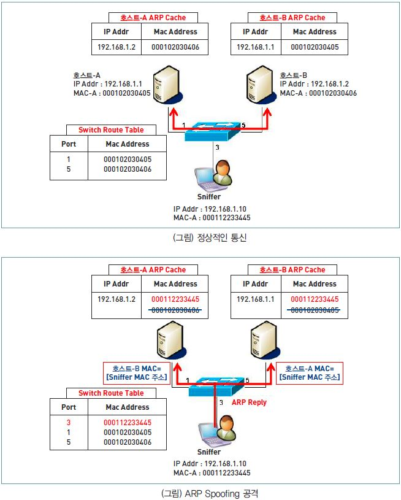

## 서비스 공격 유형

### 서비스 거부(DoS) 공격

- 표적이 되는 서버의 자원을 고갈시킬 목적으로 다수의 공격자 또는 시스템에서 대량의 데이터를 한 곳의 서버에 집중적으로 전송함으로써, 표적이 되는 서버의 정상적인 기능을 방해하는 것
- 종류
	- Ping of Death
		- 패킷의 크기를 인터넷 프로토콜 허용 범위 이상으로 전송하여 공격 대상의 네트워크를 마비시키는 방법
		- 전송된 패킷을 재조합해야 하는 부담과 분할되어 전송된 각각의 패킷들의 ICMP 프로토콜 메시지에 대한 응답을 처리하느라 시스템이 과부하됨
	- Smurfing
		- 돈세탁이라는 뜻
		- source 를 공격 대상 IP로 설정하고, destination을 해당 네트워크 라우터의 브로드캐스트 주소로 하여 패킷을 전송하는 방법
		- 해당 네트워크 내의 모든 컴퓨터는 공격 대상 IP로 응답 메시지를 전송하여 공격 대상 네트워크 과부하를 일으켜 공격
	- SYN Flooding
		- TCP 연결 과정인 3-way handshake을 의도적으로 중단시킴으로써, 대기 상태를 유발하여 서버 자원을 낭비하고 정상적인 서비스를 수행하지 못하게 하는 방법
		- 클라이언트가 SYN 메시지를 보내고 아무 것도 하지 않는다
	- TearDrop
		- 큰 패킷의 경우, 여러 개의 작은 패킷으로 분할되는데 목적지에서 재조합하기 위해 필요한 Offset의 값을 악의적으로 변경하는 방법
		- 공격 대상이 패킷들을 재조합할 때, 오류가 발생하므로 이를 처리하기 위해 많은 리소스를 사용하여 과부하를 일으키고 다운시킨다
	- LAND(Local Area Network Denial) Attack
		- source와 destination을 모두 공격 대상으로 지정하여, 공격 대상이 자신에게 무한하게 응답을 수행하여 서비스를 다운시키는 공격
### 분산 서비스 거부(DDoS) 공격
- 서비스 거부(DoS) 공격 지점이 여러 개인 상황

## 네트워크 침해 공격 유형

- 세션 하이재킹
	- 서버와 클라이언트의 접속 정보인 세션 정보를 가로채는 공격
	- 가로챈 세션을 이용해 클라이언트인 척 위장하여 서버의 자원이나 데이터를 무단으로 사용
	- e.g. TCP 세션 하이재킹 : 3-way handshake 과정의 시퀀스 번호를 가로채 서버에 무단으로 접근하는 공격
- ARP Spoofing
	
	- ARP 프로토콜의 허점을 이용하여 자신의 MAC(Media Access Control) 주소를 다른 컴퓨터의 MAC인 것처럼 속이는 공격
	- ARP 프로토콜은 인증을 요구하는 프로토콜이 아니기 때문에 간단한 ARP Reply 패킷을 각 호스트에 보내서 쉽게 ARP Cache를 업데이트시킬 수 있다
	- 계속해서 스니퍼는 Cache가 사라지기 전에 변조된 ARP Reply를 지속적으로 보내므로 각 호스트들의 ARP Cache의 변조된 MAC 주소의 정보는 계속해서 유지된다
	- 공격에 성공하면 두 호스트는 서로의 MAC 주소를 스니퍼의 MAC 주소로 인식하고 있기 때문에 모든 트래픽을 스니퍼에게 전달하게 된다. 스니퍼는 이 두 호스트에게 재전송할 수 있는 기능이 있으며 또한 모든 패킷들을 캡쳐할 수 있게 된다
	- https://m.blog.naver.com/PostView.naver?isHttpsRedirect=true&blogId=novajini&logNo=220151617774
- Smishing
	- SMS + Phishing
	- 문자 메시지(SMS)를 이용해 사용자의 개인 정보를 빼내는 공격
	- 최근에는 사이트나 앱 설치를 유도하는 방법도 사용
- Spear Phising
	- 사회 공학의 한 기법으로, 특정 대상을 선정한 후 깊은 신뢰를 쌓기 위해 일반적인 내용의 위장 이메일을 지속적으로 발송하여 속게 만든 후, 개인 정보를 탈취하는 공격
- Qshing
	- QR code + Phishing
	- QR 코드를 통해 악성 앱 다운로드를 유도하거나 프로그램을 섳리하도록하여 개인 정보 및 금융 정보를 탈취하는 공격
- Advanced Persistent Threats(지능형 지속 위협)
	- 다양한 IT 기술과 방식을 이용해 조직적으로 특정 기업이나 조직에 침투해 활동 거점을 마련한 뒤, 때를 기다리면서 보안을 무력화하고 정보를 밖으로 빼내는 공격
- Brute Force Attack
	- 암호를 찾아내기 위해 적용 가능한 모든 값을 대입하여 찾는 공격
- Sniffing
	- 네트워크 중간에서 남의 패킷 정보를 도청하는 해킹 유형의 하나
- SQL Injection
	- 입력에 SQL을 직접 입력함으로써 데이터베이스에 비인가된 액세스를 가능하게 하여 데이터베이스를 마음대로 조작하는 공격
	- e.g. `SELECT * FROM users WHERE username = '' OR '1'='1' AND password = '입력값';` 와 같이 항상 사용자 인증을 통과할 수 있게 하도록 `' OR '1'='1`을 입력할 수 있음
- Cross Site Scripting(XSS)
	- 임의의 스크립트를 실행하게 하여(링크 또는 입력을 통해), 시스템 내부 정보를 출력하거나 전송하게 하는 공격

## 기타 공격 유형

- Zombie PC
	- 악성 코드(프로그램)로 인해 컴퓨터를 조종하도록 만들어진 컴퓨터
	- 주로 Daemon에 의해 공격에 이용당함
	- C&C 서버 : Zombie PC에게 명령을 내리는 서버
	- Botnet : Zombie PC들로 구성된 네트워크
- Worm
	- 네트워크를 통해 연속적으로 자신을 복제하여 시스템에 부하를 주고 결국 시스템을 다운시키는 바이러스
	- DDoS, 버퍼 오버플로우 공격, 슬래머 등이 Worm 공격의 한 형태
- Zero Day Attack
	- 보안 취약점이 널리 알려지기 전에 이루어지는 공격. 공격의 신속성을 의미함
- Key Logger Attack
	- 컴퓨터 사용자의 키보드 움직임을 탐지해, 개인 정보를 몰래 빼가는 해킹 공격
- Ransomware
	- 사용자 컴퓨터에 잠임해, 중요한 문서나 파일을 암호화해 사용자가 사용하지 못하게 하는 공격
- Backdoor
	- 엔지니어가 액세스 편의를 위해 시스템 보안을 제거하여 만든 비밀 통로로 보안을 우회하는 공격
- Trojan Horse
	- 정상적인 기능을 하는 프로그램으로 위장하여 숨어있다가, 프로그램이 동작할 때 활성화되어 코드를 실행함

## 예상 문제 은행

```sql
무결성(Integrity) / 기밀성(Confidentiality) / 가용성(availability)

/* 목적 : 보안상 안전한 소프퉤어를 개발하기 위해 */
기존 소프트웨어 개발 라이프 사이클에 보안적인 측면을 강화한 방법론이다. 시큐어 코딩과 같은 기법을 추가하여 보안 취약점을 해결하였다.

/* 요구사항 분석 -> 설계 -> 구현 -> 테스트 -> 유지보수 */
설계 단계

시큐어 코딩

공개키 암호화 방식

해시(hash)

/* 
	DES : Data Enctyption Standard 
	64비트 블록 크기와 56비트 키 길이, 1975년 NBS에서 발표한 개인키 암호화 알고리즘, 현재는 해독이 쉽고, 3번 반복해서 사용하는 알고리즘으로 사용하기도 함
*/
?

개인키 / 해시 방식

/*
	AES : Advanced Encryption Standard
	NIST에서 발표한 개인키 암호화 알고리즘, DES 한계 극복, 128비트 블록 크기와 128, 192, 256비트 키 길이
*/
?

/* offset 값을 변경시켜 수신 측에서 패킷을 재조합할 때 오류로 인한 과부하를 발생시킴으로써 시스템이 다운되도록 하는 공격 방법 */
크기가 큰 패킷을 여러 개의 작은 패킷으로 만드는 과정에서 재조합할 때 필요한 offset이라는 필드를 틀리게 함으로써 수신 호스트가 패킷을 재조합하는데 자원을 사용하게 함으로써 낭비시키는 공격이다.

/* 오답 : Death of Ping */
Ping of Death

SYN Flooding

DDoS

지식 기반 인증 / 생체 기반 인증

/* 오답 : 서비스 */
Forwarded Events

침입 방지 시스템

/* 데이터 유출 방지 */
?

VPN

/* NAC : Network Access Control */
?

Authentication / Authorization / Accounting
```