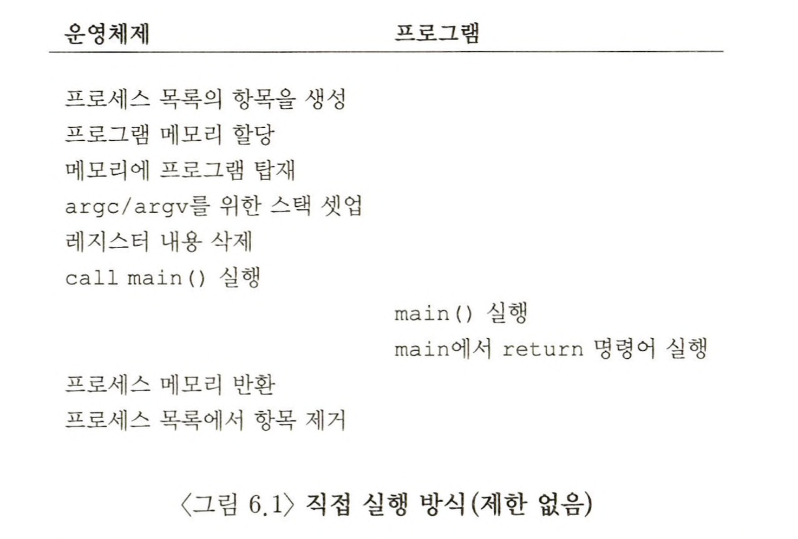
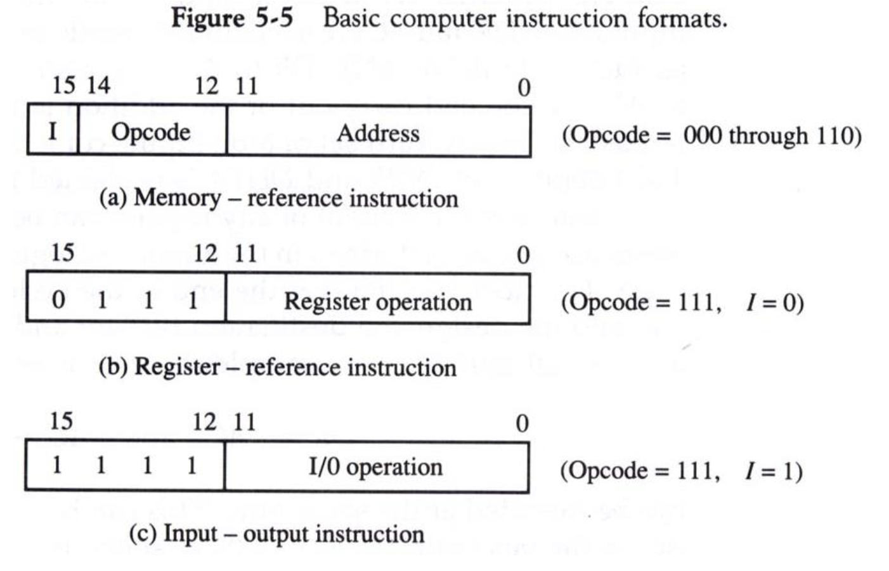
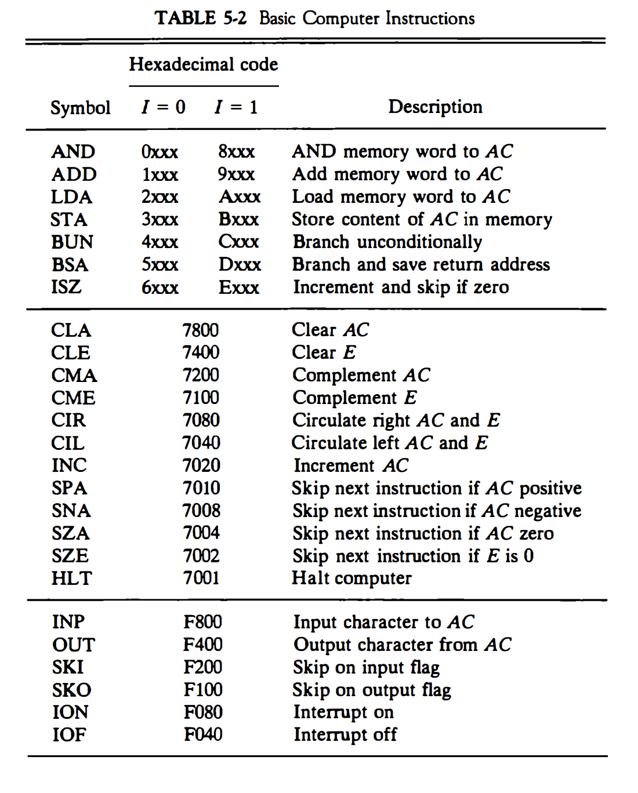
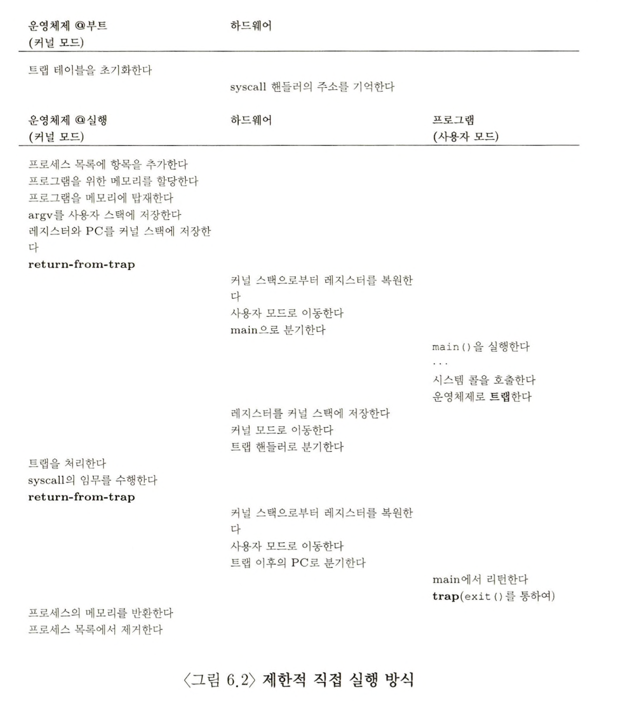

- CPU를 가상화하기 위해서 운영체제는 여러 작업들이 동시에 실행되는 것처럼 보이도록 물리적인 CPU를 공유한다
- 한 프로세스를 잠시 동안 실행하고 다른 프로세스를 또 잠깐 실행하고, 이런 식으로 계속해서 잠깐씩 실행시키면 된다
- CPU 시간을 나누어 씀(time sharing)으로써 가상화를 구현할 수 있다
- 이러한 방법에는 예상되는 문제가 있다
  1. 성능 저하
     - 시스템에 과중한 오버헤드를 주지 않으면서 가상화를 구현할 수 있을까?
  2. 제어 문제
     - CPU에 대한 통제를 유지하면서(제어를 잃지 않으면서) 프로세스를 효율적으로 실행시킬 수 있는 방법은 무엇인가?
     - 자원 관리자로서의 운영체제는 이 문제가 더 중요하다
     - 제어권을 상실하면 한 프로세스가 영원히 실행을 계속할 수 있고, 컴퓨터를 장악하거나 접근해서는 안 되는 정보에 접근하게 된다
     - 제어를 잃지 않기 위해서 하드웨어와 운영체제의 지원이 필수적이다

### 제한적 직접 실행 원리 (Limited Direct Execution)

- 운영체제 개발자들은 프로그램을 빠르게 실행하기 위하여 제한적 직접 실행(Limited Direct Execution) 이라는 기법을 개발하였다
- **직접 실행?** 프로그램을 CPU 상에서 그냥 직접 실행시키는 것이다
  - 운영 체제가 프로그램을 실행하기 시작할 때,
  - 프로세스 목록에 해당 프로세스 항목을 만들고
  - 메모리를 할당하며
  - 프로그램 코드를 디스크에서 탑재하고
  - 진입점 (예, `main()` 루틴 혹은 유사한 무엇)을 찾아 그 지점으로 분기하여 사용자 코드를 실행하기 시작한다

- 위 그림은 프로그램의 `main()` 으로 분기하고 커널로 되돌아가기 위해 일반적인 호출과 리턴을 사용하였다
- 문제점
  1.  프로그램이 운영체제가 원치않는 일을 하지 않는다는 것을 어떻게 보장할 수 있는가?
  2.  프로세스 실행 시, 운영체제는 어떻게 프로그램의 실행을 중단하고 다른 프로세스로 전환시킬 수 있는가? 즉, 시분할(time sharing) 기법을 어떻게 구현할 것인가?
- **제한적?** 프로그램 실행에 제한을 두지 않으면 운영체제는 어떠한 것도 제어할 수 없기 때문에 프로그램 실행을 일부 제한한다

### 문제점 1: 제한된 연산

- 기본적으로 프로그램이 하드웨어 CPU 에서 실행되면 빠르게 실행된다는 장점이 있다.
- 그러나 CPU에서 직접 실행시키면 새로운 문제가 발생한다
- **만일 프로세스가 특수한 종류의 연산(e.g. 디스크 입출력 요청, CPU 또는 메모리와 같은 시스템 자원에 대한 추가 할당 요청)을 수행하길 원한다면 어떻게 될 것인가?**
  - kernel mode를 만든 이유 : 프로세스가 디스크에 대하여 입출력하는 것을 제한하지 않으면, 프로세스는 전체 디스크를 읽고 쓸 수 있기 때문에 접근 권한을 검사하는 기능이 아무런 의미가 없다.
- 따라서, 운영체제는 프로세스의 이러한 특수한 종류의 연산을 제한한다
- user mode의 도입
  - 사용자 모드에서 실행되는 코드는 할 수 있는 일이 제한된다
  - 일부 명령어 대해 user mode에서 실행할 수 없다
  - e.g. 프로세스가 사용자 모드에서 실행 중이면 입출력 요청을 할 수 없도록 설정한다. 이때 입출력 요청을 하면 프로세서가 예외를 발생시키고, _운영체제는 해당 프로세스를 제거한다_
- kernel mode의 도입
  - 운영체제의 중요한 코드들이 실행된다
  - 이 모드에서 실행되는 코드는 모든 특수한 명령어를 포함하여 원하는 모든 작업을 수행할 수 있다

- 하지만 프로세스는 입출력 연산을 비롯한 다른 제한된 연산이 필요하다. 직접할 수는 없어도 대신하여 해줄 무언가가 필요하다
- **이런 제한 작업의 실행을 허용하기 위하여 거의 모든 현대 하드웨어는 사용자 프로세스에게 시스템 콜을 제공한다**
- 커널은 시스템 콜을 통하여 자신의 주요 기능을 사용자 프로그램에게 제공한다
- 파일 시스템 접근 / 프로세스 생성 및 제거 / 다른 프로세스와의 통신 / 메모리 할당 등이 포함된다

- `trap` 특수 명령어(이화여대 2-1)

  - 시스템 콜을 실행하기 위해 프로그램은 `trap` 특수 명령어를 실행해야 한다. 시스템 콜은 내부에서 trap 명령어를 호출한다
    - `open()` 이 호출되면, 라이브러리는 `open()` 의 인자 그리고 `open()` 의 시스템 콜 번호를 커널과 약속된 장소 (스택이나 레지스터)에 저장한다
    - 그리고 앞서 언급한 trap 명령어를 실행한다(interrupt line 세팅하는 명령어 실행 -> CPU에게 소프트웨어 인터럽트(trap 명령어 실행) -> 운영체제는 하드웨어에게 트랩 핸들러의 위치를 알려줌 -> 하드웨어에 의해 트랩 테이블(IVT-인터럽트 벡터 테이블)로 이동 -> 시스템 콜 수행(인터럽트 서비스 루틴-트랩 핸들러))
    - trap이 실행된 후, 라이브러리는 시스템 콜의 리턴값을 읽어들이고, 제어권을 시스템 콜을 호출한 프로그램에게 다시 넘긴다(I/O 컨트롤러로부터 작업 종료 신호를 받으면, CPU에 하드웨어 인터럽트를 보내서 작업 종료를 알림)
    - C 라이브러리는 시스템 콜을 호출하는 부분을 어셈블리어로 구현하였다. 인자의 반환 값을 올바르게 처리하고, 하드웨어마다 다른 trap 명령어를 실행하기 위해서이다
    - 시스템 콜 내부에서 _커널 코드로 진입하기 위한 일련의 작업들_, _인자와 시스템 콜 번호를 저장_, 그리고 _trap 명령어의 호출_ 등을 구현해 놓았다
  - 이 명령어는 커널 안으로 분기하는 동시에 특권 수준을 커널 모드로 상향 조정한다
  - 커널 모드로 진입하면 운영체제는 모든 명령어를 실행할 수 있고 이를 통하여 프로세스가 요청한 작업을 처리할 수 있다
  - 완료되면 운영체제는 return-from-trap 특수 명령어을 호출한다
  - 예상하는 것처럼 이 명령어는 특권 수준을 사용자 모드로 다시 하향 조정하면서 호출한 사용자 프로그램으로 리턴한다.

- `trap`의 의의

  - 시스템 콜 호출과정에서 발생할 수 있는 다양한 문제점으로 부터 운영체제를 보호하기 위하여 하드웨어적인 trap 기법을 도입하고
  - 모든 시스템 콜은 반드시 trap을 통해서 호출되도록 하는 등 많은 노력을 했다

- 하드웨어는 `trap` 명령어를 수행할 때 주의가 필요하다

  - **호출한 프로세스의 필요한 레지스터들을 저장**해야 한다. kernel mode로 변경되면서 바뀌는 레지스터 값들을 저장할 공간이 필요하다
  - 프로세스는 커널 스택을 각자 가지고 있다. 커널 모드로 진입 하거나 진출할 때 하드웨어에 의해 프로그램 카운터와 범용 레지스터 등의 레지스터가 저장되고 복원되는 용도로 사용된다.
  - 운영체제가 return-from-trap 명령어 실행 시 사용자 프로세스로 제대로 리턴할 수 있도록 하기 위함이다
  - 프로그램 카운터, 플래그와 다른 몇 개의 레지스터를 각 프로세스의 커널 스택(kernel stack) 에 저장한다. return-from-trap 명령어가 이 값들을 스택에서 팝(pop)하여 사용자 모드 프로그램의 실행을 다시 시작한다

- 현재까지의 논의에서 다루지 않은 중요한 사항이 있다. 그것은 trap이 운영체제 코드의 어디를 실행할지 어떻게 아느냐는 것이다.

  - 호출한 프로세스는 분기할 주소를 명시할 수 없다. 주소를 명시한다는 것은 커널 내부의 원하는 지점을 접근할 수 있다는 것이기 때문에 위험하다
  - 이러한 문제 때문에 커널은 trap 발생 시 어떤 코드를 실행할지 신중하게 통제해야 한다
  - 커널은 부팅 시에 트랩 테이블(trap table)을 만들고 이를 이용하여 시스템을 통제한다
  - 컴퓨터가 부트될 때는 커널 모드에서 동작하기 때문에 하드웨어를 원하는 대로 제어할 수 있다
  - 운영체제가 하는 초기 작업 중 하나는 하드웨어에게 예외 사건이 일어났을 때 어떤 코드를 실행해야 하는지 알려주는 것이다
  - e.g. 하드 디스크 인터럽트가 발생하면, 키보드 인터럽트가 발생하면, 또는 프로그램이 시스템 콜을 호출하면 무슨 코드를 실행해야 하는가? 운영체제는 특정 명령어를 사용하여 하드웨어에게 트랩 핸들러(trap handler)의 위치를 알려준다(다시 말해서, 프로세스에 트랩 핸들러의 위치를 노출하지 않는다)
  - 사용자 프로세스는 직접적으로 이 테이블의 위치를 알 수 없습니다. 대신, 시스템 콜이나 예외가 발생하면 하드웨어나 운영체제가 이 테이블을 참고하여 어떤 동작을 해야 하는지 결정합니다.
  - 따라서 시스템 콜과 같은 예외적인 사건이 발생했을 때 하드웨어는 무엇을 해야 할지 (즉, 어느 코드로 분기하여 실행할지) 알 수 있다.

- 모든 시스템 콜은 자신의 고유 번호를 갖는다
- 사용자 프로그램은 원하는 시스템 콜을 호출하기 위해서, 해당 시스템 콜 번호를 레지스터 또는 스택의 지정된 위치에 저장한다. 그리고, trap 명령어를 호출한다
- trap 핸들러는 운영체제의 일부분이다. 운영체제는 시스템 콜 번호를 읽어 사용자가 명시한 시스템 콜 번호가 유효한 시스템 콜에 해당하는지를 먼저 파악한다. 예를 들어, 의도치 않게 사용자가 음수값을 넣을 수도 있기 때문이다. 유효한 시스템 콜 번호로 판명되면, 해당 코드로 이동하여 실행한다.
- 각 시스템 콜의 코드 위치는 운영체제만 알고 있다. 시스템 콜 코드의 시작 위치를 사용자 프로그램으로부터 숨김으로써, 사용자는 시스템 콜 번호를 이용하여 커널에게 시스템 콜의 실행을 요청해야 한다. 커널 코드의 무분별한 실행을 방지하기위한 일종의 보안 기법이다
- 하드웨어에게 트랩 테이블의 위치를 알려주는 것은 매우 강력한 기능이다. 당연히 이 역시 특권 명령어이다. 사용자 모드에서 이 명령어를 실행하려고 하면 실행할 수 없고, 어떤 결과가 올 지 알고 있을 것이다.

### 문제점 2: 프로세스 간 전환

- 프로세스의 전환은 실행 중인 프로세스를 멈추고 다른 프로세스를 실행하는 것이다
- 말로 쓰자면 간단해 보이지만, 실제로는 매우 까다로운 문제이다.
- 프로세스가 실행 중이라는 것은 운영체제는 실행 중이지 않다는 것을 의미한다. 운영체제가 실행하고 있지 않다면 어떻게 프로세스를 전환할 수 있을까? (힌트: 할 수 없다). 운영체제가 실행 중이 아니라면, 운영체제는 어떠한 조치도 취할 수 없다.
-
