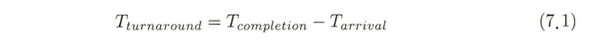
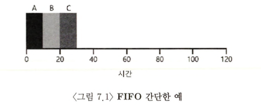
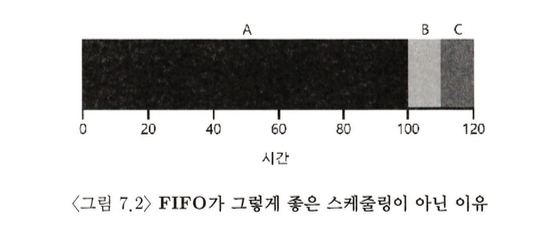
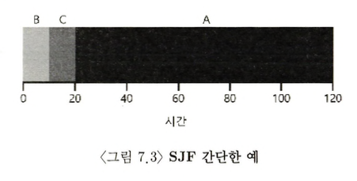
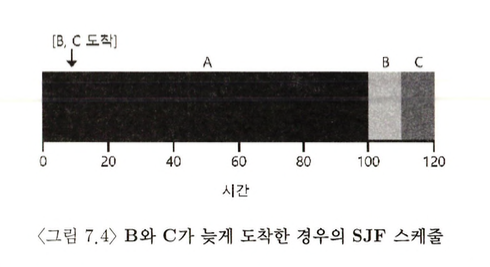
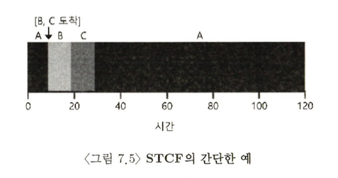
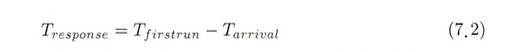
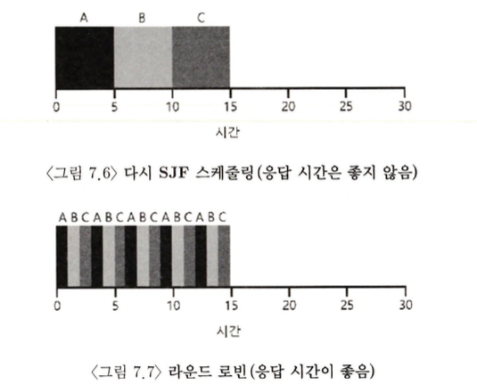
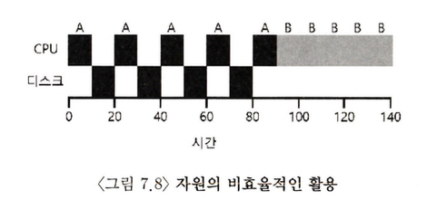
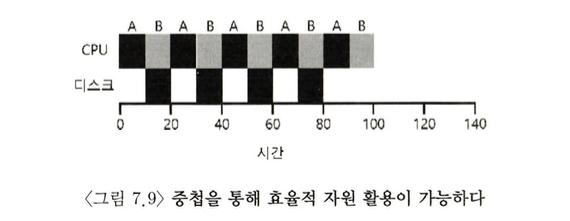

- 지금까지 살펴본 것은 프로세스를 실행시키기 위한 문맥 교환 등의 저수준 기법이고, 이제부턴 운영체제 스케줄러의 고수준 정책에 관해서 이해가 필요하다

### 워크로드에 대한 가정

- 프로세스가 동작하는 일련의 행위를 워크로드(workload)라 한다
- 적절한 워크로드의 선정은 스케줄링 정책 개발에 매우 중요한 부분이다. 워크로드에 대한 이해도 높을수록, 그에 최적화된 스케줄링 정책을 정교하게 개발할 수 있기 떄문이다
- 이번 장에서 사용할 워크로드는 현실과는 거리가 좀 있다. 하지만, 이번장의 내용을 다루는 데에는 큰 문제가 없다
- 앞으로 진도가 나가면서 점차 현실적인 워크로드 를 사용할 것이다. 최종적으로 **제대로 동작하는 스케줄링 정책**을 만들게 될 것이다
- 가정
  1.  모든 작업은 같은 시간 동안 실행된다
  2.  모든 작업은 동시에 도착한다
  3.  작업은 일단 시작하면 최종적으로 종료될 때까지 실행된다
  4.  모든 작업은 CPU만 사용한다(즉, 입출력을 수행하지 않는다)
  5.  각 작업의 실행 시간은 사전에 알려져 있다
- 스케줄러가 *실행 시간*을 포함하여 모든 것을 다 알 수 있다는 매우 이상적인 가정이다

### 1. 스케줄링의 평가 기준 : 반환 시간

- 스케줄링 정책의 평가를 위해 스케줄링 평가 항목(scheduling metric)을 결정해야 한다
- 다양한 평가 기준이 존재한다

1.  반환 시간(turnaround time)



- "작업이 완료된 시각"에서 "작업이 도착한 시각"을 뺀 시간을 의미한다.
- 여기에서는 모든 작업은 동시에 도착한다고 가정했으므로 `arrival = 0`으로 생각할 수 있다. 즉, `turnaround = completion` 이다. 이 가정은 완화해 나갈 것이다.
- 성능 측면에서의 평가 기준이다. 또 다른 평가 기준으로는 공정성이 있다. 성능과 공정성은 서로 상충(trade-off)되는 평가 지표이다.

### 1-1. 선입선출(FIFO, First In First Out)

- 가장 기본적인 알고리즘은 선입선출이다
- 장점 : 단순하다. 구현하기 쉽다.



- 세 작업의 평균 반환 시간은 20((10 + 20 + 30) / 3)이다
- 1번 가정을 완화하여, *"모든 작업이 같은 시간 동안 실행되지 않은 경우"*를 생각해보자



- 세 작업의 평균 반환 시간은 110((100 + 110 + 120) / 3)으로 늘어났다.
- convoy effect : CPU를 많이 필요로 하지 않는 프 로세스들이, CPU를 오랫동안 사용하는 프로세스가 끝나기를 기다리는 현상을 말한다.
- e.g. 나는 음료수 한병만 계산하면 되는데, 앞사람이 카트 세 개에 물건을 가득 싣고, 계산을 기다리는 경우

### 1-2. 최단 작업 우선(SJF, Shortest Job First)

- 선입선출에서 발생하는 convoy effect를 해결하는 알고리즘이다
- 가장 짧은 실행 시간을 가진 작업을 먼저 실행시킨다



- 세 작업의 평균 반환 시간은 50((10 + 20 + 120) / 3)으로 감소하였다
- 모든 작업이 동시에 도착한다면 SJF가 최적(optimal)의 스케줄링 알고리즘임을 증명할 수 있다
- 하지만 여전히 비현실적인 가정을 토대로 하고 있다
- 2번 가정을 완화하여 *"모든 작업은 동시에 도착하지 않는 경우"*를 생각해보자



- B와 C가 A 바로 뒤에 도착한다고 하더라도 A가 끝날 때까지 기다릴 수밖에 없어서 이전의 convoy 문제가 다시 발생한다
- 세 작업의 평균 반환 시간은 103.33((100 + (110 - 10) + (120 - 10)) / 3)으로 다시 증가하였다
- 아직까지는 3번 가정(_"작업은 끝날 때까지 계속 실행된다"_)에 의해 비선점형(non-preemptive) 스케줄러를 가정한다

### 1-3. 최소 잔여시간 우선(STCF, Shortest Time-to-Completion First)

- 위의 문제를 해결하기 위해서는 3번 가정을 완화하여 _"작업은 실행 도중에 중단될 수 있어야 한다"_
- 타이머 인터럽트와 문맥 교환이 가능한 상황이라면, B나 C가 도착했을 때, 스케줄러는 **하던 일을 중지하고 다른 작업으로 문맥 교환이 가능하다**



- 새로운 작업이 도착하면, 이 스케줄러는 현재 실행중인 작업의 잔여 실행 시간과 새로운 작업의 잔여 실행 시간을 비교하여, 잔여 실행 시간이 가장 작은 작업을 스케줄한다.
- B나 C가 도착한 경우 A가 실행중이지만, A의 실행을 중지하고 B와 C를 먼저 실행한다(최소 잔여시간이 더 적기 때문에)
- 세 작업의 평균 반환 시간은 50(((120 - 0) + (20 - 10) + (30 - 10)) / 3)으로 줄어들었다
- 아직까지는 최적의 스케줄링 알고리즘이라고 생각할 수 있다

### 2. 새로운 평가 기준 : 응답 시간

- 작업의 길이를 미리 알고 있고, 작업이 오직 CPU만 사용하며, 평가 기준이 반환 시간 하나라면, STCF는 매우 훌륭한 정책이다
- 초기 일괄처리 컴퓨터 시스템에서는 이러한 스케줄링 알고리즘이 의미가 있었다
- 시분할 컴퓨터의 등장이 모든 것을 바꾸었다. 이제 사용자는 터미널에서 작업하게 되어 시스템에게 상호작용을 원활히 하기 위한 성능을 요구하게 되었다
  - 이제는 모든 작업이 완료될 때까지 기다리는 것이 아니라
  - 터미널에서 언제든지 새로운 작업을 실행할 수 있어야 하게 되었다
  - 시분할(time-sharing) 기법을 이용할 수 있음
- 응답 시간(response time)이라는 새로운 평가 기준이 태어나게 된다.

2. 응답 시간(response time)



- "처음으로 스케줄 될 때까지의 시각"에서 "작업이 도착한 시각"을 뺀 시간으로 정의된다
- "상호작용" 측면에서 중요한 요소이다
- cf> 반환 시간은 "작업이 완료된 시각에서 작업이 도착한 시각을 뺀 시간"
- STCF를 비롯하여 비슷한 류의 정책들은 응답 시간이 상대적으로 길다
- 반환 시간 기준으로는 훌륭하지만, 응답 시간과 상호작용 기준으로는 나쁘다
- e.g. 3개의 작업이 동시에 도착한 경우, 세 번째 작업은 딱 한번 스케줄 되기 위해 먼저 실행된 두 작업이 완전히 끝날 때까지 기다린다

- 지금까지는 반환 시간 기준으로 최적의 알고리즘을 설계했다면, 이제부터는 응답 시간을 기준으로 최적의 알고리즘을 생각해본다

### 2-1. 라운드 로빈(RR, Round-Robin)

- 응답 시간 문제를 해결하기 위하여 라운드 로빈 스케줄링이라 불리는 스케줄링 알고리즘을 도입한다
- 기본 발상은 간단하다. 일정 시간 동안 실행한 후 실행 큐의 다음 작업으로 전환한다
- 이때 작업이 실행되는 일정 시간을 타임 슬라이스(time slice) 또는 스케줄링 퀀텀(scheduling quantum) 이라 부른다
- 단, 타임 슬라이스의 길이는 타이머 인터럽트 주기의 배수여야 한다
- 타임 슬라이스의 길이는 RR에게 매우 중요하다. 즉, 타임 슬라이스가 짧을수록, 응답 시간이 짧아지기 때문에 RR의 성능은 더 좋아진다
- 그렇다고 너무 짧게 지정하면, 오히려 문맥 교환 비용이 전체에 미치는 영향이 증가하기 떄문에 오히려 오버헤드가 더 커져 성능이 하락하는 문제가 발생한다
  - 문맥 교환 비용에는 레지스터를 저장/복원하는 작업만 있는 것이 아니다
  - CPU 캐시, TLB, 분기 예측 등을 비롯하여 다른 하드웨어에도 프로그램과 관련된 다양한 작업 정보들이 저장되어 있다
  - 그렇기 때문에 문맥 교환은 매우 큰 비용을 가진다
- 문맥 교환 비용을 시간 단위로 측정하고, 타임 슬라이스도 시간 단위로 측정하여 비율로써 효율을 측정한다
  - e.g. 타임 슬라이스 10ms, 문맥 교환 시간 1ms일 때 "10%" 시간이 문맥 교환에 사용되는 것이다



- RR의 세 작업의 평균 응답 시간은 1((0 + 1 + 2) / 3)이다
- 반면, SJF의 세 작업의 평균 응답 시간은 5((0 + 5 + 10) / 3)이다. 다른 작업을 실행하기 전에 각 작업을 종료할 때까지 실행하기 때문이다

- 응답 시간이 유일한 평가 기준인 경우 RR은 매우 훌륭하다. 하지만 반환 시간도 같이 평가될 경우 그렇지 않다
- 위에서 구할 수 있는 RR의 세 작업의 평균 반환 시간은 14((13 + 14 + 15) / 3)이다. 평균 반환 시간은 가장 느린 축에 속한다고 할 수 있다
- RR과 같은 공정한 정책, 즉 작은 시간 단위로 모든 프로세스에게 CPU를 분배하는 정책은 반환 시간과 같은 평가 기준에서는 성능이 당연히 나쁠 수 밖에 없다
  - 불공정하게 한다면 하나의 작업을 끝까지 실행하고 종료할 수 있지만 나머지 작업들에 대한 응답 시간은 포기해야 한다
  - 반대로 공정성을 더 중히 여긴다면 응답 시간은 줄 어들지만 반환 시간은 나빠지게 된다
  - SJF, STCF : 반환 시간 측면에서는 좋은 성질을 보이지만(불공정성), 응답 시간은 좋지않다
  - RR : 응답 시간 측면에서는 좋지만(공정성), 반환시간 측면에서는 좋지 못한 특성을 갖고 있다
- 또한 여전히 4번 가정과 5번 가정은 비현실적인 가정이다

### 입출력 연산의 고려

- 4번 가정을 완화하여 *"입출력을 수행할 수 있는 경우"*를 생각해보자
- 아무런 입력과 출력이 없는 프로그램의 실행은 아무 의미가 없다
- 현재 실행중인 프로세스가 **입출력 작업을 요청한 경우** 스케줄러는 다음에 어떤 작업을 실행할지를 결정해야 한다. 스케줄러는 그 시간 동안 실행될 다른 작업을 스케줄 해야 한다
- 마찬가지로 스케줄러는 **입출력 완료 시에도** 의사 결정을 해야 한다
- 이 때, 운영체제는 각 작업을 어떻게 처리해야 하는가?




- STCF 스케줄러를 이용하여 두개의 작업 A, B를 처리하고자 한다.
- 분할된 A의 각 10 msec 작업을 독립적인 작업으로 간주한다면, STCF 스케줄러는 가장 짧은 작업을 선택하기 때문에 스케줄러는 A를 먼저 실행시키고, B를 다음에 실행시킨다
- 또한, STCF는 타이머 인터럽트와 문맥 교환이 가능하기 때문에 A가 BLOCKED 상태로 바뀔 때, 프로세스 B를 실행할 수 있다
- 이러한 과정을 통해 하나의 프로세스가 입출력 완료를 대기하는 동안, 다른 프로세스가 CPU를 사용하여 연산의 중첩이 가능해지고, 시스템 사용률을 향상시킬 수 있다
- 즉, **각 CPU 버스트를 하나의 작업으로 간주함으로써** 스케줄러는 대화형 프로세스가 더 자주 실행되는 것을 보장한다.
  - 스케줄러는 **I/O 작업(입출력 연산)이 발생할 때마다 다른 프로세스를 실행할 수 있도록 하여, 사용자와의 상호 작용에 빠른 응답성을 제공**할 수 있다
  - 이러한 대화형 작업이 입출력을 실행하는 동안 *다른 계산위주의 작업*들이 실행된다
  - 결과적으로 CPU의 이용률이 더 높아진다
- 그러므로 I/O 작업을 고려하는 것은 SJF/STCF에서나 RR에서나 크게 문제가 되지 않는다

### 만병통치약은 없다

- 5번 가정 _"작업의 실행 시간은 사전에 알려져있다"_ 는 모든 가정 중 가장 비현실적인 가정이다
- 일반적인 운영체제에서(우리가 현재 고려 중인 것과 같은), 작업의 길이를 미리 알 수 있는 길은 없다
- 아무런 사전 지식 없이 SJF/STCF 처럼 행동하는 알고리즘을 구축할 수 있을까?
  - 미래 동작을 예측하는 방법을 사용한다
  - 특히, 프로세서의 미래 동작을 예측함에 있어 과거의 프로세스 동작 이력을 반영하는 방식으로 이 문제를 해결한다
- 여기에 추가적으로, 응답 시간 개선을 위하여, RR 스케줄러의 아이디어를 도입하는 방법은 없을까?

### 요약

- 우리는 스케줄링의 기본적인 개념과 두 종류의 접근법을 살펴보았다
- 1. 남아있는 작업 중 실행 시간이 제일 짧은 작업을 수행하고, 평균 반환 시간을 최소화한다(STCF)
- 2. 모든 작업을 번갈아 실행시키고 응답 시간을 최소화한다(RR)
- 둘은 trade-off 이므로, 적절한 절충이 필요할 것 같다
- CPU 스케줄링에 입출력 연산을 어떻게 반영되어야 하는지도 보았다
  - 입출력 연산(CPU 버스트)를 하나의 작업으로 간주하고
  - I/O 작업이 발생할 때마다 문맥 교환이 가능하게 한다
  - 이 때 실행되는 작업은 계산 위주의 작업이다
- 현실에서는 5번 가정을 이용할 수 없으므로 과거의 프로세스 동작 이력을 반영하는 프로세스 미래 동작을 예측한다
- 멀티 레벨 피드백 큐(multi-level feedback queue)

### 숙제

1. 길이가 200인 세 개의 작업을 SJF와 FIFO 스케줄링 방식으로 실행할 경우 응답 시간과 반환 시간을 계산하시오.

<200, 200, 200>

FIFO

- 반환 시간 : 400((200 + 400 + 600) / 3)
- 응답 시간 : 200((0 + 200 + 400) / 3)

SJF

- 반환 시간 : 400((200 + 400 + 600) / 3)
- 응답 시간 : 200((0 + 200 + 400) / 3)

<169, 152, 85>

FIFO

- 반환 시간 : 298.67((169 + 321 + 406) / 3)
- 응답 시간 : 163.33((0 + 169 + 321) / 3)

SJF

- 반환 시간 : 242.67((85 + 237 + 406) / 3)
- 응답 시간 : 107.33((0 + 85 + 237) / 3)

2. 같은 조건이지만 작업의 길이가 각각 100, 200 및 300일 경우에 대해 계산하시오.

<300, 100, 200>

FIFO

- 반환 시간 : 433.33((300 + 400 + 600) / 3)
- 응답 시간 : 233.33((0 + 300 + 400) / 3)

SJF

- 반환 시간 : 333.33((100 + 300 + 600) / 3)
- 응답 시간 : 133.33((0 + 100 + 300) / 3)

3. 2번과 같은 조건으로 타임 슬라이스가 1인 RR 스케줄러에 대해서도 계산하시오.

<300, 100, 200>

RR

- 반환 시간 : 466.67((300 + 500 + 600) / 3)
- 응답 시간 : 1((0 + 1 + 2) / 3)

4. SJF와 FIFO가 같은 반환 시간을 보이는 워크로드의 유형은 무엇인가?

- job의 길이가 모두 같을 때

5. SJF가 RR과 같은 응답 시간을 보이기 위한 워크로드와 타임 퀀텀의 길이는 무엇인가?

- job의 길이가 모두 같고, job의 길이와 타임 슬라이스의 길이가 같을 때

6. 작업의 길이가 증가하면 SJF의 응답 시간은 어떻게 되는가? 변화의 추이를 보이기 위해서 시뮬레이터를 사용할 수 있는가?

- 작업의 길이가 모두 증가하면 증가한다. 마지막 작업을 제외하고 길이가 변하지 않는다면 SJF의 응답 시간은 변하지 않는다.

```shell
$> python scheduler.py -p SJF -j 3 -m 10 -c
$> python scheduler.py -p SJF -j 3 -m 20 -c
$> python scheduler.py -p SJF -j 3 -m 50 -c
$> python scheduler.py -p SJF -j 3 -m 100 -c
$> python scheduler.py -p SJF -j 3 -m 200 -c
$> python scheduler.py -p SJF -j 3 -m 500 -c
```

7. 타임 퀀텀의 길이가 증가하면 RR의 응답 시간은 어떻게 되는가? N개의 작업이 주어졌을 때, 최악의 응답 시간을 계산하는 식을 만들 수 있는가?

- 타임 퀀텀의 길이가 증가하면 RR의 응답 시간은 증가한다. max([N개의 작업])
