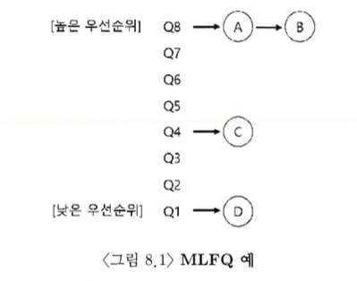
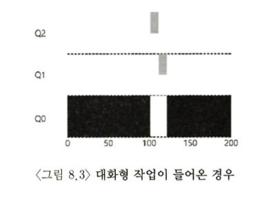
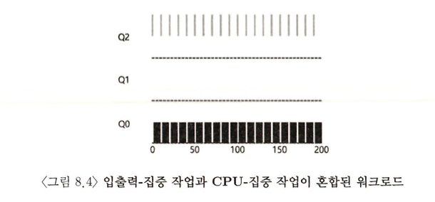
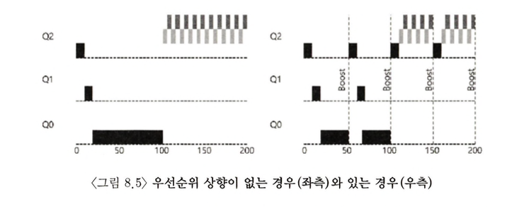
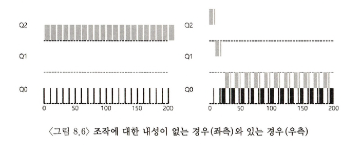

- **멀티 레벨 피드백 큐(Multi-level Feedback Queue, MLFQ) 스케줄러**는 Compatible Time-Sharing System(CTSS) 에 사용되 며 Corbato 등에 의 해 1962 년에 최초로 소개되었다
- MLFQ가 해결하려고 하는 기본적인 문제는 두 가지이다
  - 첫째, 짧은 작업을 먼저 실행시켜 반환 시간을 최적화하고자 한다
  - 둘째, MLFQ는 대화형 사용자(즉, 화면 앞에 앉아 바라보면서 프로세스의 종료를 기다리는 사용자) 에게 응답이 빠른 시스템이라는 느낌을 주고 싶었기 때문에 응답 시간을 최적화한다
- SJF나 STCF 같은 알고리즘은 작업의 실행 시간 정보를 필요로 하지만, 불행히도 운영 체제는 이 실행 시간을 미리 알 수 없다. 또한 RR과 같은 알고리즘은 응답 시간을 단축시키지만 반환 시간은 거의 최악이다
- **작업의 실행 시간에 대한 선행 정보 없이 대화형 작업의 응답 시간을 최소화하고 동시에 반환 시간을 최소화하는 스케줄러를 어떻게 설계할 수 있는가?**

### MLFQ: 기본 규칙

- MLFQ는 **1) 여러 개의 큐**로 구성되며, **2) 각각 다른 우선순위(priority level)**가 배정된다
- MLFQ는 실행할 프로세스를 결정하기 위하여 우선순위를 사용한다. 높은 우선순위를 가진 작업이, 즉 높은 우선순위 큐에 존재하는 작업이 선택된다
- 하나의 큐에는 둘 이상의 작업이 존재할 수 있다. 이들은 모두 같은 우선순위를 가진다. 이 작업들 사이에서는 라운드 로빈(Round-Robin, RR) 스케줄링 알고리즘이 사용된다
- MLFQ는 각 작업에 고정된 우선순위를 부여하는 것이 아니라 **각 작업의 특성에 따라 동적으로 우선순위를 부여**한다
  - e.g.
  - 어떤 작업이 키보드 입력을 기다리며 _반복적으로 CPU를 양보하면_ MLFQ는 해당 작업의 _우선순위를 높게 유지한다_
  - 한 작업이 _긴 시간 동안 CPU를 집중적으로 사용하면_ MLFQ는 해당 작업의 _우선순위를 낮춘다_
- MLFQ는 작업이 진행되는 동안 해당 작업의 정보를 얻고, 이 정보를 이용하여 미래 행동을 예측한다

> 규칙 1: Priority(A) > Priority(B) 이면, A가 실행된다 (B는 실행되지 않는다)

> 규칙 2: Priority(A) = Priority(B) 이면, A와 B는 RR 방식으로 실행된다

- MLFQ의 동작을 고려하면 스케줄러는 가장 높은 우선순위의 큐의 A와 B를 번갈아 실행할 것이다
- 불쌍한 작업 C와 D는 실행되지도 않는다
- 정적인 하나의 스냅 사진만으로는 MLFQ가 어떻게 동작하는지 알 수 없다
- 규칙 1과 2에는 작업의 우선순위가 어떻게 바뀔지에 대한 내용은 나와있지 않다
- 작업 우선순위가 **시간에 따라** 어떻게 변화하는지 알아보자

### 시도 1 : 우선순위의 변경

- 작업의 우선순위를 변경하는 것은 작업이 존재할 큐를 결정하는 것과 마찬가지다
- 우선순위를 변경하기 위해 워크로드의 특성을 반영해야 한다
- 작업들 중에는

  - **짧은 실행 시간을 갖는 CPU를 자주 양보하는 대화형 작업**과
  - **많은 CPU 시간을 요구하지만 응답 시간은 중요하지 않은 긴 실행 시간의 CPU 위주 작업**이
  - 혼재되어 있다

> 규칙 3: 작업이 시스템에 진입하면, 가장 높은 우선순위, 즉 맨 위의 큐에 놓여진다

> 규칙 4a: 주어진 타임 슬라이스를 모두 사용하면 우선순위는 낮아진다. 즉, 한 단계 아래 큐로 이동한다

> 규칙 4b: 타임 슬라이스를 소진하기 전에 CPU를 양도하면 같은 우선순위를 유지한다

- 스케줄러는 작업이 짧은 작업인지 긴 작업인지 알 수 없기 때문에 일단 짧은 작업이라고 가정하여 높은 우선순위를 부여한다
- 규칙 4a에 의해 짧은 작업이면 빨리 실행되고 종료되고, 짧은 작업이 아니라면 우선순위가 가장 낮은 큐로 가게된다
- 다시 말해서, 진짜 짧은 작업이면 빨리 실행되고 바로 종료할 것이다. 짧은 작업이 아니라면 천천히 아래 큐로 이동하게 되고 스스로 긴 배치형 작업이라는 것을 증명하게 된다
- **이러한 방식으로 MLFQ는 SJF를 근사할 수 있다**
- 즉, 짧은 작업인지를 알 수는 없지만, 위와 같은 규칙에 의해 짧은 작업을 먼저 실행하는 SJF와 비슷하다고 할 수 있다(반환 시간을 줄인다)

- 검정색은 오래 실행되는 CPU 위주(배치형) 작업, 회색은 짧은 대화형 작업이다

- 규칙 4b가 말하는 것처럼, 프로세스가 타임 슬라이스를 소진하기 전에 프로세서를 양도하면 같은 우선순위를 유지하게 한다
- 즉, 대화형 작업이 키보드나 마우스로부터 사용자 입력을 대기하며 자주 입출력을 수행하면 타임 슬라이스가 종료되기 전에 CPU를 양도하게 될 것이다

- 짧은 대화형 작업(회색)은 타임 슬라이스를 모두 소진하기 전에 CPU를 계속해서 양도하기 때문에 MLFQ 방식은 B를 가장 높은 우선순위로 유지한다
- 대화형 작업을 빨리 실행시킨다는 목표에 근접하게 된다(응답 시간을 줄인다)
- 반면, 긴 CPU 위주 작업(검정색)은 낮은 우선순위인 채로 대화형 작업이 끝나기를 기다리고 있다

- 하지만 이 방법은 심각한 결점을 갖는다
  1.  기아(starvation) 상태가 발생할 수 있다
      - 시스템에 너무 많은 대화형 작업이 존재하면 그들이 모든 CPU 시간을 소모하게 될 것이고
      - 따라서 긴 실행 시간 작업은 CPU 시간을 할당받지 못하는 문제가 발생할 수 있다
      - 긴 배치형 작업도 실행에서 아예 배제되는 것이 아니라 같이 진행이 되도록 만들어야 한다
  2.  CPU를 거의 독점하는 애플리케이션을 만들 수 있다
      - 타임 슬라이스가 끝나기 전에 아무 파일을 대상으로 입출력 요청을 내려 CPU를 양도한다
      - 그렇게 하면 같은 큐에 머무를 수 있고 따라서 더 높은 퍼센트의 CPU 시간을 얻게 된다
      - 제대로 된다면, 예를 들어 타임 슬라이스의 99%를 실행하고 CPU를 양도하게 되면 CPU를 거 의 독점할 수 있다
  3.  시간 흐름에 따라 특성이 변할 수 있다
  - CPU 위주 작업이 대화형 작업으로 바뀔 수 있다
  - 반대로, 대화형 작업이 CPU 위주 작업으로 바뀔 수도 있다
  - 현재 구현 방식으로는 그런 작업은 운이 없게도 다른 대화형 작업들과 같은 대우를 받을 수 없다

### 시도 2 : 우선순위의 상향 조정

- 규칙을 보완하여 기아 문제를 방지할 수 있는지 살펴보자
- 주기적으로 모든 작업의 우선순위를 상향 조정(boost)하여 CPU 위주 작업이 조금이라도 진행하는 것을 보장할 수 있다

> 규칙 5: 일정 기간 S가 지나면, 시스템의 모든 작업을 최상위 큐로 이동시킨다

- 규칙 5는 1, 3번 문제를 해결한다
- 첫째, 최상위 큐에 존재하는 동안 작업은 다른 높은 우선순위 작업들과 라운드 로빈 방식으로 CPU를 공유하게 되고 서비스를 받게 된다
- 둘째, CPU 위주의 작업이 대화형 작업으로 특성이 변할 경우 우선순위 상향을 통해 스케줄러가 변경된 특성에 적합한 스케줄링 방법을 적용한다
- 일정 기간 S는 얼마가 되어야 하는가?
- 부두 상수(voo-doo constants) : 너무 크면 긴 실행 시간을 가진 작업은 굶을 수 있으며 너무 작으면 대화형 작업이 적절한 양의 CPU 시간을 사용할 수 없게 된다

- 우선순위 상향(boost)가 없는 왼쪽 그림은, 긴 실행 시간 작업은 두 개의 짧은 작업이 도착한 이후에는 굶게 된다
- 우선순위 상향(boost)가 있는 오른쪽 그림은, 긴 실행 시간 작업도 꾸준히 진행된다는 것을 보장할 수 있으며, 50 msec 마다 상향되고 따라서 주기적으로 실행된다

### 시도 3 : 더 나은 시간 측정

- 아직 문제 2를 해결하지 못하였다. 스케줄러를 자신의 실행 프로그램에게 유리하게 동작하는 것을 어떻게 막을 수 있는가?
- 이러한 일을 가능하게 만든 주범은 규칙 4a와 4b이다
- 즉, 타임 슬라이스가 끝나기 전에 CPU를 양보하여 우선 순위를 유지가 가능하게 한다
- **해결책은 MLFQ의 각 단계에서 CPU 총 사용 시간을 측정하는 것이다**
- 즉, CPU 사용 시간을 누적하여 독점적으로 반복하여 사용하는 것을 막는다. 한 번의 CPU 사용마다 사용 시간이 초기화되지 않고 누적된 시간을 채우면 다음 우선순위 큐로 강등된다

> 규칙 4: 주어진 단계에서 시간 할당량을 소진하면 (CPU를 몇 번 양도하였는지 상관 없이), 우선순위는 낮아진다 (즉, 아래 단계의 큐로 이동한다).

- 조작에 대한 내성이 없는 왼쪽 그림은 짧은 대화형 작업(회색)이 CPU 사용 시간을 계속 초기화하며 최상위 우선순위 큐를 유지하고 있다. 이 때문에 긴 CPU 위주의 작업(검정색)은 실행되지 못한다
- 조작에 대한 내성이 있는 오른쪽 그림은 짧은 대화형 작업(회색)이 사용하는 CPU 사용 시간이 사용 횟수와 관계없이 누적되기 때문에 최상위 우선순위 큐를 계속하여 유지할 수 없다

> 규칙 1: Priority(A) > Priority(B) 이면, A가 실행된다 (B는 실행되지 않는다)

> 규칙 2: Priority(A) = Priority(B) 이면, A와 B는 RR 방식으로 실행된다

> 규칙 3: 작업이 시스템에 진입하면, 가장 높은 우선순위, 즉 맨 위의 큐에 놓여진다

> 규칙 4: 주어진 단계에서 시간 할당량을 소진하면 (CPU를 몇 번 양도하였는지 상관 없이), 우선순위는 낮아진다 (즉, 아래 단계의 큐로 이동한다).

> 규칙 5: 일정 기간 S가 지나면, 시스템의 모든 작업을 최상위 큐로 이동시킨다

### MLFQ 조정과 다른 쟁점들

- 적절한 변수 값을 설정해야 한다
  - 몇 개의 큐?
  - 큐당 타임 슬라이스의 크기?
  - 얼마나 자주 우선순위가 상향 조정되어야 하는가?
- 정답이 존재하지 않기 때문에, 워크로드에 대해 충분히 경험하고 계속 조정해 나가면서 균형점을 찾아야 한다
- 대부분의 MLFQ 기법들은 큐 별로 타임 슬라이스를 변경할 수 있다. **우선순위가 높은 큐는 보통 짧은 타임 슬라이스가 주어진다**
  - 높은 우선순위 : 대화형 작업들로 구성, 10ms 이하
  - 낮은 우선순위 : CPU 위주 작업들로 구성, 수백ms 이상
- Solaris
  - 프로세스의 우선순위가 일생 동안 어떻게 변하는지, 타임 슬라이스의 길이는 얼마인지, 작업의 우선순위는 얼마나 자주 상향되는지를 결정하는 테이블을 제공한다
  - 관리자는 이 테이블을 수정하여 스케줄러의 동작 방식을 바꿀 수 있다
  - 기본 설정 값 : 큐(60개), 타임 슬라이스 크기(20ms ~ 수백ms), 우선순위 상향 조정 주기(1초)
- FreeBSD
  - 작업의 현재 우선순위를 계산하기 위하여 프로세스가 사용한 CPU 시간을 기초로 한 공식을 사용한다
  - CPU 사용은 시간이 지남에 따라 감쇠되어 이 장에서 설명한 방식과는 다른 방식으로 우선순위 상향을 제공한다(감쇠-사용(decay-usage) 알고리즘)
- 일부 스케줄러

  - 가장 높은 우선순위를 운영체제 작업을 위해 예약해 둔다
  - 일반적인 사용자 작업은 시스템 내에서 가장 높은 우선순위를 얻을 수 없다
  - `nice` 명령어로 작업의 우선순위를 조절할 수 있다

### 요약

- Multi-level Feedback Queue

  - Multi-level Queue : 여러 개의 우선순위 큐
  - Feedback : 지정된 작업의 우선순위를 정하기 위하여 피드백을 사용(과거에 보여준 행동이 우선순위 지정의 지침이 된다)

- 특징
  - 작업의 특성에 대한 정보 없이, 작업의 실행을 관찰한 후 그에 따라 우선순위를 지정한다
  - 반환 시간과 응답 시간을 모두 최적화한다
  - 짧게 실행되는 대화형 작업에 대해서는 우수한 전반적인 성능을 제공한다(SJF/ STCF와 유사)
  - 오래 실행되는 CPU-집중 워크로드에 대해서는 공정하게 실행하고 조금이라도 진행되도록 한다

### 숙제
