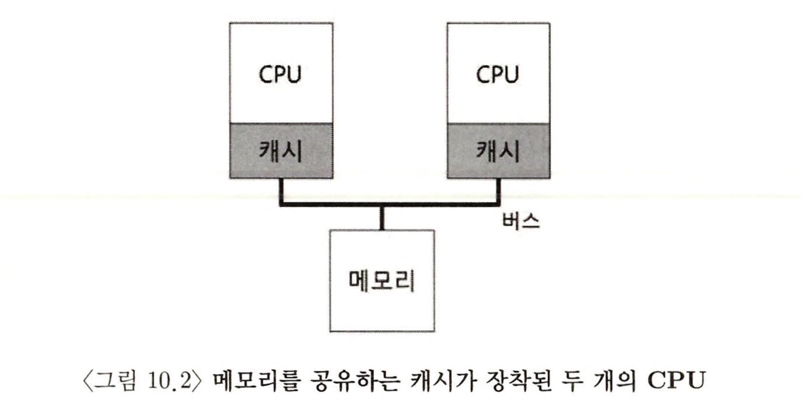
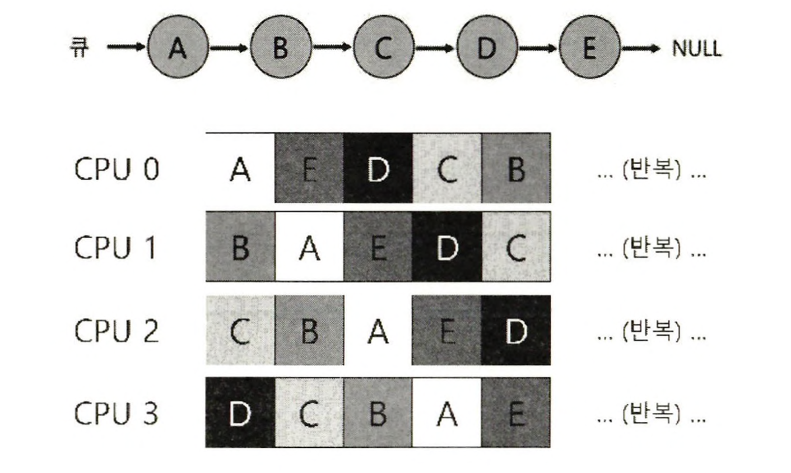
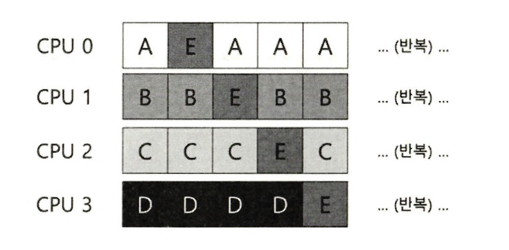
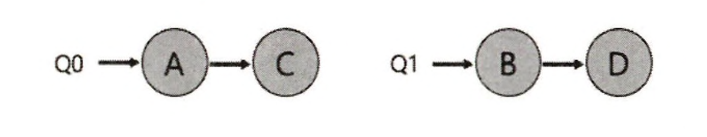
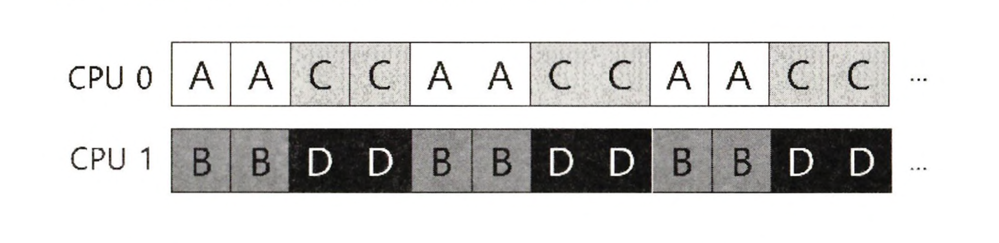
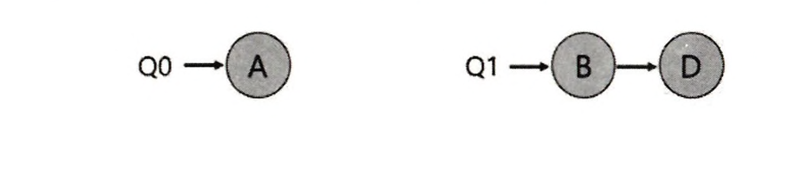
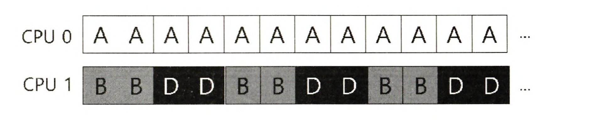
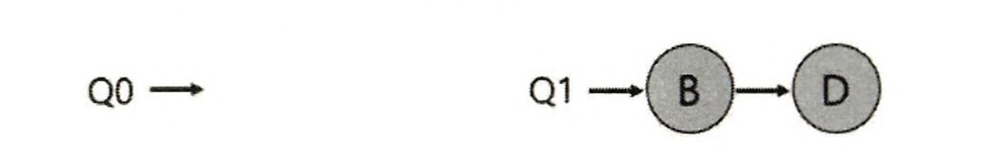
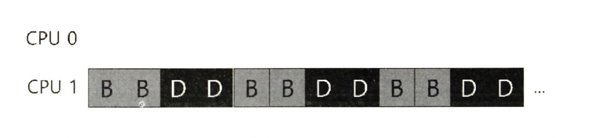
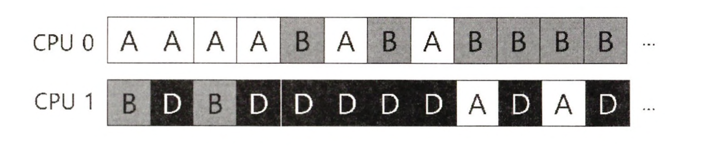

- 멀티프로세서 스케줄링(multiprocessor scheduling) 의 기본을 소개한다
- 고사양 컴퓨터에만 존재했던 멀티프로세서(multiprocessor) 시스템은 일반적이 되었으며, 데스크톱 컴퓨터, 노트북, 심지어 모바일 장치에도 사용되고 있다
- 다중 CPU 시대가 오면서 많은 문제가 발생하였다. 가장 중요한 것은 전통적 응용 프로그램은 (예, 당신이 작성한 C 프로그램) 오직 하나의 CPU만 사용한다는 것이다
  - 더 많은 CPU를 추가해도 더 빨리 실행되지 않는다
  - 이 문제를 해결하려면 응용 프로그램을 병렬(parallel)로 실행되도록 다시 작성해야 한다. 보통 쓰레드를 이용한다
  - 멀티 쓰레드 응용 프로그램은 작업을 여러 CPU에 할당하며, 따라서 더 많은 수의 CPU가 주어지면 더 빠르게 실행된다
- **응용 프로그램뿐 아니라 운영체제가 새로이 직면한 문제는 멀티프로세서 스케줄링이다**
- 운영체제는 여러 CPU에 작업을 어떻게 스케줄 해야 하는가?
- 어떤 새로운 문제가 등장하는가? 예전 기술을 적용할 것인가 아니면 새로운 아이디어가 필요한가?

### 배경 : 멀티프로세서 구조

- 멀티프로세서 스케줄링에 대한 새로운 문제점을 이해하기 위해서는 **단일 CPU 하드웨어와 멀티 CPU 하드웨어의 근본적인 차이에 대한 이해가 필요하다.**
  - 1. 다수의 프로세서 간의 데이터의 공유
  - 2. 하드웨어 캐시의 사용 방식에서 근본적인 차이가 발생한다

### 1. 캐시 일관성 문제(cache coherence)

- 단일 CPU 시스템에는 하드웨어 캐시 계층이 존재한다. 이 캐시는 프로그램을 빠르게 실행하기 위해 존재한다. 캐시는 메인 메모리에서 자주 사용되는 데이터의 복사본을 저장하는 작고 빠른 메모리이다.
  - 프로그램이 처음 load 명령어를 실행할 때, 데이터가 메인 메모리에 존재하므로 데이터를 가져오는 데 긴 시간이 소모된다
  - 데이터가 다시 사용될 것으로 예상한 프로세서는 읽은 데이터의 복사본을 CPU 캐시에 저장한다
  - 프로그램이 나중에 다시 같은 데이터를 가져오려고 하면, CPU는 우선 해당 데이터가 캐시에 존재하는지 검사한다
  - 캐시에 존재하기 때문에 데이터는 훨씬 빨리 접근되고(수 nano second) 프로그램은 빨리 실행한다
- 캐시는 지역성(locality)에 기반한다
  - 지역성에는 시간 지역성(temporal locality) 과 공간 지역성(spatial locality)의 두 종류가 있다
  - 시간적 지역성의 기본 아이디어는 데이터가 한번 접근되면 **가까운 미래에 다시 접근되기 쉽다는 것**이다
    - e.g. *루프에서 여러 번 반복해서 접근*되는 변수 또는 명령어
  - 공간적 지역성의 기본 아이디어는 프로그램이 **주소 x의 데이터를 접근하면 x 주변의 데이터가 접근되기 쉽다는 것**이다
    - e.g. *전체 배열을 차례대로 접근*하는 프로그램 또는 순차적으로 실행되는 명령어
  - _지역성에 기반하여_ 하드웨어 시스템은 캐시에 어떤 데이터를 저장할지 비교적 정확하게 추측을 할 수 있고, 캐시는 잘 작동한다



- 하나의 시스템에 1) 여러 프로세서가 존재하고 2) 하나의 공유 메인 메모리가 있을 때 어떤 일이 일어나는가?
- 알려진 것처럼 멀티프로세서 시스템에서 캐시를 사용하는 것은 훨씬 복잡하다
- 캐시 일관성 문제(cache coherence)
  - CPU 1에서 실행 중인 프로그램이 주소 A를(D 값을) 읽는다고 가정하자
  - 데이터가 CPU 1 캐시에 존재하지 않기 때문에 시스템은 _메인 메모리로부터_ 데이터를 가져오고 값 D를 얻는다
  - 그런 후 프로그램은 *주소 A의 값을 변경*한다
  - 변경은 캐시에 존재하는 값만 D'으로 갱신한다
  - 메모리에 데이터를 쓰는 것은 시간이 오래 걸리므로 _메인 메모리에 기록하는 것은 보통 나중에 한다_
  - 운영체제가 프로그램의 실행을 중단하고 CPU 2로 이동하기로 결정한다고 가정하자
  - 프로그램은 주소 A의 값을 다시 읽는다
  - CPU 2의 캐시에는 그러한 데이터가 존재하지 않고 따라서 시스템은 메인 메모리에서 데이터를 가져온다. 이때 D'이 아니라 옛날 값인 D를 가져온다.
  - 이런!
- 기본적인 해결책은 하드웨어에 의해 제공된다
- "하드웨어는 메모리 주소를 계속 감시하고, 항상 _올바른_ 순서로 처리되도록 시스템을 관리한다"
  - 특히, 여러 개의 프로세스들이 하나의 메모리에 갱신할 때에는 항상 공유되도록 한다
- 버스 기반 시스템에서는 **버스 스누핑(bus snooping)** 이라는 오래된 기법을 사용한다
  - 이 용어는 데이터 버스 상에서 정보를 감시하거나 가로채는 것을 의미합니다
  - 캐시는 자신과 메모리를 연결하는 *버스의 통신 상황을 계속 모니터링*한다
  - 캐시 데이터에 대한 변경이 발생하면, 1) 자신의 복사본을 무효화(invalidate) 시키거나(즉, 자신의 캐시에서 삭제) 2) 정보를 가로채 갱신(새로운 값을 캐시에 기록) 한다
  - 나중 쓰기 (write-back) 캐시는 메인 메모리에 쓰기 연산이 지연되기 때문에 캐시 일관성 유지 문제를 훨씬 복잡하게 만든다

### 2. 동기화를 잊지 마시오

- 일관성 유지에 대한 모든 일을 캐시가 담당한다면, 프로그램 또는 운영체제 자신은 공유 데이터를 접근할 때 걱정할 필요가 있을까?
- 불행하게도 대답은 예이고 이 책의 “병행성” 에 관한 부분에서 자세하게 설명된다
- CPU들이 동일한 데이터 또는 구조체에 접근할 때 (특히, 갱신), 올바른 연산 결과를 보장하기 위해 락과 같은 상호 배제를 보장하는 동기화 기법이 많이 사용된다
- 락-프리(lock-free) 데이터 구조 등의 다른 방식은 복잡할 뿐 아니라 특별한 경우에만 사용 된다
- 캐시의 일관성을 보장하는 프로토콜이 존재한다 하더라도 _락이 없이는_ 항목의 추가나 삭제가 제대로 동작하지 않을 것이다.
- **구조체를 원자적으로 갱신하기 위해서는 락이 필요하다**

```c
typedef struct __Node_t {
  int               value;
  struct  __Node_t  *next;
} Node_t;

int List_Pop() {
  Node_t  *tmp = head;          // 이전 head를 기억...
  int     value = head->value;  // 이전 값도 기억

  head = head->next;            // head를 다음 포인터로 이동
  free(tmp);                    // 이전 head 동적 할당 해제
  return value;                 // head의 값을 반환
}
```

- 연결 리스트에서 원소 하나를 삭제하는 코드
- 두 CPU의 쓰레드가 동시에 이 루틴으로 진입한다고 가정하자
- 쓰레드 1 이 첫 번째 행을 실행하면 head의 현재 값을 tmp에 저장한다. 그런 후 쓰레드 2가 첫 번째 행을 실행하면 역시 head의 같은 값을 tmp에 저장한다. tmp는 스택에 할당된다.
- 각 쓰레드는 동일한 헤드 원소를 제거하려고 한다 : `free(tmp)`
- expect : 앞의 두 원소가 차례대로 동적 할당 해제하고, 다른 원소의 value 반환
- output : 같은 원소를 두 번 동적 할당 해제 해제하고, 같은 원소의 value 반환

- 물론 해결책은 락(lock)을 사용하여 올바르게 동작하도록 만드는 것이다
  - e.g.
  - mutex를 할당하고 (예, `pthread_mutex_t m;`)
  - 루틴의 시작에 `lock(&m);`, 마지막에 `unlock(&m);` 을 추가하면 문제를 해결할 수 있다
- 이러한 접근 방식이 문제가 없는 것은 아니다. 특히, 성능 측면에서 문제가 있다
- _CPU의 개수가 증가할수록 동기화된 자료 구조에 접근하는 연산은 매우 느리게 된다_

### 3. 마지막 문제점 : 캐시 친화성

- 멀티프로세서 캐시 스케줄러에서의 마지막 문제점은 캐시 친화성(cache affinity) 이다
- CPU에서 실행될 때 *프로세스는 해당 CPU 캐시와 TLB에 상당한 양의 상태 정보*를 올려 놓게 된다
- 다음 번에 프로세스가 실행될 때 동일한 CPU에서 실행되는 것이 유리하다. 해당 CPU 캐시에 일부 정보가 이미 존재하고 있기 때문에 더 빨리 실행될 것이기 때문이다.
- 반면 프로세스가 매번 다른 CPU에서 실행되면 실행할 때마다 필요한 정보를 캐시에 다시 탑재해야만 하기 때문에 프로세스의 성능은 더 나빠질 것이다
- 멀티프로세서 스케줄러는 스케줄링 결정을 내릴때 캐시 친화성을 고려해야 한다. **가능한 한 프로세스를 동일한 CPU에서 실행하려고 노력하는 방향으로 결정해야 한다**

### 단일 큐 스케줄링

- 멀티프로세서 시스템의 스케줄러 개발 방법에 대해 논의해 보자
- 가장 기본적인 방식은 단일 프로세서 스케줄링의 기본 프레임워크를 그대로 사용하는 것이다. 이러한 방식을 **단일 큐 멀티프로세서 스케줄링(single queue multiprocessor scheduling, SQMS)**이라고 부른다
- 장점) 단순함
  - 기존 정책을 다수 CPU에서 동작하도록 하는 데는 많은 변경이 필요치 않다
  - 예를 들어, CPU가 2개라면 실행할 작업 두 개를 선택한다
- 단점)

  - 1. 확장성(scalability) 결여

    - 스케줄러가 다수의 CPU에서 제대로 동작하게 하기 위해 _코드에 일정 형태의 락을 삽입한다_
    - 락은 SQMS 코드가 단일 큐를 접근할 때 (즉, 실행시킬 다음 작업을 찾을 때) 올바른 결과가 나오도록 한다
    - **불행히도 락은 성능을 크게 저하시킬 수 있고, 시스템의 CPU 개수가 증가할수록 더욱 그렇다**
    - 단일 락에 대한 경쟁이 증가할수록 시스템은 락에 점점 더 많은 시간을 소모하게 되고 실제 필요한 일에 쓰는 시간은 줄어들게 된다

  - 2. 캐시 친화성 결여

    

    - 실행할 5개의 작업이 있고 (A, B, C, D, E) 4개의 프로세서가 있다고 가정하자
    - 세로 방향으로 CPU 0 부터 CPU 3까지 A ~ E 작업을 하나씩 선택하여 실행한다
    - A(0) -> B(1) -> C(2) -> D(3) -> E(0) -> A(1) -> B(2) ...
    - 캐시 친화성 관점에서 보면 잘못된 선택을 하는 것이다. 각 작업은 CPU를 옮겨 다니게 되기 때문이다
    - 이 문제의 해결을 위해 대부분의 SQMS 스케줄러는 가능한 한 프로세스가 동일한 CPU에서 재실행될 수 있도록 시도한다

    

    - 이 배열에서 A부터 D까지의 작업은 각각 자신의 프로세서에서 실행된다
    - 오직 E 만이 하나의 프로세서에서 다른 프로세서로 이동한다
    - 그렇게 함으로써 대부분의 작업 에게 친화성을 보존하고 있다
    - **그러나 이러한 기법은 구현이 복잡해질 수 있다.**

- 요약
  - 장점 : 기존의 단일 CPU 스케줄러가 있다면 하나의 큐밖에 없기 때문에 구현이 간단하다
  - 단점 : 동기화 오버헤드 때문에 이 방식은 확장성이 좋지 않고 캐시 친화성에 문제가 있다

### 멀티 큐 스케줄링

#### 단일 큐 스케줄러의 문제 해결

- 단일 큐 스케줄러로 인한 문제 때문에 _일부 시스템은 멀티 큐, 예를 들어, CPU마다 큐를 하나씩 둔다_
- **멀티 큐 멀티프로세서 스케줄링 (multi-queue multiprocessor scheduling, MQMS)**
- MQMS에서 기본적인 스케줄링 프레임워크는 여러 개의 스케줄링 큐로 구성된다
- 각 큐는 아마도 라운드 로빈 같은 특정 스케줄링 규칙을 따를 것이고 물론 어떤 스케줄링 기법도 사용 가능하다
- 순서
  - 작업이 시스템에 들어가면 _하나의_ 스케줄링 큐에 배치된다
  - _배치될 큐의 결정은 적당한 방법을 따른다_ (예를 들어, *무작위*로 할 수도 있고 또는 *다른 큐보다 적은 수의 작업이 있는 큐*로 배치할 수도 있다)
  - 그 후에는 각각이 _독립적으로 스케줄 되기 때문에_ 단일 큐 방식에서 보았던 정보의 공유 및 동기화 문제를 피할 수 있다
- e.g.

  

  - 2개의 CPU(CPU 0과 CPU 1)와 A, B. C, D 네 개의 작업이 시스템에 존재한다고 가정하자
  - 큐 스케줄링 정책에 따라 각 CPU는 현재 2개씩의 작업을 가지고 있다

  

  - 라운드 로빈의 경우 위와 같은 스케줄이 생성될 수 있다

- MQMS가 SQMS의 문제점을 해결한다
- 먼저, 확장성이 좋다. CPU 개수가 증가할수록, 큐의 개수도 증가하므로 **락과 캐시 경합(cache contention)은 더 이상 문제가 되지 않는다**
  - why?
  - 같은 큐에서 처리하기 때문에?
- 또한, MQMS는 본질적으로 **캐시 친화적**이다. 작업이 같은 CPU 에서 계속 실행되기 때문에 캐시에 저장된 내용을 재사용하는 이점을 얻게 된다.

#### 새로운 문제 : 워크로드의 불균형 문제

- 하지만 새로운 문제가 발생한다
- 멀티 큐 기반 방식의 근본적인 문제는 **워크로드의 불균형(load imbalance)이다**
- 앞에 예에서 하나의 작업(C)가 종료되었다고 하자




- A가 B와 D보다 2배의 CPU를 차지하고 이는 우리가 원하는 결과가 아니다
- 설상가상으로 A와 C가 모두 종료하여 B와 D만 남게 되었다고 가정하면, CPU 0은 놀게 된다




- 이 질문에 대한 당연한 답은 작업을 이리저리로 이동시키는 것이다. 우리는 이 기술을 **이주(migration)**라고 부른다. 작업을 한 CPU에서 다른 CPU로 이주시킴으로써 워크로드 균형을 달성한다.

#### 해결 방법 : 이주

- 두 번째 경우처럼 CPU 0이 놀고 있는 경우, CPU 1의 작업을 옮기면 해결된다
- 하지만 첫 번째 경우는 조금 더 복잡하다. 한 번의 이주만으로는 해결되지 않는다
- **답은 작업들을 지속적으로 이주시키는 것이다**



- 처음에 A는 CPU 0에 혼자 있고 B와 D는 CPU 1에서 번갈아 실행되고 있다
- 몇 번의 타임 슬라이스 후 B는 CPU 0로 이주하여 A와 경쟁한다
- 그동안 D는 CPU 1에서 몇 개의 타임 슬라이스 동안 혼자 실행된다
- 따라서 워크로드의 균형이 맞게 된다

- 물론 가능한 많은 다른 이주 패턴이 존재한다. **이주 필요 여부를 어떻게 결정할까?**
- 한 가지 기본적인 접근 방식은 **작업 훔치기 (work stealing)**라는 기술이다
  - 작업 훔치기에서는 작업 의 개수가 낮은 (소스) 큐가 가끔 다른 (대상) 큐에 훨씬 많은 수의 작업이 있는지를 검사한다
  - 대상 큐가 소스 큐보다 더 가득 차 있다면 워크로드 균형을 맞추기 위해 소스는 대상에서 하나 이상의 작업을 가져온다
- _큐를 너무 자주 검사하게 되면 높은 오버헤드로 확장성에 문제가 생기게 된다_
  - 확장성은 멀티 큐 스케줄링의 가장 중요한 목적이다
- _반면 다른 큐를 자주 검사하지 않으면 심각한 워크로드 불균형을 초래할 가능성이 있다_
- 시스템 정책 설계에 흔히 있는 일로서 적절한 값을 찾아내는 것은 마법의 영역이다.

### Linux 멀티프로세서 스케줄러

- Linux 커뮤니티에서는 멀티프로세서 스케줄러를 위한 단일화된 방식이 존재하지 않았다. 세 가지 스케줄러가 등장했다
- 1. 0(1) 스케줄러
- 2. Completely Fair Scheduler(CFS)
- 3. BF 스케줄러 (BFS)
- *0(1)과 CFS는 멀티 큐*를, *BFS는 단일 큐*를 사용하기 때문에 두 방식 모두 실제 시스템에서 성공적으로 사용할 수 있다는 것을 보이고 있다
- 물론, *이 스케줄러들을 구분하는 다른 많은 분류 기준들이 존재*한다
  - 0(1) 스케줄러는 우선순위 기반 스케줄러로서 (전에 논의했던 MLFQ와 유사) 프로세스의 우선순위를 시간에 따라 변경 하여 우선순위가 가장 높은 작업을 선택하여 다양한 목적을 만족시킨다
  - CFS는 결정론적 (deteministic) 비 례 배분 (proportional share) 방식이다(전에 논의했던 보폭 스케줄링에 가까움)
  - BFS는 셋 중에서 유일한 단일 큐 방식이며 또한 비례배분 방식이다

### 요약

- 단일 큐 방식 (SQMS)
  - 구현이 용이하고 워크로드의 균형을 맞추기 용이하지만
  - 많은 개수의 프로세서에 대한 확장성과 캐시 친화성이 좋지 못하다
- 멀티 큐 방식 (MQMS)
  - 확장성이 좋고 캐시 친화성을 잘 처리하지만
  - 워크로드 불균형에 문제가 있고 구현이 복잡하다
- 어떤 방식을 택하든지 쉬운 답은 없다
- CPU 스케줄러는 사소한 코드 수정으로 시스템의 동작이 엄청나게 바뀌기 때문에 모든 경우에 다 잘 동작하는 범용 스케줄러를 구현하는 것은 매우 어렵다

### 숙제

- 멀티프로세서 CPU 스케줄러를 시뮬레이션
