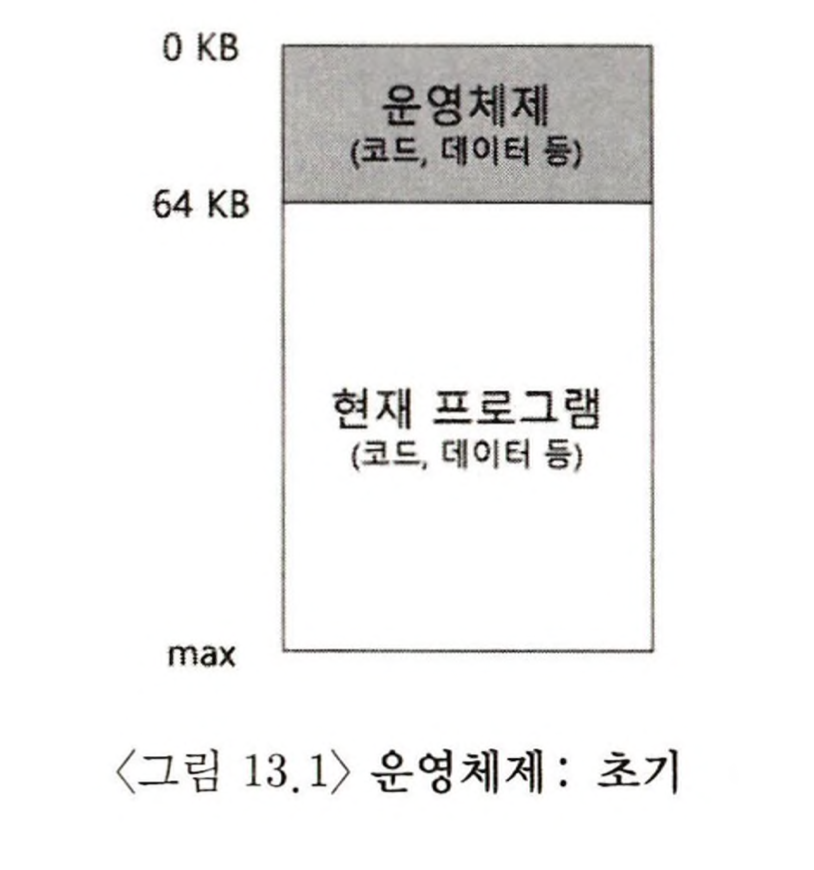
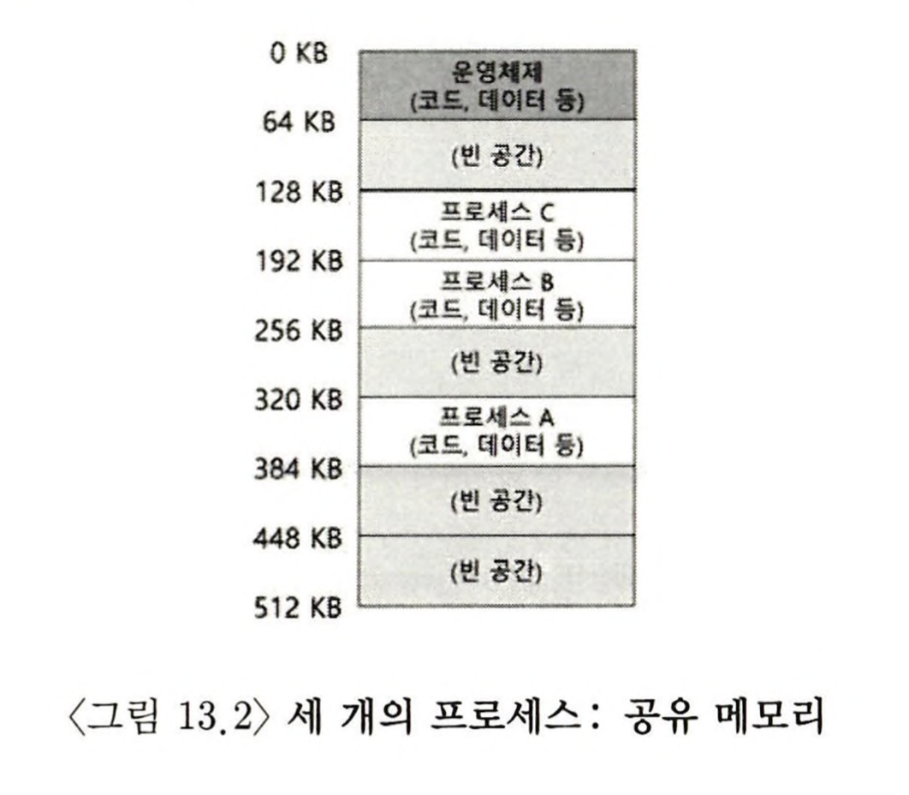
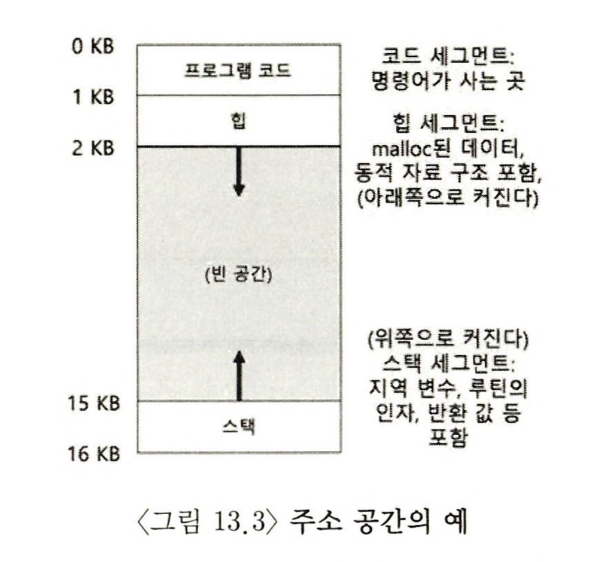

- 초기에는 컴퓨터 시스템을 구현하는 것이 쉬웠다. 사용자가 많은 것을 기대하지 않았기 때문이다
- **이 모든 두통거리를 만든 사람들은 바로 “사용의 편이”, “고성능”, “신뢰성” 등을 기대한 훌륭한 사용자이다**

### 초기 시스템

- 메모리 관점에서 초기 컴퓨터는 많은 개념을 사용자에게 제공하지 않았다



- 초기 컴퓨터의 물리 메모리
- 운영체제
  - 물리 주소 0 KB ~ 64 KB에 존재하였다
  - 메모리에(이 예에서는 물리 주소 0부터) 상주하는 루틴(실제로는 라이브러리)의 집합이었다
- 응용 프로그램
  - 물리 주소 64 KB부터 존재하였다
  - 나머지 물리 주소에는 **하나**의 실행 중인 프로그램 (프로세스)이 존재하였다

### 멀티 프로그래밍과 시분할

- 멀티프로그래밍(multi-programming) 시대가 도래하였다
- **효율성**을 중요시하기 시작하였다
- 즉, 여러 프로세스가 실행 준비 상태에 있고 운영체제는 그들을 전환하면서 실행하였다
- 한 프로세스가 입출력을 실행하면, CPU는 다른 프로세스로 전환하여 CPU의 이용률을 증가시켰다

#### 기존의 일괄처리 방식(batch computing)

- 특히 오랜 시간이 걸리는 (따라서 비효과적인) 프로그램-디버그 사이클에 지친 프로그래머 자신들이 일괄처리방식 컴퓨팅의 한계를 느꼈다
- 응답 시간이 길어지고, CPU가 일을 처리하지 않는 시간이 발생하여 전체 시스템의 효율성이 낮았습니다

#### 새로운 시분할(time-sharing) 시스템

- 운영체제는 시분할을 이용하여 효율성을 증가시켰다
- 시분할 시스템은 CPU 시간을 작은 단위로 나누어 여러 프로세스가 번갈아가며 실행되도록 합니다. 각 프로세스는 작은 시간 동안 CPU를 할당받아 실행됩니다
- 많은 사용자가 동시에 컴퓨터를 사용하고, 현재 실행 중인 작업으로부터 즉시 응답을 원하기 때문에 대화식 이용(interactivity)의 개념이 중요하게 되었다

#### 초기 시분할 시스템

- 하나의 프로세스를 짧은 시간 동안 실행시키는 것을 엉성하게 구현하였다
- 해당 기간 동안 프로세스에게 *모든 메모리를 접근할 권한*이 주어진다
- 그런 후에, 이 프로세스를 중단하고, 중단 시점의 모든 상태를 디스크 종류의 장치 (모든 물리 메모리를 포함하여)에 저장하고 다른 프로세스의 상태를 탑재하여 또 짧은 시간 동안 실행시킨다
- 문제 : 너무 느리게 동작한다는 것이고, 특히 메모리가 커질수록 느리게 된다
  - 레지스터 상태를 저장하고 복원하는 것은 빠르지만
  - **메모리의 내용 전체를 디스크에 저장하는 것은 엄청나게 느리다**
- 해결해야 할 것 : 프로세스 전환 시 **프로세스를 메모리에 그대로 유지**하면서, 운영체제가 시분할 시스템을 효율적으로 구현할 수 있게 하는 것이다
- 프로세스 보호는 할 수 있지만 속도가 매우 느리다

#### 더 빠른 접근 방법 : 공유 메모리



- 세 개의 프로세스(A, B, C)가 있고 각 프로세스는 각기 작은 부분을 할당받았다(64 KB)
- 디스크에 직접 I/O는 하지 않고 메모리에 들고 있기 때문에 **속도는 빨라졌다**
- 운영체제는 실행할 한 개의 프로세스(A라 하자)를 선택하고, 다른 프로세스들(B와 C)은 메모리 상의 준비 큐에서 실행을 기다린다
- 하지만 **보호(protection) 기능은 없다**. 즉, 한 프로세스가 다른 프로세스의 메모리를 읽거나 혹은 더 안 좋게는 쓸 수 있는 상황이 발생할 수 있다

### 주소 공간

- 우리는 그런 위험한 행위를 하는 사용자를 염두에 두어야 한다
- 그런 위험에 대비하여 운영체제는 사용하기 쉬운(easy to use) 메모리 개념을 만들어야 한다
- 결국, **물리 메모리를 "직접적으로"** 사용자 또는 프로그래머에게 관리하게 하는 것은

  - 1.  최대 메모리를 제한하여 프로그래밍을 어렵게하고
  - 2.  동시에 이용할 수 있는 프로세스의 수가 제한되며
  - 3.  각각의 프로세스가 다른 주소에 있는 프로세스를 제어할 수 있는 가능성이 존재하기 때문에 위험하다

- 이를 해결할 수 있는 것이 가상 메모리 즉, 주소 공간(address space)이다
- 주소 공간은 실행 프로그램의 모든 메모리 상태를 갖고 있다
  - 코드(code, 명령어)는 반드시 메모리에 존재해야 하고 따라서 주소 공간에 존재한다
  - 스택(stack)은 함수 호출 체인 상의 현재 위치, 지역 변수, 함수 인자와 반환 값 등을 저장하는 데 사용된다
  - 힙(heap)은 동적으로 할당되는 메모리를 위해 사용된다
  - 주소 공간 구성 요소에는 정적으로 초기화된 변수 등의 다른 것들도 있지만 단순화하여 세 영역만 존재한다고 가정한다



- 겨우 16KB의 아주 작은 주소 공간이다
- 프로그램 코드는 주소 공간의 위쪽에 위치한다
- 코드는 정적이기 때문에 메모리에 저장하기 쉽다. 따라서 주소 공간의 상단에 배치하고, 프로그램이 실행되면서 추가 메모리를 필요로 하지 않는다(고정되어 있다)
- 주소 공간의 상단에 존재하는 힙과 하단에 존재하는 스택은 프로그램 실행과 더불어 확장되거나 축소될 수 있다
- 두 메모리 영역은 확장할 수 있어야 하기 때문에 이런 방식으로 배치하고, 주소 공간의 양 끝단에 배치해야 두 영역 모두 확장하는 것이 가능하다. 두 영역은 확장 방향이 반대 방향일 수밖에 없다
- 힙은 코드 바로 뒤 1KB부터 시작하고 아래 방향으로 확장한다(예를 들면, 사용자가 malloc() 함수를 통해 더 많은 메모리를 요청할 때). 스택은 16KB에서 시작하고 위쪽 방향으로 확장한다(예를 들어, 사용자가 프로시저를 호출할 때)
- _나중에 보겠지만 주소 공간에 여러 쓰레드가 공존할 때는 이런 식으로 주소 공간을 나누게 되면 동작하지 않는다_
- 쓰레드는 각자의 스택 영역을 갖는다

#### 메모리 가상화(virtualizing memory)

- 실제로 **프로그램이 물리 주소 0에서 16KB 사이에 존재하는 것은 아니다.** 실제로는 임의의 물리 주소에 탑재된다
- "운영체제는 물리 메모리를 공유하는 다수의 프로세스에게 어떻게 프로세스 전용의 커다란 주소 공간이라는 개념을 제공할 수 있는가?"
- 이렇게 <U>프로세스 전용의 커다란 주소 공간을 제공하는 것을 메모리 가상화라고 부른다</U>
- 실행 중인 프로그램은 자신이 특정 주소의 메모리에(예를 들어 0) 탑재되고 매우 큰 주소 공간을(예를 들어, 32비트 또는 64비트) 가지고 있다고 생각한다
- e.g.
  - 프로세스 A가 주소 0으로부터 (우리는 이를 가상 주소(virtual address)라고 부를 것이다) load 연산을 수행할 때
  - 운영체제는 하드웨어의 지원을 통해 물리 주소 0이 아니라 물리 주소 320KB(A가 탑재된 메모리)를 읽도록 보장해야 한다
  - 이것이 메모리 가상화의 열쇠이고, 현대 모든 컴퓨터 시스템의 기저를 이룬다

### 목표

- 1. 가상 메모리 시스템(VM)의 주요 목표 중 하나는 투명성(transparency)이다
  - 운영체제는 실행 중인 프로그램이 가상 메모리의 존재를 인지하지 못하도록 가상 메모리 시스템을 구현해야 한다
  - 오히려 프로그램은 자신이 전용 물리 메모리를 소유한 것처럼 행동해야 한다
  - 많은 작업들이 메모리를 공유할 수 있도록, 무대 뒤에서 운영체제와 하드웨어가 모든 작업을 수행한다
- 2. VM의 또 다른 목표는 효율성(efficiency)이다
  - 시간적으로는 프로그램이 너무 느리게 실행되서는 안 되고
  - 공간적으로는 가상화를 지원하기 위한 구조를 위해 너무 많은 메모리를 사용해서는 안 된다
  - 시간-효율적인 가상화를 구현할 때, 운영체제는 TLB 등의 하드웨어 기능을 포함하여 하드웨어의 지원을 받아야 한다
- 3. 마지막으로 VM의 세 번째 목표는 보호(protection)이다
  - 운영체제는 프로세스를 다른 프로세스로부터 보호해야 하고 운영체제 자신도 프로세스로부터 보호해야 한다
  - 프로세스가 탑재, 저장, 혹은 명령어 반입 등을 실행할 때 어떤 방법으로든 다른 프 로세스나 운영체제의 메모리 내용에 접근하거나 영향을 줄 수 있어서는 안 된다
  - 즉, 자신의 주소 공간 밖의 어느 것도 접근할 수 있어서는 안 된다

### 여담 : 당신이 보는 모든 주소는 가상 주소이다

- 포인터를 줄력하는 c 프로그램을 작성한 적이 있는가? 당신이 보는 값은(좀 큰 변수, 종종 16진수로 출력되는) 가상 주소(virtual address)이다
- 사용자 프로그램(user level program)이 볼 수 있는 주소는 모두 가상 주소이다
- **메모리 가상화의 기술 때문에, 명령어와 데이터가 탑재되어 있는 물리 메모리 주소를 알 수 있는 것은 오직 운영체제와 하드웨어 뿐이다**

```c
#include <stdio.h>
#include <stdlib.h>

int	main(int argc, char *argv[]) {
	printf("location of code : %p\n", main);
	printf("location of heap : %p\n", malloc(100e6));
	int	x = 3;
	printf("location of stack : %p\n", &x);

	return x;
}

// location of code :	0x1095afe50
// location of heap :	0x1096008c0
// location of stack :	0x7fff691aea64
```

- 코드가 제일 먼저 등장하고, 다음에 힙이 배치되고, 마지막 으로 대규모 가상 공간의 반대편에 스택이 위치한다는 것을 알 수 있다
- 이 모든 주소는 가상 주소이며, 저장된 실제 물리 메모리 위치에서 값을 반입하기 위해 운영체제와 하드웨어에 의해 물리 주소로 변환된다.

### 요약

- VM 시스템은 프로세스 전용 공간이라는 환상을 프로그램에게 제공할 책임이 있다
- 이 공간에 프로그램의 명령어 전부와 데이터 전부가 저장된다
- **하드웨어의 도움을 받아 운영체제는 가상 메모리 주소를 받아 물리 주소로 변환한다**
- VM 시스템을 통해 다음과 같은 목표를 달성할 수 있다
  - 프로그래밍을 쉽게 하고(easy to use)
  - 프로그램과 운영체제를 보호한다

### 숙제
