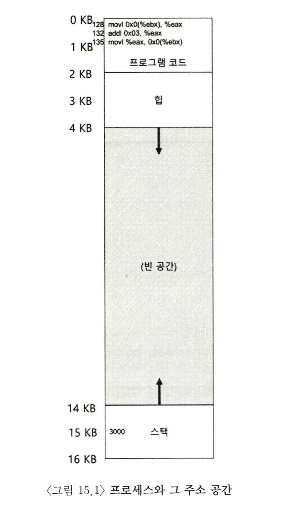
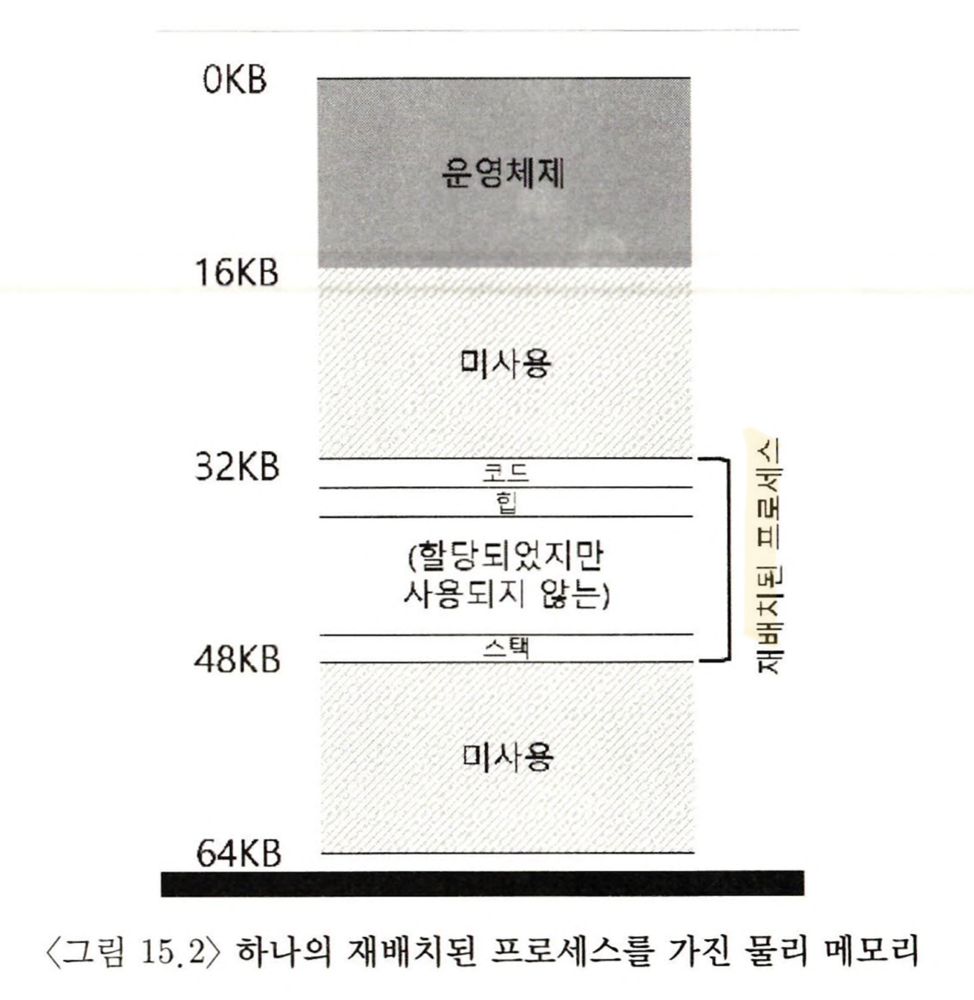
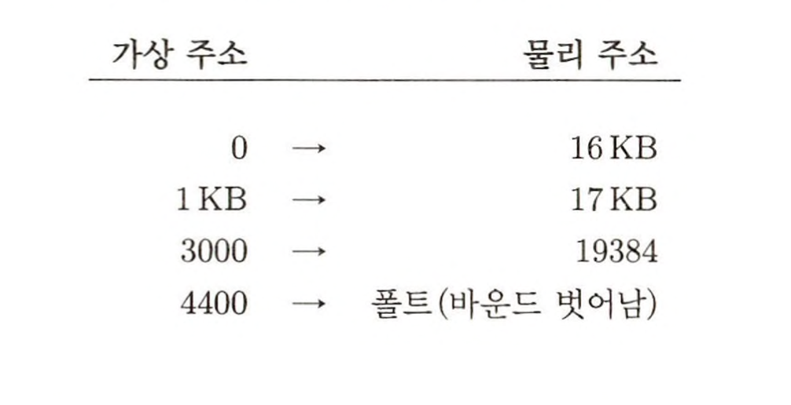

- CPU 가상화 부분에서, 제한적 직접 실행(LDE)이라는 기법을 집중적으로 다루었다
  - 대부분의 경우 프로그램은 하드웨어에서 직접 실행된다
  - 프로세스가 시스템 콜을 호출하거나 타이머 인터럽트가 발생할 때 등의 **특정 순간에는 운영체제가 개입하여** 문제가 발생하지 않도록 한다
  - 운영체제는 약간의 하드웨어 지원(e.g. 타이머, 인터럽트 등)을 받아 효율적인 가상화를 제공하기 위해 실행 프로그램에게 방해가 되지 않도록 최선을 다한다
  - 중요한 순간에 운영체제가 관여하여 하드웨어를 직접 제어한다. 효율성과 제어가 현대 운영체제의 목표이다
- 메모리 가상화에서 비슷한 전략을 추구할 것이다 : 가상화를 제공하는 동시에 효율성(efficiency)과 제어(control) 모두를 추구한다
  - 1. 효율성
    - 마찬가지로 효율성을 높이려면 하드웨어 지원을 활용 할 수밖에 없다
    - e.g. 몇 개의 레지스터, TLB, 페이지 테이블 등 점차 복잡한 하드웨어를 사용한다
  - 2. 제어
    - 응용 프로그램이 자기자신의 메모리 이외에는 다른 메모리에 접근하지 못한다는 것을 운영체제가 보장하는 것을 의미한다
    - 이 떄에도 프로그램을 다른 프로그램으로부터 보호하고 운영체제를 프로그램으로부터 보호하기 위하여 하드웨어 도움이 필요하다
  - 3. 유연성
    - 프로그래머가 원하는 대로 주소 공간을 사용하고, 프로그래밍하기 쉬운 시스템을 만들기 원한다
- 하드웨어 기반 주소 변환(hardware-based address trans­ lation) 또는 주소 변환(address translation) 기법
  - "주소 변환을 통해 하드웨어는 **명령어 반입, 탑재, 저장 등의 가상 주소를** **정보가 실제 존재하는 물리 주소로** 변환한다"
  - 프로그램의 모든 (가상) 메모리 참조를 실제 (물리) 메모리 위치로 재지정하기 위하여 하드 웨어가 주소를 변환한다
- 하드웨어에 의해 제공되는 저수준(low level) 기능들은 변환을 가속화시키는 도움을 주지만, _하드웨어만으로 메모리 가상화를 구현할 수는 없다_
  - _정확한 변환이 일어날 수 있도록_ 하드웨어를 셋업하기 위해 운영체제가 관여해야 한다
  - 즉, 운영체제는 메모리의 빈 공간과 사용 중인 공간을 항상 알고 있어야 하고, 메모리 사용을 제어하고 관리한다
- 프로그램이 자신의 전용 메모리를 소유하고 그 안에 자신의 코드와 데이터가 있다는 환상을 만드는 것이다
  - 이 가상 현실의 이면에는 불편한 진실이 존재한다
  - CPU가 실행 중인 한 프로그램에서 다음 프로그램으로 전환 하는 것처럼, 많은 프로그램이 메모리를 공유한다

### 가정

- 첫 번째 시도는 매우 간단하며 비현실적이다
- 1. 당분간 사용자 주소 공간은 물리 메모리에 연속적으로 배치되어야 한다고 가정한다
- 2. 논의를 단순화하기 위해 주소 공간의 크기가 너무 크지 않다고 가정한다
- 3. 주소 공간은 물리 메모리 크기보다 작다
- 4. 각 주소 공간의 크기는 같다고 가정한다

### 사례

- 메모리에서 값을 탑재 => 3을 증가 => 다시 메모리에 저장

```c
void func() {
	int x = 3000;
	x = x + 3; 		// 우리가 관심있는 코드
}
```

```assembly
128: movl 0x0 (%ebx), %eax	; 0+ebx를 eax에 저장
132: addl $0x03, %eax		; eax 레지스터에 3을 더한다
135: movl %eax, 0x0 (%ebx)	; eax를 메모리에 다시 저장
```

- x의 주소는 레지스터 ebx에 저장되어 있다고 가정
- 이 주소에 저장되어 있는 값(ebx)을 movl 명령어(longword를 이동하는 명령어)를 사용하여 범용 레지스터 eax에 넣는다
- 다음 명령은 eax에 3을 더하고
- 마지막 명령은 eax의 값을 같은 위치의 메모리(ebx)에 저장한다



- 세 개 명령어의 코드는 주소 128에 위치하고
- 변수 x의 값은 주소 15 KB(아래 쪽 스택에)에 위치한다
- x의 초기 값은 3000이다
- 명령어가 실행되면 프로세스의 관점에서 다음과 같은 메모리 접근이 일어난다
  - 주소 128의 명령어를 반입
  - 이 명령어 실행(주소 15 KB에서 탑재) : 0+ebx를 eax에 저장
  - 주소 132의 명령어를 반입
  - 이 명령어 실행(메모리 참조 없음)
  - 주소 135의 명령어를 반입
  - 이 명령어 실행(15 KB에 저장) : eax를 메모리에 다시 저장
- 프로그램 관점에서 주소 공간은 주소 0부터 시작하여 최대 16 KB까지이다. 프로그램이 생성하는 모든 메모리 참조는 이 범위 내에 있어야 한다
- 메모리 가상화를 위해 운영체제는 프로세스를 물리 메모리 주소 0이 아닌 다른 곳에 위치시키고 싶다
- **어떻게 하면 프로세스 모르게 메모리를 다른 위치에 재배치 하느냐가 우리가 해결해야 할 문제이다.** 프로세스 주소 공간이 실제로는 다른 물리 주소에 배치되어 있을 때, 주소 0 번지부터 시작하는 가상 주소 공간의 환상을 어떻게 제공할 수 있을까?



- 프로세스의 주소 공간이 물리 메모리에 배치될 수 있는 예시
  - 프로세스 주소 공간 크기만큼 물리 메모리의 슬롯을 나누어 하나의 슬롯을 프로세스의 주소 공간으로 사용한다
  - 첫 번째 슬롯은 운영체제가 사용한다

### 동적 (하드웨어 기반) 재배치

- 첫 번째 하드웨어 기반 주소 변환 실현 사례
- 1950년대 후반 첫 번째 시분할 컴퓨터에서 사용되었다
- **베이스와 바운드(base and bound)**, **동적 재배치(dynamic relocation)**라고 한다
- 각 CPU마다 2개의 하드웨어 레지스터가 필요하다
- 하나는 베이스(base) 레지스터 라고 불리고, 다른 하나는 바운드(bound) 레지스터 혹은 한계 (limit) 레지스터 라고 불린다
- 이 베이스와 바운드 쌍은 우리가 원하는 위치에 주소 공간을 배치할 수 있게 한다
- 배치와 동시에 프로세스가 오직 자신의 주소 공간에만 접근한다는 것을 보장한다
- 각 프로그램은 주소 0에 탑재되는 것처럼 작성되고 컴파일된다
- 프로그램 시작 시, **운영체제가 프로그램이 탑재될 물리 메모리 위치를 결정하고** 베이스 레지스터를 그 주소로 지정한다
- e.g. 운영체제는 프로세스를 물리 주소 32 KB에 저장하기로 결정하고 베이스 레지스터를 이 값으로 설정한다

#### 베이스 레지스터

- 프로세스에 의해 생성되는 모든 주소가 다음과 같은 방법으로 프로세서에 의해 변환된다
- **"physical address = virtual address + base"**
- 프로세스가 생성하는 메모리 참조(virtual address)는 가상 주소이다
- 하드웨어는 베이스 레지스터의 내용(virtual address)을 이 주소(base)에 더하여 물리 주소(physical address)를 생성한다

```assembly
128: movl 0x0 (%ebx), %eax
...
135: movl %eax, 0x0 (%ebx)
```

- 하드웨어가 명령어를 반입할 때, 두 레지스터를 이용해 물리 메모리 주소를 계산한다
  - base : 32 KB(32768)
  - PC : 128(virtual address)
  - 변환된 물리 메모리 주소 : 32768 + 128 = 32896(physical address)
- 하드웨어는 해당 물리 주소에서 명령어를 가져온다
- 다시 가상 주소 15KB의 값을 저장하라는 명령어를 내리면, 변환된 물리 메모리 주소 약 47 KB(32 KB + 15 KB)에서 명령어를 가져온다
- 주소의 재배치(base)는 실행 시에 일어나고, 프로세스가 실행을 시작한 이후에 도 주소 공간을 이동할 수 있기 때문에 동적 재배치(dynamic relocation) 라고도 불린다

- 1. 정적 재배치
  - 일부 시스템은 소프트웨어만으로 엉성하게 재배치를 수행
  - 로더(loader)라 불리는 소프트웨어가 실행하고자 하는 실행 파일의 모든 주소를 원하는 물리 메모리 오프셋으로 변경한다
  - 실행 파일의 물리 메모리 위치를 직접 바꾸는 방식이다
  - 정적 재배치에서는 프로그램이 실행되기 전에 메모리의 크기와 위치가 결정되고, 그 후에는 변경되지 않습니다
  - e.g. `movl 1000, %eax` 로 작성된 실행 파일, 프로그램 주소 공간이 주소 3000부터 탑재되었다면 로더는 명령어의 모든 주소를 3000씩 이동한 주소로 다시 작성한다 `movl 4000. %eax`
  - 단점) 보호 기능이 없다. 즉, 잘못된 주소를 생성하여 다른 프로세스나 운영체제의 메모리를 불법적으로 접근할 수 있다
  - 단점) 한번 배치되면 추후 주소 공간을 재배치하는 것이 어렵다
- 2.  동적 재배치

  - 하드웨어의 지원(베이스 레지스터)을 받아 재배치를 수행
  - 실행 파일의 메모리 위치는 (가상 메모리 위치로) 그대로 가져가고, 베이스 레지스터에 의해 물리 메모리가 결정된다
  - 실제 물리 메모리 주소는 "베이스 레지스터"와 "가상 주소"의 합으로 계산된다
  - 이 주소의 재배치는 실행 시에 일어나고, 프로세스가 실행을 시작한 이후에도 주소 공간을 이동할 수 있기 때문에 동적 재배치라고 불린다

#### 바운드(한계) 레지스터

- 바운드 레지스터는 보호를 지원하기 위해 존재한다
- 프로세서는 먼저 메모리 참조가 합법적인가를 확인하기 위해 **가상 주소가 바운드 안에 있는지 확인한다**
- 프로세스가 *바운드보다 큰 가상 주소 또는 음수인 가상 주소*를 참조하면 CPU는 예외를 발생시키고 프로세스는 종료될 것이다
- e.g. 바운드 레지스터는 항상 16KB로 설정된다
- 베이스와 바운드 레지스터는 **CPU 칩 상에 존재하는 하드웨어 구조**임을 주의하라
- 주소 변환에 도움을 주는 프로세서의 일부를 **메모리 관리 장치(memory management unit, MMU)**라고 부른다
- 두 가지 방식
  - 1. 주소 공간의 크기를 저장하는 방식 : 하드웨어는 가상 주소를 베이스 레지스터에 _더하기 전에_ 먼저 바운드 레지스터와 비교한다(가상 주소와 가상 주소의 비교)
  - 2. 주소 공간의 마지막 물리 주소를 저장하는 방식 : 하드웨어는 먼저 베이스 레지스터를 _더하고_(물리 메모리 주소를 만든 후) 그 결과가 바운드 안에 있는지 검사한다(물리 주소와 물리 주소의 비교)

#### 주소 공간 변경

- 프로세스가 중단되면(즉, 실행 상태가 아닐 때에는), 운영체제가 메모리의 현 위치에 서 다른 위치로 (물리적) 주소 공간을 비교적 쉽게 옮길 수 있다는 사실에 주목해야 한다
- 1. 프로세스의 (물리적) 주소 공간을 이동시키려면 운영체제는 먼저 프로세스의 실행을 중지시킨다
- 2. 그런 후 운영체제는 현재 위치에서 새 위치로 주소 공간을 복사한다(이는 코드, 데이터, 스택 등의 세그먼트를 모두 포함한다)
- 3. 마지막으로, 운영체제는 프로세스 구조체에 저장된 베이스 레지스터를 갱신하여 새 위치를 가리키도록 한다
- 4.프로세스가 실행을 재개하면 새로운 베이스 레지스터가 복원되고 다시 실행을 시작하고, 명령어와 데이터가 전혀 다른 새 위치에 존재한다는 사실을 인식하지 못한다

#### 예제



- 주소 공간의 크기가 4 KB인 프로세스가 물리 주소 16 KB에 탑재되어 있다고 가정하자
- 예에서 볼 수있는 것처럼 물리 주소를 얻기 위해서는 간단히 가상 주소에 베이스 주소를 더하기만 하면 된다
- 물리 메모리 주소의 최대는 20 KB(16 KB + 4 KB) 이므로, 가상 주소 4400에 접근하면 폴트가 발생한다

### 하드웨어 지원: 요약


- 필요한 하드웨어 지원을 요약해 보자
- 1. 특권 모드
  - 운영체제는 특권 모드(또는 커널 모드)에서 실행하며 컴퓨터 전체에 대한 접근 권한을 가진다
  - 응용 프로그램은 사용자 모드에서 실행되며, 할 수 있는 일에 제한이 있다
  - **프로세서 상태 워드(processor status word) 레지스터**의 한 비트가 CPU의 현재 실행 모드를 나타낸다
  - 특정한 순간에 (예를 들면, 시스템 콜 또는 다른 종류의 예외나 인터럽트 발생 시) CPU는 모드를 전환한다
- 2. **베이스와 바운드 레지스터**
  - CPU는 메모리 관리 장치(MMU)의 일부인 추가의 레지스터 쌍을 가진다
  - 프로그램이 실행 중인 경우, 하드웨어는 프로그램이 생성한 가상 주소에 베이스 값을 더하여 주소를 변환한다
  - 하드웨어는 주소가 유효한지 검사할 수 있어야 한다(바운드 레지스터와 CPU 내의 일부 회로)
  - 하드웨어는 **베이스와 바운드 레지스터 값을 변경하는 명령어**를 제공해야 한다
  - 운영체제는 다른 프로세스를 실행시킬 때, 이 명령어(특권 명령어)를 사용하여 베이스와 바운드 레지스터 값을 변경할 수 있다. 즉, 커널 모드(또는 특권 모드)에서만 레지스터를 변경할 수 있다
- 3. **예외 핸들러(exception handler)**
  - CPU는 사용자 프로그램이 바운드를 벗어난 주소로 불법적인 메모리 접근을 시도하려는 상황에서 예외를 발생시킬 수 있어야 한다
  - 이 경우 CPU는 **사용자 프로그램의 실행을 중지하고 운영체제의 “바운드 벗어남” 예외 핸들러(exception handler)가 실행**되도록 조치해야 한다
  - 운영체제 핸들러는 어떻게 대처할지 결정할 수 있다. 이 경우에 프로세스를 종료시킬 확률이 매우 높다
  - 마찬가지로 사용자 프로그램이 특권이 필요한 베이스와 바운드 레지스터 값의 변경을 시도하면 CPU는 예외를 발생시키고 **“사용자 모드에서의 특권 연산 발생” 핸들러**를 실행시켜야 한다

### 운영체제 이슈

- 동적 재배치 지원을 위해 하드웨어가 새로운 기능을 제공하는 것과 마찬가지로, 운영 체제에도 새로운 이슈가 등장한다
- 하드웨어 지원과 운영체제 관리가 결합되면 간단한 가상 메모리를 구현할 수 있다
- 베이스와 바운드 방식의 가상 메모리 구현을 위해서 **운영체제가 반드시 개입되어야 하는 중요한 세 개의 시점이 존재**한다
- 1. 첫째, 프로세스가 생성될 때 운영체제는 **주소 공간이 저장될 물리 메모리 공간을 찾아** 조치를 취해야 한다
  - 다행히도 각 주소 공간은 (a) 물리 메모리의 크기보다 작고 (b) 크기가 일정하다라는 가정하에서는 운영체제가 쉽게 처리할 수 있다
  - 운영체제는 물리 메모리를 슬롯의 배열로 보고 각 슬롯의 사용여부를 관리한다
  - 새로운 프로세스가 생성되면 운영체제는 새로운 주소 공간 할당에 필요한 영역을 찾기 위해 (흔히 빈 공간 리스트(free list)라고 불리는) 자료 구조를 검색해야 한다 : 프로세스에게 메모리를 할당할 수 있도록 사용되지 않는 메모리 공간의 리스트
  - 일단 가변 크기 주소 공간은 고려하지 않는다
- 2. 둘째, 프로세스가 종료할 때(즉 정상적으로 종료될 때 또는 잘못된 행동을 하여 강제적으로 죽게될 때), 프로세스가 **사용하던 메모리를 회수하여** 다른 프로세스나 운영체제가 사용할 수 있게 해야 한다
  - 프로세스가 종료하면, 운영체제는 종료한 프로세스의 메모리를 다시 빈 공간 리스트에 넣고 연관된 자료 구조를 모두 정리한다
- 3. 셋째, 운영체제는 **문맥 교환이 일어날 때에도** 몇 가지 추가 조치를 취해야 한다.
  - CPU마다 한 쌍의 베이스-바운드 레지스터만 존재하고 각 프로그램은 다른 물리 주소에 탑재되어야 하기 때문에 실행 중인 프로그램마다 다른 값을 가진다
  - 운영체제는 **프로세스 전환 시 베이스와 바운드 쌍을 저장하고 복원**해야 한다
  - 즉, 운영체제가 실행 중인 프로세스를 중단시키기로 결정하면 운영체제는 메모리에 존재하는 *프로세스 제어 블럭 (process control block, PCB) 안에 베이스와 바운드 레지스터의 값을 저장*해야 한다
- 4. 넷째, 위에서 언급한 것처럼 **운영체제는 예외 핸들러 또는 호출될 함수를 제공**해야 한다
  - 운영체제는 부팅할 때 특권 명령어를 사용하여 이 핸들러를 설치한다
  - 핸들러는 ROM에(하드웨어에 의해) 저장되어 있어야 한다
  - 프로세스가 바운드 밖의 메모리에 접근하려는 경우 CPU는 예외를 발생시킨다
  - 운영체제의 일반적인 대응은 적대적인 양상을 보인다
  - 운영체제는 불법 행위를 한 프로세스를 종료 시킨다. 운영체제는 자신이 실행되는 컴퓨터를 보호해야 한다. 허가 받지 않은 메모리에 접근하거나 또는 명령어를 실행하려는 프로세스를 좋아하지 않는다


- 하드웨어/OS의 상호작용을 타임라인으로 보여준다
- 부팅할 때 컴퓨터를 사용 가능한 상태로 만들기 위하여 운영체제가 무엇을 하는지 보여 준다


- 프로세스(Process A) 가 실행을 시작할 때 무슨 일이 일어나는지 보여 준다
- **메모리 변환은 운영체제의 개입 없이 하드웨어에 처리된다는 사실에 주목하라**
  - 운영체제는 주소 공간이 저장될 물리 메모리 공간을 찾고, 해당 메모리를 특권 명령을 통해 베이스 및 바운드 레지스터에 올리는 작업만 한다
  - 주소 변환과 CPU가 메모리를 참조하는 것은 전적으로 하드웨어에 의해 처리된다
- 시간이 흐른 후에 타이머 인터럽트가 발생하고 운영체제는 Process B로 전환한다
- Process B는 불법적인 주소에 잘못된 탑재를 실행한다
- 그 시점에 운영체제가 개입하여 프로세스를 끝낸 후 B의 메모리를 해제하고 프로세스 테이블에서 해당 항목을 제거하여 정리한다
- 그림에서 볼 수 있듯이, 우리는 아직 **제한적 직접 실행**의 기본적인 접근 방식을 따르고 있다
  - 운영체제는 다만 하드웨어를 적절하게 설정하고 프로세스가 CPU 에서 직접 실행할 수 있게 한다
  - 프로세스가 잘못된 행동을 했을 때에만 운영체제가 개입하여야 한다

### 요약

- 주소 변환이라고 알려진 가상 메모리 기법을 통해 제한적 직접 실행의 개념을 확장하였다
- 주소 변환의 이점 : 효율성 / 제어 / 유연성
  - 운영체제는 프로세스의 모든 메모리 접근을 제어할 수 있고
  - 접근이 항상 주소 공간의 범위 내에서 이루어지도록 보장할 수 있다
- 하드웨어 지원이 있었기에 효율적으로 구현이 가능하였다
  - 1. 프로세서 상태 워드(processor status word) 레지스터
  - 2. 베이스와 바운드 레지스터
  - 3. 베이스와 바운드 레지스터 값을 변경하는 특권 명령어
  - 4. 예외 핸들러(exception handler)
- 하드웨어 지원은 프로세스가 이해하는 메모리인 가상 주소를 실제 메모리 모습인 물리 주소로 변환하며 이 변환을 빠르게 수행한다
- 베이스와 바운드(base-and-bound) 또는 동적 재배치
  - 베이스 레지스터를 가상 주소에 더하고 생성된 주소가 바운드를 벗어나는지 검사하기 위한 간단한 하드웨어 회로만 추가하면 되기 때문에 base-and-bound 가상화는 매우 효율적이다
  - base-and-bound 가상화는 또한 보호 기능도 제공한다
- 이 방법은 주소 변환의 이점 중 제어는 달성했을지 몰라도 효율적이지는 않다
  - 프로세스 스택과 힙이 아주 크지 않기 때문에, 둘 사이의 공간이 단순히 낭비되고 있기 때문이다
  - 애초에 많은 공간을 사용하지 않았다면, 더 많은 프로세스를 동시에 실행시킬 수 있었다
  - 할당된 영역의 내부 공간이 사용되지 않기 때문에, 즉 단편화가 발생되어 낭비된다. 이런 유형의 낭비를 **내부 단편화(internal fragmentation)라고 한다**
  - 현재 접근 방식에서 비록 더 많은 프로세스를 탑재할 수 있는 충분한 물리 메모리가 있더라도, 고정 크기의 슬롯에 주소 공간을 배치해야 하기 때문에 내부 단편화가 발생한다
- 물리 메모리의 이용률을 높이고 내부 단편화를 방지하기 위해 더 정교한 기법이 필요하다
  - base-and-bound를 일반화하는 것이다
  - **세그멘테이션(segmentation)이라고 부른다**

### 숙제

- 베이스와 바운드 레지스터를 가진 시스템에서 주소 변환
