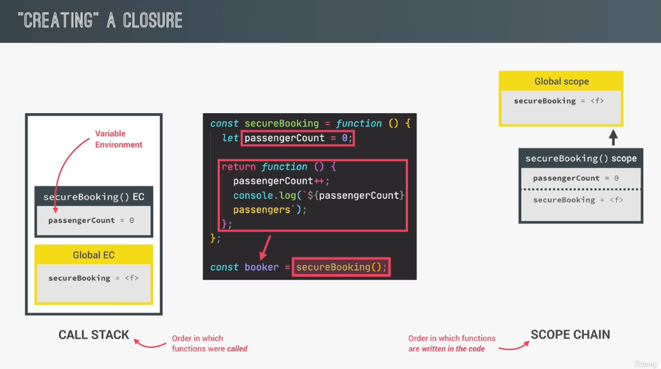
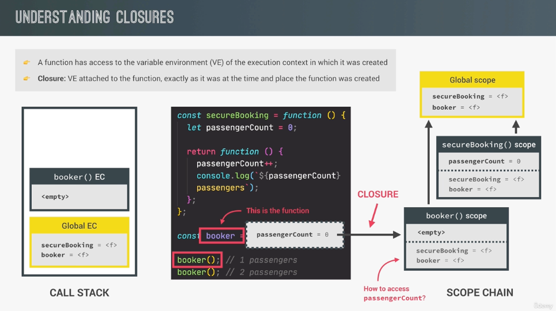

### Default Parameters

```js
const bookings = [];

const createBooking = function(
	flightNum,
	numPassengers = 1,
	price = 199 * numPassengers
) {
	// ES5
	// numPassengers = numPassengers || 1;
	// price = price || 199;

	const booking = {
		flightNum,
		numPassengers,
		price,
	}
	console.log(booking);
	bookings.push(booking);
}

createBooking('LH123'); // {flightNum: 'LH123', numPassengers: 1, price: 199}
createBooking('LH123', 2, 800); // {flightNum: 'LH123', numPassengers: 2, price: 800}
createBooking('LH123', 2); // {flightNum: 'LH123', numPassengers: 2, price: 398}
createBooking('LH123', 5); // {flightNum: 'LH123', numPassengers: 5, price: 995}

// 사용하지 않는 parameter는 비워두면 안 되고, undefined를 할당해야 정상적으로 동작
createBooking('KS123', ,700); // Uncaught SyntaxError: Unexpected token ','
createBooking('KS123', undefined ,700); // {flightNum: 'KS123', numPassengers: 1, price: 700}
```

- ES6에서 Default Parameter가 추가되어 깔끔하게 처리할 수 있음
- 직접 명시하지 않은 Parameter는 `undefined`로 할당이 되는데, Default Parameter는 명시되지 않는 Parameter를 자동으로 할당하는 기능
- `price`에서 `numPassengers`를 사용할 수 있는 이유는 먼저 선언이 되었기 때문
  - 역으로 `numPassengers`에서 `price`를 사용할 수는 없음
- 사용하지 않는 parameter는 비워두면 안 되고, `undefined`를 할당해야 정상적으로 동작
  - Destructuring과는 다르게 동작,,,
  - 비슷한 맥락에서 Default Parameters를 명시하지 않고 사용하기 위해서는 일반 Parameter 이전에 오면 안 됨

### Passing Arguments by Value or Reference

```js
const flight = "LH234";
const jonas = {
  name: "Jonas schmedtmann",
  passport: 2389562938,
};

const checkIn = function (flightNum, passenger) {
  // "primitive 데이터 타입"은 함수 내부에서 값을 복사
  // 외부의 flight 변수에 영향을 미치지 않음
  flightNum = "LH999";
  // 반면, Object / Array와 같은 "reference 데이터 타입"은 참조를 복사
  // 그렇기 때문에 외부의 jonas 변수에 접근할 수 있고, 영향을 미칠 수 있음
  passenger.name = "Mr. " + passenger.name;

  if (passenger.passport !== 2389562938) {
    alert("Wrong passport");
  }
};

checkIn(flight, jonas);
console.log(flight, jonas); // LH234 {name: 'Mr. Jonas schmedtmann', passport: 2389562938}
```

- 다른 사람들과 협업할 때, 이러한 동작에 주의해야 한다
- javascript에서는 Passing by Value
  - C++처럼 명시적으로 Reference를 넘기는 방법은 없고, 모든 변수를 단순히 넘기는 Passing by Value이다
  - 하지만 내부적으로 "primitive"과 "reference" 데이터 타입의 동작 방식이 다르다
    - primitive : 값 자체를 복사하기 때문에 원본 변수에 영향이 없다
    - reference : 참조(메모리 주소)를 복사하기 때문에 원본 변수에 영향을 미친다
- https://stackoverflow.com/questions/518000/is-javascript-a-pass-by-reference-or-pass-by-value-language

```js
function changeObject(x) {
  x = { member: "bar" };
  console.log("in changeObject: " + x.member);
}

function changeMember(x) {
  x.member = "bar";
  console.log("in changeMember: " + x.member);
}

let x = { member: "foo" };

console.log("before changeObject: " + x.member);
changeObject(x);
console.log("after changeObject: " + x.member); /* change did not persist */

console.log("before changeMember: " + x.member);
changeMember(x);
console.log("after changeMember: " + x.member); /* change persists */
```

- 두 함수 모두 reference로서가 아니라 value로서 전달하기 때문에, 첫 번째 함수 이후 `x`의 값이 변하지 않았다
- reference로서 전달했다면, `x`의 값이 첫 번째 함수 내부에서 변경되어야 했을 것이다

### First Class Functions, Higher Order Functions

- 일급 함수(First Class Functions)와 고차 함수(Higher Order Functions)의 관계?
  - _일급 함수가 있기 때문에 고차 함수를 만들고, 사용(write, use)할 수 있다_
- 비교
  - 일급 함수 : 언어적 특징, practice가 아니라 concept
  - 고차 함수 : 일급 함수의 practice

```js
const add = (a, b) => a + b;
const counter = {
  value: 23,
  inc: function () {
    this.value++;
  },
};

const greet = () => console.log("Hey Jonas");
btnClose.addEventListener("click", greet);

counter.inc.bind();
```

- 일급 함수
  - 자바스크립트에서 함수는 또 다른 `Object` 타입이다
  - `Object`는 값이기 때문에, 함수 또한 값이다
  - 그렇기 때문에, **_1) 변수에 저장하거나, 2) Object 프로퍼티로 값으로 저장할 수 있다_**
  - 또한 **_3) 함수에 인자로 넘겨줄 수 있다_**
  - **_4) 함수에서 함수를 반환할 수 있다_**
  - **_5) 함수 내부에 프로퍼티와 메서드를 가질 수 있다(Object 이기 때문에) : `name` 프로퍼티_**

```js
const greet = () => console.log("Hey Jonas");
btnClose.addEventListener("click", greet);

// higher order function : addEventListener
// callback function : greet

function count() {
  let counter = 0;
  return function () {
    counter++;
  };
}

// higher order function : count
// returned function : function() { counter++; }
```

- 고차 함수
  - _함수를 인자로 받는 함수 또는 함수를 반환하는 함수_
  - 일급 함수이기 때문에 가능한 개념이다

```js
// 고차 함수
// 1) 함수를 인자(콜백 함수)로 받는 함수
const oneWord = function (str) {
  return str.replace(/ /g, "").toLowerCase();
};

const upperFirstWord = function (str) {
  const [first, ...others] = str.split(" ");
  return [first.toUpperCase(), ...others].join(" ");
};

// higher order function
const transformer = function (str, fn) {
  console.log(`Original string: ${str}`);
  console.log(`Transformed string: ${fn(str)}`);

  console.log(`Transformed by: ${fn.name}`);
};

transformer("JavaScript is the best!", upperFirstWord);
transformer("JavaScript is the best!", oneWord);

const high5 = function () {
  console.log("👋");
}[(1, 2, 3)].forEach(high5);
```

- 콜백 함수로 전달하는 것(고차 함수)은 자바스크립트에서 매우 일상적인 패턴이다
- 장점? (객체 지향적 설계가 가능)
  - 1.  코드를 분리하고 쉽고, 재사용하기 좋음
  - 2.  추상화를 가능하게 함
    - 추상화 : 자세한 코드 구현 사항을 나타내지 않고 숨기는 방식
    - 즉, 고차 함수는 구체적인 로직에는 관심이 없음(저차 함수에 구현을 위임)
    - 문제를 조금 더 높은 단계, 추상적인 단계에서 생각할 수 있게 함

```js
// 2) 함수를 반환하는 함수
const greet = function (greeting) {
  return function (name) {
    console.log(`${greeting} ${name}`);
  };
};

// 반환 값은 함수이다
const greeterHey = greet("Hey");

// Closure
// greet 함수가 종료되었음에도 불구하고 greeting 변수에 Hey라는 값이 남아있고 접근할 수 있다
greeterHey("Jonas"); // Hey Jonas
greeterHey("Steven"); // Hey Steven
greet("Hello")("Jonas"); // Hello Jonas

const greetArrow = (greeting) => (name) => console.log(`${greeting} ${name}`);

greetArrow("Hey")("Charlie"); // Hey Charlie
```

- 함수형 프로그래밍에서 함수를 반환하는 함수 패턴이 중요하고 자주 쓰인다
- 화살표 함수를 이용하면, 한 줄로 간단하게 함수를 반환하는 함수를 작성할 수 있다

### `call`, `apply`

```js
const lufthansa = {
  airline: "Lufthansa",
  iataCode: "LH",
  bookings: [],
  book(flightNum, name) {
    console.log(
      `${name} booked a seat on ${this.airline} flight ${this.iataCode}${flightNum}`
    );
    this.bookings.push({ flight: `${this.iataCode}${flightNum}, name` });
  },
};

// 메서드로서 호출
lufthansa.book(239, "Jonas Schmedtmann"); // Jonas Schmedtmann booked a seat on Lufthansa flight LH239
lufthansa.book(635, "John Smith"); // John Smith booked a seat on Lufthansa flight LH635
console.log(lufthansa); // {airline: 'Lufthansa', iataCode: 'LH', bookings: Array(2), book: ƒ}

const eurowings = {
  airline: "Eurowings",
  iataCode: "EW",
  bookings: [],
};

// 재사용하기 위한 로직
const book = lufthansa.book;

// 함수로서 호출
// book(23, 'Sarah Williams'); // Uncaught TypeError: Cannot read properties of undefined (reading 'arline')
```

- `this`를 수동으로 설정할 수 있는 `Function` 함수 객체의 메서드
- 상황 : `lufthansa.book()` 함수를 재사용하기 위한 방법으로 `book`을 선언
- 하지만 함수로서 호출할 수 밖에 없기 때문에 `use strict` 모드에서 `this`가 `undefined`에 바인딩된다
  - 마치 static 함수를 사용할 때는 바인딩할 인스턴스가 지정되어 있지 않기 때문에, C++에서 따로 static 변수를 선언하고, 해당 변수로 `this`가 바인딩되는 것과 비슷하다
  - 자바스크립트에서는 `window` 또는 `undefined`가 할당된다
- cf> `lufthansa.book()`을 화살표 함수로 선언하면 `this` 바인딩이 생성되지 않기 때문에, 아래와 같이 `this` 바인딩 메서드를 사용해도 변경되지 않는다
- `this` 바인딩을 변경할 수 있는 방법
  1.  `call`
  2.  `apply`
  3.  `bind`

```js
// 1) call
book.call(eurowings, 23, "Sarah Williams"); // Sarah Williams booked a seat on Eurowings flight EW23
console.log(eurowings); // {airline: 'Eurowings', iataCode: 'EW', bookings: Array(1)}

book.call(lufthansa, 239, "Mary Cooper"); // Mary Cooper booked a seat on Lufthansa flight LH239
console.log(lufthansa); // {airline: 'Lufthansa', iataCode: 'LH', bookings: Array(3), book: ƒ}

// 2) apply
book.apply(eurowings, [23, "Mary Cooper"]); // Mary Cooper booked a seat on Eurowings flight EW23
console.log(eurowings); // {airline: 'Eurowings', iataCode: 'EW', bookings: Array(2)}

// 3) bind
const bookEW = book.bind(eurowings);
const bookLH = book.bind(lufthansa);

bookEW(23, "Steven Williams"); // Steven Williams booked a seat on Eurowings flight EW23
console.log(eurowings); // {airline: 'Eurowings', iataCode: 'EW', bookings: Array(3)}

// partial application pattern : 일부 argument를 미리 설정해 놓는 것도 가능
const bookEW23 = book.bind(eurowings, 23);

bookEW23("Jonas Schmedtmann"); // Jonas Schmedtmann booked a seat on Eurowings flight EW23
console.log(eurowings); // {airline: 'Eurowings', iataCode: 'EW', bookings: Array(4)}
```

- `call(this, ...arguments)`
- `apply(this, [...arguments])`
- `bind(this, arguments)(...rest_arguments)`

```js
// with EventListeners
lufthansa.planes = 300;
lufthansa.buyPlane = function () {
  console.log(this);

  this.planes++;
  console.log(this.planes);
};

document.querySelector(".buy").addEventListener("click", lufthansa.buyPlane);
// <button class="buy">Buy new plane</button>
// NaN

document
  .querySelector(".buy")
  .addEventListener("click", lufthansa.buyPlane.bind(lufthansa));
// {airline: 'Lufthansa', iataCode: 'LH', bookings: Array(3), planes: 310, book: ƒ}
// 311
```

- 넘겨준 콜백 함수는 내부적으로 호출이 될 때, 메서드로서 호출이 될 수 없다
- `addEventListener()` 내부적으로 호출된 HTML element tag에 `this`를 바인딩한다(`addEventListener()` 함수의 동작)
- 이 동작보다 미리 `this` 바인딩을 하기 위해서는 콜백 함수 자체를 `bind` 메서드를 사용하여 `this` 바인딩을 해준다
  - `addEventListener()` 내부적으로 `bind` 메서드를 호출한다해도 여전히 첫 번째 호출한 `bind`의 `this`가 남아있다

```js
// partial application : 인자 preset
const addTax = (rate, value) => value + value * rate;
const addVAT = addTax.bind(null, 0.23);

console.log(addTax(0.1, 200)); // 200
console.log(addVAT(100)); // 123
console.log(addVAT(23)); // 28.29

const addTax2 = (rate) => (value) => value + value * rate;
const addVAT2 = addTax2(0.23);

console.log(addVAT2(100)); // 123
console.log(addVAT2(23)); // 28.29
```

- `this` 바인딩이 필요하지 않을 때에는 `this` 자리에 `null`을 넣어 아무런 변화가 없게 한다
- Higher Order Function을 사용해서 비슷하게 표현할 수도 있다

### IIFE(Immediately Invoked Function Expression)

```js
(function () {
  console.log("This will never run again");
})();
// This will never run again

(() => console.log("This will ALSO never run again"))();
// This will ALSO never run again

// 일반 함수와 같이 반환도 가능하다
let increment = (function () {
  let a = 0;

  return function () {
    return ++a;
  };
})();

console.log(increment()); // 1
console.log(increment()); // 2

let increment;

{
  let a = 0;
  increment = function () {
    return ++a;
  };
}

console.log(increment()); // 1
console.log(increment()); // 2

// 클로저는 함수와 그 함수가 선언될 당시의 렉시컬 환경(Lexical Environment)의 조합
// 클로저가 다른 실행 컨텍스트(함수 클로저)를 통해서만 렉시컬 환경에 접근할 수 있는 것이 아니고, 같은 실행 컨텍스트(블록 스코프 클로저) 내의 렉시컬 환경(다른 블록)에 접근하는 경우도 일컫는다.
```

- 함수 표현식을 변수에 담지 않고는 일반적으로 사용할 수 없지만, IIFE 방식으로 사용할 수 있다
  - IIFE 뒤에 `()` 실행 키워드를 붙이지 않아도 에러는 발생하지 않는다. 당연히 함수가 실행되지도 않는다
- 용도
  1.  함수를 한 번만 실행시키고 싶을 때
  2.  함수 스코프를 이용해 변수를 숨기고(private, encapsulation) 싶을 때
      - 스코프 체인이 내부 -> 외부 접근은 가능하지만, 외부 -> 내부 접근은 불가능하다는 언어 특성을 이용
      - ES6에서 블록 스코프(`let`, `const`)가 나오면서 대체가 되기 때문에, 이 용도로는 많이 사용하지 않음
      - `var`을 사용해야 할 때는 사용할 수도?
- `async`, `await`를 사용할 때 필요한 기술
  - 무슨 의미?
  - https://developer.mozilla.org/ko/docs/Glossary/IIFE#%EB%B9%84%EB%8F%99%EA%B8%B0_%ED%95%A8%EC%88%98_%EC%8B%A4%ED%96%89

#### 웹 이용 사례

```html
<!DOCTYPE html>
<html lang="en">
  <head>
    <meta charset="UTF-8" />
    <meta name="viewport" content="width=device-width, initial-scale=1.0" />
    <meta http-equiv="X-UA-Compatible" content="ie=edge" />
    <link rel="stylesheet" href="style.css" />
  </head>
  <body>
    <script src="test.js"></script>
    <script src="test2.js"></script>
  </body>
</html>
```

```js
// test.js
const a = 0;
console.log(a); // 0

// test2.js
const a = 0;
console.log(a); // Uncaught SyntaxError: Identifier 'a' has already been declared
```

- 과거에 모듈이 존재하지 않던 때, HTML에 여러 개의 자바스크립트 파일끼리는 스코프를 공유하였다
  - 하나의 스코프에 같은 이름의 여러 개의 변수를 선언하지 못하기 때문에, 이런 방식에서는 파일끼리의 충돌이 잦았다
  - 일일이 수정하거나, 처음부터 이를 고려하고 자바스크립트 코드를 작성해야 했다

```js
// test.js
(function () {
	const a = 0;
	console.log(a); // 0
}();

// test2.js
(function () {
	const a = 0;
	console.log(a); // 0
}();
```

- IIFE를 이용하여 파일 전체에 적용해주는 방식으로 에러 발생을 회피하는 방법을 이용하기도 했다
- 하지만 조금 더 근본적인 방법으로 이를 해결하기 위해, 모듈 시스템이 등장한다
  - 서버사이드 : Node.js 의 `CommonJS`
  - 클라이언트사이드
    - `CommonJS`로 작성된 파일을 브라우저에서 작동 가능하게 변환
    - 모듈 로더(`RequireJS`), 모듈 번들러(`Browserify`, `webpack`)

```html
<!DOCTYPE html>
<html lang="en">
  <head>
    <meta charset="UTF-8" />
    <meta name="viewport" content="width=device-width, initial-scale=1.0" />
    <meta http-equiv="X-UA-Compatible" content="ie=edge" />
    <link rel="stylesheet" href="style.css" />
  </head>
  <body>
    <script type="module" src="test.js"></script>
    <script type="module" src="test.js"></script>
  </body>
</html>
```

```js
// test.js
const a = 0;
console.log(a); // 0

// test2.js
const a = 0;
console.log(a); // 0
```

- ES6에서 `CommonJS`를 변환하는 방법이 아닌, 클라이언트사이드 자체에서도 모듈 시스템을 지원하게 되었다
  - `ES Module`
- `<script type="module"></script>` 처럼 `type="module"` 속성을 추가하여 독립적인 스코프를 갖게 내부적으로 다르게 처리한다
  - 그렇기 때문에 사용하지 않았을 때(일반 스크립트)처럼 에러가 발생하지 않는다
- 차이점

| 특징              | 일반 스크립트 | 모듈 스크립트               |
| ----------------- | ------------- | --------------------------- |
| 실행 방식         | 동기적        | 비동기적 (`defer`처럼 동작) |
| 스코프            | 전역          | 모듈(독립적)                |
| 엄격 모드         | 기본 아님     | 기본 적용                   |
| 가져오기/내보내기 | 지원 안 함    | `import`/`export`           |
| 중복 실행         | 중복 가능     | 한 번만 실행                |
| URL 기반          | N/A           | URL 기반 로드               |
| CORS 정책         | N/A           | CORS 필요                   |

```html
<!DOCTYPE html>
<html lang="en">
  <head>
    <meta charset="UTF-8" />
    <meta name="viewport" content="width=device-width, initial-scale=1.0" />
    <meta http-equiv="X-UA-Compatible" content="ie=edge" />
    <link rel="stylesheet" href="style.css" />
  </head>
  <body>
    <script type="module" src="main.js"></script>
  </body>
</html>
```

```js
// main.js
import "./index.js";
import "./index2.js";

// test.js
const a = 0;
console.log(a); // 0

// test2.js
const a = 0;
console.log(a); // 0
```

- 이렇게도 처리가 가능하다
- `import`, `export` 등 `ES Module`을 사용하기 위해서는 해당 파일도 반드시 `type="module"` 속성을 추가해야 한다
- `import` path에는 `.js`도 반드시 붙여야 하는 등 정확한 경로를 입력해야 한다

### Closure

```js
// 함수를 반환하는 고차 함수
// - 내부 스코프 변수에 고차 함수가 접근을 함으로써 값(실행 컨텍스트, 클로저)이 유지
const secureBooking = function() {
	let passengerCount = 0;
	
	return function() {
		passengerCount++;
		console.log(`${passengerCount} passengers`);
	}
}

const booker = secureBooking();

// secureBooking 함수는 이미 실행 컨텍스트에서 사라졌기 때문에, 내부 변수 passengerCount에 접근할 수 없는 것 아닌가?
// - 클로저는 이전에 존재했던 실행 컨텍스트에 접근할 수 있다
// - 단지 스코프 체인 만으로는 설명이 힘들다
booker(); // 1 passengers;
booker(); // 2 passengers;
booker(); // 3 passengers;
```
- 클로저는 콜 스택, 스코프 체인을 마법과 같은 방법으로 한데 모으는 개념이라고 할 수 있다
- 클로저는 프로그래머가 명시적으로 사용하는 것은 아니다
	- 유형의 자바스크립트 객체가 아니다
	- 특정 상황에서 자동적으로 적용이 된다
	- 해당 상황에 클로저가 적용이 된 것인지를 알면 된다
- ***Any function always has access to the variableEnvironment of the Excution Context in which the function was created.***
	- Even after that Exection Context is gone.


- 위 예제에서
	- `booker()` 스코프(현재 및 전역 실행 컨텍스트)에는 `passengerCount`라는 변수가 존재하지 않는다
	- `passengerCount`는 이미 실행 컨텍스트에서 `pop` 된 `secureBooking()` 내부 스코프에 존재한다
	- 따라서 스코프 체인을 이용하여 `passengerCount`를 찾는 것은 불가능하다
	- 클로저라는 또 다른 방법으로, 접근할 수 없는 스코프에 접근이 가능하다
		- 콜 스택에서 이미 `pop` 된 실행 컨텍스트
		- 같은 실행 컨텍스트 내의 서로 다른 블록 등...
- *현재 콜 스택에 있는 실행 컨텍스트에서 이어진 스코프 체인이 아니라, 클로저라는 별도의 방법으로 해당 스코프에 제한적으로 접근하게 할 수 있다*
- 클로저란?
	- 해당 실행 컨텍스트가 사라진 후에도 함수가 생성되었던 실행 컨텍스트와 둘러싼 렉시컬 스코프에 접근할 수 있는 방법을 말한다
	- 특정 함수가 반환되어도, 여전히 특정 함수의 변수에 접근할 수 있다
- 클로저가 존재하는 `함수`를 `console.dir()` 로 출력하는 경우, `[[Scopes]]` 내부 슬롯에서 클로저를 확인할 수 있다

```js
let f;

const g = function() {
	const a = 23;
	f = function() {
		console.log(a + 2);
	}
}

g();
f(); // 25
```
- 클로저를 생성하기 위해 함수를 반환할 필요는 없다
	- 방법의 차이

```js
let f;

{
	const a = 23;
	f = function() {
		console.log(a + 2);
	}
}

f(); // 25
```
- ES6에서 추가된 블록 스코프를 이용하면 실행 컨텍스트를 이용하지 않고도 클로저를 만들 수 있다

```js
const boardPassengers = function (n, wait) {
	const perGroup = n / 3;

	// 콜백 함수가 boardPassengers의 렉시컬 스코프(클로저)에 접근하여 값을 기억할 수 있다
	setTimeout(function() {
		console.log(`We are now boarding all ${n} passengers`);
		console.log(`There are 3 groups, each with ${perGroup} passengers`);
	}, wait * 1000)

	console.log(`Will start boarding in ${wait} seconds`);
}

const perGroup = 1000;
boardPassengers(100, 3);
// Will start boarding in 3 seconds
// We are now boarding all 100 passengers
// There are 3 groups, each with 33.333333333333336 passengers
```
- 클로저는 스코프 체인보다 우선순위가 높다
	- 둘 다 존재할 때, 클로저 변수 값을 먼저 참조한다
- 만약 `perGroup`이 `boardPassengers()` 내부에 있지 않다면(e.g. 전역에만 존재한다면), 클로저는 생성되지 않는다
	- 클로저가 아닌 스코프 체인을 따라 변수를 검색하게 된다