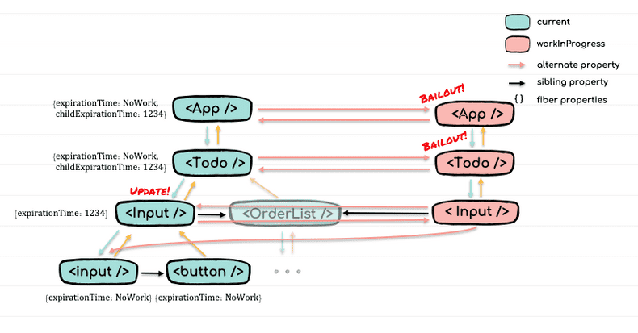
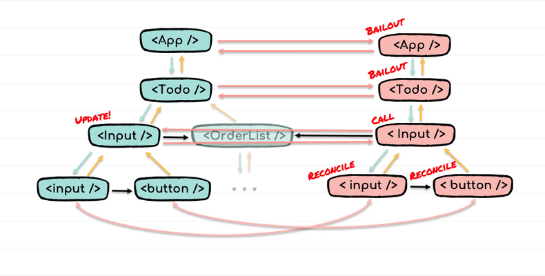

# 2.2 가상 DOM과 리액트 파이버

- 리액트의 특징으로 가장 많이 언급되는 것은 **실제 DOM이 아닌 가상 DOM을 운영한다**는 것이다.

## DOM과 브라우저 렌더링 과정

- Document Object Model: 웹 페이지 구조와 컨텐츠를 어떻게 보여줄지에 대한 정보를 담고 있다.
- DOM을 생성하는 순서
  - 1. 웹 서버로부터 HTML 파일을 다운로드하면서 비동기로 파싱을 시작한다.
  - 2. `<html>`, `<head>`, `<body>` 등을 재귀적으로 파싱해 **DOM 트리**를 생성한다.
  - 3. `<script>`, `<link>` 등에서 필요하다면 JS, CSS 파일을 비동기로 다운로드한다.
  - 4. CSS도 비슷한 방법으로 파싱하여 **CCSOM 트리**를 생성한다.
  - 5. DOM 트리를 순회하면서 필요하지 않은(e.g. `display: none`와 같이 화면에 보이지 않는) 노드는 제외하고 방문한다.
  - 6. 방문하는 DOM 노드에 CSSOM 정보를 적용하여 **렌더 트리**를 완성한다.
    - layout, reflow: 각 노드의 화면 좌표를 결정하는 과정이다.
    - painting: 실제로 렌더링할 화면을 그리는 과정이다.
  - 7. Compoisiting: 페인팅된 내용은 여러 레이어로 나뉘고, GPU가 이를 컴포지팅하여 최종적으로 표시된다.

## 가상 DOM의 탄생 배경

- 위처럼 브라우저 렌더링 과정은 복잡하고 많은 비용이 든다
- 요즘 대다수의 웹 서비스들은 사용자와의 인터랙션이 많기 때문에 화면 전환(렌더링)이 잦다.
- 렌더링 케이스
  - 요소의 색상 변경: painting 과정만 발생하므로 빠르게 처리된다.
  - 요소의 크기 변경: layout, painting이 발생한다.
  - DOM 요소의 변경: DOM 트리를 변경해야 하기 때문에 더 많은 비용이 요구된다.
- SPA의 특성 상, DOM 요소의 변경이 매우 많이 발생하기 때문에 그만큼 DOM을 효율적으로 관리하기가 어려워진다.

- 사용자의 인터랙션에 따라 DOM의 모든 변경 사항을 추적하는 것은 개발자 입장에서 매우 어렵다.

  - 1. 바닐라 자바스크립트에서 모든 DOM 요소를 수동으로 선택하고 변경하는 코드를 만드는 것은 번거롭고 관리 대상이 많아진다.
  - 2. 웹 서비스 규모가 커질수록 관리해야 할 포인트가 많아지므로 복잡해진다.

- 이러한 문제점을 해결하기 위해 나온 대안이 `가상 DOM`이다.
- 실제 DOM이 아닌 리액트가 관리하는 가상의 DOM이다.
- 웹 페이지가 표시해야 할 DOM을 메모리에서 관리하고, 리액트가 실제 변경에 대한 준비가 완료되었을 때 가상 DOM을 실제 DOM에 반영한다.
- 가상 DOM은 버퍼로서, 실제로 여러 번 발생했을 렌더링 횟수를 최소화한다.
- 가상 DOM을 사용하는 것이 항상 빠르지는 않다. 가상 DOM을 채택한 이유는 _애플리케이션을 개발할 수 있을 만큼 합리적으로 빠르기 때문에 개발자에게 도움을 줄 수 있었기 때문이다._

## 가상 DOM을 위한 아키텍처, 리액트 파이버

### 스택 기반 재조정과 한계점

- 스케줄러가 존재하지 않았다.
- 렌더링 작업이 한 번 시작되면, 스택이 빌 때까지 동기적으로 모든 작업을 수행하였다.
- 렌더링이 끝날 때까지, 사용자 입력과 같은 다른 작업을 처리할 수 없기 때문에 브라우저가 응답하지 않는 현상이 발생할 수도 있다.

### 파이버의 도입

- 이러한 문제를 해결하기 위해 도입된 비동기 아키텍처이다.
- 렌더링 작업을 더 작은 단위로 분할하여, 렌더링 작업을 비동기적으로 스케줄링하는 것이 목표였다.
- 이로 인해 스케줄러가 도입되었다.
- 렌더링 작업 도중에 사용자 입력과 같은 다른 중요한 작업을 먼저 실행할 수 있게 되었다.

### 파이버

- 파이버는 react element에 (컴포넌트의 상태, life cycle, hook 등)의 정보를 추가한 확장 객체이다.
- 렌더링 또는 리렌더링이 되면, 자바스크립트는 컴포넌트를 호출하고 babel JSX 변환을 통해 React.createElement가 호출된다.
- 생성된 react element는 파이버로 변환된다.
- 파이버 노드를 기반으로 리액트는 변경 사항을 계산하고 필요한 부분을 업데이트한다.(재조정; Reconciliation)

### 가상 DOM

- 가상 DOM는 파이버 노드로 구성된 트리 형태
- current 트리: 실제 DOM에 마운트된 파이버
- workInProgress 트리: render phase에서 작업 중인 파이버, commit phase를 지나면서 current 트리가 된다.
- 이 구조를 더블 버퍼링 구조라고 한다.
- current 트리는 workInProgress 트리가 작업 중일 동안 보여지는 역할을 하고, 재조정 작업이 완료되면 commit phase를 통해 실제 DOM에 적용한다.
- 두 트리는 실제로는 binary tree 형태가 아니라 왼쪽은 자식 노드, 오른쪽은 형제 노드를 가리키는 LCRS(left child, right sibling) linked list의 형태이다.

### render phase

- 변경된 상태값을 반영한 workInProgress 트리 구축 과정을 말한다.
- Sync Work(performSyncWorkOnRoot): 동기적으로 재조정을 진행
- Async Work(performCurrentWorkOnRoot): 중간에 양보해야 할 작업이 있다면, 재조정을 중단하고 스케줄러에 나머지 작업을 추가
- 과정
  - 1. Host root부터 업데이트 컴포넌트까지 current를 복제하여 workInProgress 트리를 만든다.(바뀌지 않은 부분은 재사용)
  - 2. 업데이트 컴포넌트를 호출하여 변경된 상태 값을 반영한 React element를 fiber로 확장한다.
  - 3. 2의 과정을 leaf 노드까지 반복하여 workInProgress 트리를 완성한다.
- 중요한 점
  - fiber의 프로퍼티인 `childExpirationTime`를 플래그로 사용하여 자손 업데이트 최적화를 한다. 플래그가 없다면, 자손은 모두 확인하지 않고(current를 유지하고) 형제로 넘어간다. 플래그가 있다면, 업데이트 컴포넌트가 있다는 뜻이고 해당 자손 컴포넌트까지 current를 유지한 채 내려간다.
  - 익히 알고 있듯이, 업데이트 컴포넌트가 호출되면 자식들도 모두 호출되고 react element로 반환된다. props가 빈 객체더라도 재생성되기 때문에 호출된다.
    - 호출을 피하는 방법
    - 1. 이 흐름에서 사용자가 개입할 수 있는 때가 한 번 있는데 `shouldComponentUpdate`와 `memo`이다. 업데이트 컴포넌트는 반드시 재호출되어야 하지만, 자식 컴포넌트들은 props가 변경되지 않는다면 호출되지 않는 편이 좋다. 이 때 `memo`를 이용하여 컴포넌트를 메모 컴포넌트로 만들 수 있다. 메모 컴포넌트는 `shallowEqual`을 통해 자손의 리렌더링을 render phase에서 제거할 수 있다.
    - 2. `createElement`이 호출되지 않도록 우회하는 방법이다. 외부에서 컴포넌트를 props로 주입하게 되면, 해당 props가 바뀌지 않는 한 주입받은 컴포넌트가 업데이트 컴포넌트가 되더라도 주입된 컴포넌트는 리렌더링 되지 않는다.

```tsx

// 1. memo
function updateSimpleMemoComponent(current, nextProps,...){
  /*...*/
  const prevProps = current.memoizedProps;
  // props가 변하지 않았다면 bailoutOnAlreadyFinishedWork을 호출하여 자식 탐색을 종료
  if (shallowEqual(prevProps, nextProps)) {
    didReceiveUpdate = false;
    if (updateExpirationTime < renderExpirationTime) {
      return bailoutOnAlreadyFinishedWork(...);
    }
  }
  /*...*/
}

// 2. 외부 컴포넌트 주입
function SubmitBtn() {
  log("Button 호출");
  return <button>submit</button>;
}

function Input({ SubmitBtn }) {
	// 내부에서 컴포넌트 업데이트가 발생해도 SubminBtn의 createElement는 호출되지 않기 때문에
  const [value, setValue] = useState("");
  return (
    <>
      <input value={value} onChange={(e) => setValue(e.target.value)} />
      {SubmitBtn} {/*또는 {this.props.children}*/}
    </>
  );
}

function Todo() {
  const [todos, push] = useState([]);
  return (
    <>
      <Input SubmitBtn={<SubmitBtn />} />{" "}
      {/*또는 <Input><SubmitBtn /></Input>*/}
      <OrderList list={todos} />
    </>
  );
}
```

```tsx
function workLoopSync() {
  // null이 될 때까지 반복
  while (workInProgress !== null) {
    workInProgress = performUnitOfWork(workInProgress);
  }
}

// 현재 fiber에 Work를 수행하고 다음 fiber를 반환하는 함수
// dfs 방식: 자식을 모두 처리한 후 형제 방문
function performUnitOfWork(unitOfWork: Fiber): Fiber | null {
  const current = unitOfWork.alternate;

  let next = beginWork(current, unitOfWork, renderExpirationTime); // 자식 반환

  unitOfWork.memoizedProps = unitOfWork.pendingProps;
  if (next === null) {
    // 더이상 반환되는 자식이 없다면 현재 fiber를 마무리 한다.
    next = completeUnitOfWork(unitOfWork); // 형제 반환
  }

  return next;
}

// 목적: workInProgress의 컴포넌트를 호출해야 하는지 판단
// - 기준: 컴포넌트 상태 변경, props 변경
function beginWork(
  current: Fiber | null,
  workInProgress: Fiber,
  renderExpirationTime: ExpirationTime
): Fiber | null {
  const updateExpirationTime = workInProgress.expirationTime;

  // 1. 컴포넌트 마운트 여부 확인
  if (current !== null) {
    const oldProps = current.memoizedProps;
    const newProps = workInProgress.pendingProps;

    // 2. 컴포넌트 호출 대상 판단 1: props 참조 값 비교
    if (oldProps !== newProps) {
      didReceiveUpdate = true;

      // 2. 컴포넌트 호출 대상 판단 3: 현재에서 업데이트가 발생했는지 확인
      // 발생했다면 건너뛰어서 Work를 수행
      // 발생하지 않았다면, 자식을 확인하여 더 이상 진행하지 않던가 자식의 current를 복제하고 점프
      // - 자식의 자식들은 컴포넌트로 호출되어야 하기 때문에 자식의 current를 복제하는 구조인듯?
    } else if (updateExpirationTime < renderExpirationTime) {
      didReceiveUpdate = false;

      // 자식의 업데이트를 확인하는 함수
      return bailoutOnAlreadyFinishedWork(
        current,
        workInProgress,
        renderExpirationTime
      );

      // 2. 컴포넌트 호출 대상 판단 3
    } else {
      didReceiveUpdate = false;
    }

    // 1. 컴포넌트 마운트 여부 확인
  } else {
    didReceiveUpdate = false;
  }

  workInProgress.expirationTime = NoWork;

  // fiber에 맞는 재조정 작업 라우팅
  // - 컴포넌트 호출(createElement)히고 자식 fiber를 반환
  switch (workInProgress.tag) {
    /*...*/
    case FunctionComponent: {
      /*...*/
      // 내부적으로 reconcileChildren 함수를 호출한다.
      return updateFunctionComponent(
        current,
        workInProgress,
        Component,
        resolvedProps,
        renderExpirationTime
      );
    }
  }
}

function bailoutOnAlreadyFinishedWork(
  current: Fiber | null,
  workInProgress: Fiber,
  renderExpirationTime: ExpirationTime
): Fiber | null {
  var childExpirationTime = workInProgress.childExpirationTime;

  // 자식에서 업데이트가
  if (childExpirationTime < renderExpirationTime) {
    // 발생하지 않았다면, 더 이상 Work를 진행하지 않도록 null을 반환(current를 유지)
    return null;
  } else {
    // 발생했다면, 아래로 내려갈 수 있도록 자식의 current를 복제 및 점프
    cloneChildFibers(current, workInProgress);
    return workInProgress.child;
  }
}

function updateFunctionComponent(current, workInProgress, Component, nextProps, renderExpirationTime) {

  // 훅 관련 로직을 처리하는 함수
  let nextChildren = renderWithHooks(
    current,
    workInProgress,
    Component,
    nextProps,
    context,
    renderExpirationTime
  );

  // 1. beginWork에서 props는 변경되지 않은 것으로 판명
  // 2. 컴포넌트 호출 후에도 didReceiveUpdaterk === false라면 컴포넌트 상태 또한 변경되지 않음
  // 두 가지 모두 해당된다면 변경된 것이 없기 때문에 자식으로 이동
  if (current !== null && !didReceiveUpdate) {
	// 문제는 컴포넌트가 한 번 호출되었기 때문에 라이프 사이클 훅(useEffect 등)과 관련된 부분들을 초기화
    bailoutHooks(current, workInProgress, renderExpirationTime);
    return bailoutOnAlreadyFinishedWork(...);
  }

  workInProgress.effectTag |= PerformedWork;

  // 컴포넌트 상태가 변경되었으므로 재조정을 실행한다.
  reconcileChildren(
    current,
    workInProgress,
    nextChildren,
    renderExpirationTime,
  );
  return workInProgress.child;
}
```



### 재조정

- 컴포넌트 호출을 통해 반환된 **react element를 current fiber와 비교**하여 workInProgress를 새로 만들어야 하는지, 아니라면 어떤 부분들이 변경되었는지, current는 삭제되어야 하는지 등 두 컴포넌트를 **재조정**한다.
- 컴포넌트 호출이 발생했다 하더라도, 전부 새로 생성하는 것이 아니라 바뀌어야 할 부분만 바꿔서 최적화한다.(e.g. 참조는 바뀌었더라도 내부가 완전히 동일한 prevState, nextState)
- 비교는 요소의 타입과 key 값을 기반으로 이루어진다. 만약 새로운 요소가 이전과 같은 타입이면, 기존 DOM 노드를 유지하고 속성만 업데이트하거나 자식 요소만 변경한다.
- 재조정: 가상 DOM에서 변경이 발생한 부분을 효과적으로 비교하여 새로운 트리를 만들어내는 과정이다. render phase의 일부분이라고 봐야 하지 않을까?
- 핵심은 **react element를 fiber로 확장할 때, current를 재사용할 수 있는지 또는 새로운 fiber를 만들어 내야 하는지 결정하는 것이다.** 새로운 fiber를 만든다면, 하위 서브트리는 새로운 서브트리가 된다.

```tsx
function reconcileChildren(
  current: Fiber | null,
  workInProgress: Fiber,
  nextChildren: any,
  renderExpirationTime: ExpirationTime
) {
  if (current === null) {
    workInProgress.child = mountChildFibers(
      workInProgress,
      null,
      nextChildren,
      renderExpirationTime
    );
  } else {
    workInProgress.child = reconcileChildFibers(
      workInProgress,
      current.child,
      nextChildren,
      renderExpirationTime
    );
  }
}

// react element의 형식에 맞게 재조정 함수로 라우팅하는 역할
// - react element에는 단일 react element, react element 배열, text, Fragment 등 다양한 것이 올 수 있다.
// - 각각의 함수를 통해 current와 형식에 해당하는 값을 비교하게 된다.
function reconcileChildFibers(
  returnFiber,
  currentFirstChild,
  newChild,
  expirationTime
) {
  // key가 없는 Fragment
  const isUnkeyedTopLevelFragment =
    typeof newChild === "object" &&
    newChild !== null &&
    newChild.type === REACT_FRAGMENT_TYPE &&
    newChild.key === null;
  if (isUnkeyedTopLevelFragment) {
    newChild = newChild.props.children;
  }

  const isObject = typeof newChild === "object" && newChild !== null;

  // react element
  if (isObject) {
    switch (newChild.$$typeof) {
      case REACT_ELEMENT_TYPE:
        return placeSingleChild(
          reconcileSingleElement(
            returnFiber,
            currentFirstChild,
            newChild,
            expirationTime
          )
        );
      /*...*/
    }
  }

  // text
  if (typeof newChild === "string" || typeof newChild === "number") {
    return placeSingleChild(
      reconcileSingleTextNode(
        returnFiber,
        currentFirstChild,
        "" + newChild,
        expirationTime
      )
    );
  }

  // react element 배열
  if (isArray(newChild)) {
    return reconcileChildrenArray(
      returnFiber,
      currentFirstChild,
      newChild,
      expirationTime
    );
  }

  // Remaining cases are all treated as empty.
  return deleteRemainingChildren(returnFiber, currentFirstChild);
}
```

- reconcileChildrenArray: current의 연결 리스트와 컴포넌트가 반환한 react element 배열 비교를 통해 workInProgress tree를 재조정하는 함수
- 단일 형식(react element, text 등)은 시간 복잡도와 크게 관련이 없지만, 복수의 자식을 가지고 있는 배열이라면 재조정의 최대 시간 복잡도가 증가한다.
  - current의 이동 / 추가 / 삭제가 없는 경우: 최대 시간복잡도 O(n)
  - current의 이동 / 추가 / 삭제가 없는 있는 경우: 최대 시간복잡도 O(n^2). 각 요소가 어디로 움직였는지 완전 탐색이 필요하다.
- 리액트는 아래 경우를 위해 공간 복잡도를 올리고, 시간 복잡도를 내리는 선택을 한다.
  - 비교 기준인 current의 연결 리스트를 key prop을 key로 하는 Map으로 변환한다.
  - 이렇게 하면, 비교 대상을 순회하며 current Map에서 key를 찾았다면 이동한 것이고, 찾지 못했다면 삭제된 것을 알 수 있다.
  - 재사용이 가능한 경우(즉, key와 type이 같은 경우) props만 변경한다.
  - 그렇기 때문에 key prop을 설정하지 않거나(null) 배열의 index를 사용하는 경우, **key와 type이 같으니 props만 변경되어 fiber의 hook 객체에 담겨있는 다른 정보는 변하지 않기 때문에 그대로이다.**
  - 즉, Map에서 key를 검색할 수 있고(순서만 바뀌었으므로) 타입도 대부분의 경우 같을 것이므로, fiber를 재생성하지 않고 props만 변경하여 재활용한다. 그렇기 때문에 예상대로 제대로 바뀌지 않는다.



### Work 마무리

-

Q) 스케줄러가 fiber의 프로퍼티인 expirationTime와 childExpirationTime을 언제, 어떻게 설정하는가?
Q) useState를 여러 번 호출하는 것이 Work를 여러 개 만드는 것인가? No. 애초에 훅은 비동기로 처리되기 때문에 여러 상태 값 변경을 한 번에 처리한다.
Q) 스택 기반 재조정을 사용한다면 setState 뒤에 출력 코드는 반영된 상태 값을 얻을 수 있는가? No
