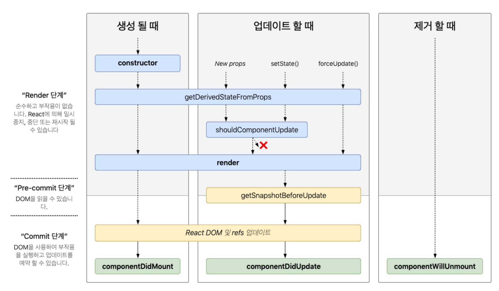

# 2.4 렌더링은 어떻게 일어나는가?

## 리액트에서 렌더링이란?

- 브라우저에서의 렌더링: HTML과 CSS 리소스를 기반으로 웹 페이지에 필요한 UI를 그리는 과정이다.
- 리액트에서의 렌더링: 간단하게는 가상 DOM을 만드는 과정이다. 모든 컴포넌드들이 현재 자신들이 가지고 있는 props와 state의 값을 기반으로 어떻게 UI를 구성하고 이를 바탕으로 어떤 DOM 결과를 브라우저에 제공할 것인지 계산하는 과정이다.
- 리액트의 렌더링은 브라우저에서의 렌더링과 깊은 연관이 있기 때문에 웹 페이지 성능과 직결된다. 리액트의 렌더링이 브라우저의 렌더링을 최소화하는 역할이라고 해도 잘못 사용하면 오히려 더 성능이 나빠질 수 있다. 그렇기 때문에 리액트 개발자는 리액트의 렌더링 과정을 최소화할 수 있어야 한다.

## 리액트의 렌더링이 일어나는 이유

- 발생하는 시점
  - 1. 최초 렌더링
  - 2. setState(c)
  - 3. forceUpdate(c): 강제로 리렌더링해야 할 때 사용한다. 호출하면 shouldComponentUpdate를 건너뛴다.
  - 4. useState(f)
  - 5. useReducer(f)의 dispatch
  - 6. key props의 변경: key가 존재하지 않는다면 index를 넣은 것과 같은 효과가 발생한다. key의 변화는 리렌더링을 발생시킨다. key를 변경하지 않으면 리렌더링이 발생하지 않는다.
  - 7. props의 변경
  - 8. 부모 컴포넌트의 렌더링: 원칙적으로 자식 컴포넌트는 반드시 리렌더링된다.
- Q) 재조정 단계에서 fiber를 교체하지 않고 재활용하는 것은 리렌더링이라고 할 수 있는가? (React.createElement는 호출했지만 재활용하는 경우)
- mobx, redux와 같은 전역 상태 관리 라이브러리에서도 위 방법 중 하나를 사용해 리렌더링을 발생시킨다.
- recoil은 내부적으로 useState 등을 통해 리렌더링을 발생히킨다.

## 리액트의 렌더링 프로세스

- 1. 렌더링 프로세스가 시작되면 루트 컴포넌트부터 아래쪽으로 내려가면서 업데이트가 필요하다고 지정되어 있는 모든 컴포넌트를 찾는다.
- 2. 업데이트가 필요한 컴포넌트를 발견하면 `render` 또는 함수 컴포넌트 자체를 호출한 후, 결과물을 저장한다.
- 3. 각 컴포넌트의 렌더링 결과물을 수집하면서 workInProgress 트리를 만든다.(재조정)
- 4. 이 트리를 기반으로 모든 변경 사항을 수집하고, 업데이트가 필요한 컴포넌트를 결정한다.
- 5. 재조정 과정이 끝나면 변경된 부분을 하나의 동기 시퀀스로 DOM에 적용한다.

## 렌더와 커밋

### render phase

- 컴포넌트를 호출하여 얻은 결과와 이전 가상 DOM을 비교하는 과정을 거쳐 변경이 필요한 컴포넌트를 체크하는 단계이다.
- 비교하는 것은 `type`, `props`, `key`이고, 하나라도 변경된 것이 있으면 변경이 필요한 컴포넌트로 체크한다.

### commit phase

- 변경 사항을 실제 DOM에 적용해 사용자게에 보여주는 과정이다.
- 리액트가 먼저 실제 DOM을 업데이트한다.
- 리액트 내부(current tree)가 실제 DOM을 가리키도록 참조를 업데이트한다.
- 마지막으로 생명주기 메서드(`componentDidMount`, `componentDidUpdate`, `useLayoutEffect`)를 호출한다.
- _render phase가 실행되었다고해서 반드시 DOM이 업데이트 되는 것은 아니다. 즉, 커밋 단계는 생략될 수 있다._

### 리액트 18의 동시성 렌더링

- 렌더링 중 렌더 단계가 비동기로 작동해 **특정 렌더링의 우선순위를 낮추거나 필요하다면 중단하거나 재시작하거나 포기**할 수도 있다.
- 브라우저의 동기 작업을 차단하지 않고 백그라운드에서 새로운 가상 DOM 트리를 준비할 수도 있으므로 사용자는 더욱 매끄러운 사용자 경험을 누릴 수 있다.
- 파이버 아키텍처와의 차이점? (chatGPT 답변)
  - 파이버 아키텍처: 렌더링을 작은 작업 단위로 나누어 처리하는 구조이다. 작은 청크로 나누어 처리함으로써 중간에 렌더링을 멈추고 다른 작업을 할 수 있다. 중단은 주로 재조정 과정에서 이루어진다. 명시적으로 비동기적이지는 않았다. 동기적으로 작업을 수행하되, 작업을 중단하고 다시 이어서 할 수 있는 유연성을 제공하는 것이 핵심이다.
  - 동시성 렌더링: 진정한 비동기적 처리와 동시성을 제공한다. 렌더링 중단, 취소하는 것 뿐만 아니라 **작업을 병렬로 수행할 수 있는 환경을 제공**한다. 사용자 인터랙션에 더 빠르게 반응할 수 있게 하여 더 유연하고 끊김 없는 사용자 경험을 제공한다. 이를 통해, 렌더링 작업을 즉시 커밋하지 않고, 결과를 준비하는 동안 중단하거나 미룰 수 있게 되었다.

