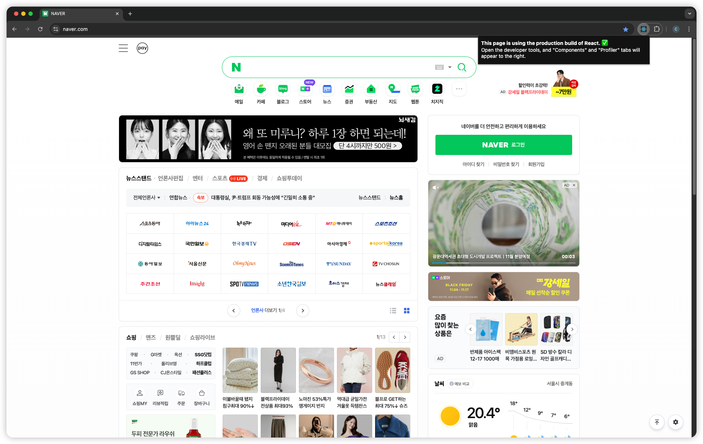
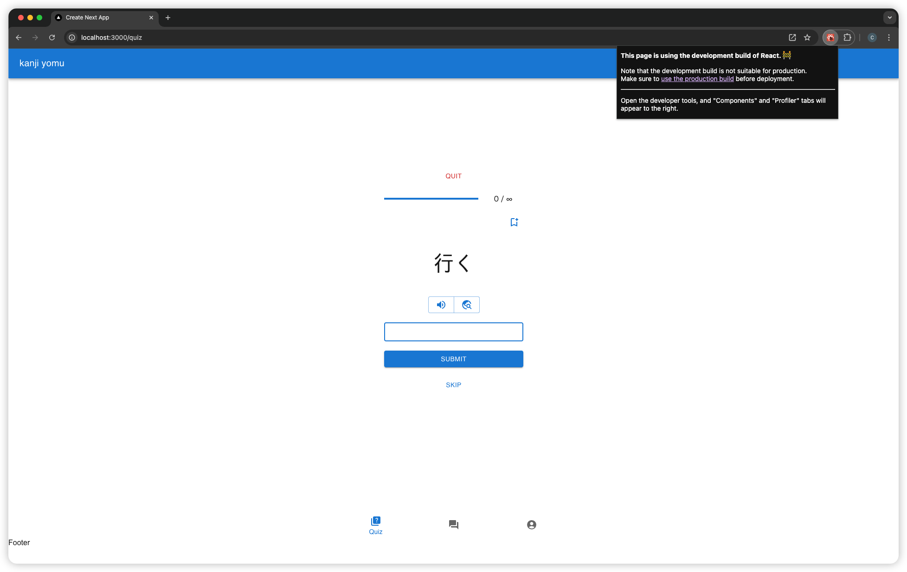
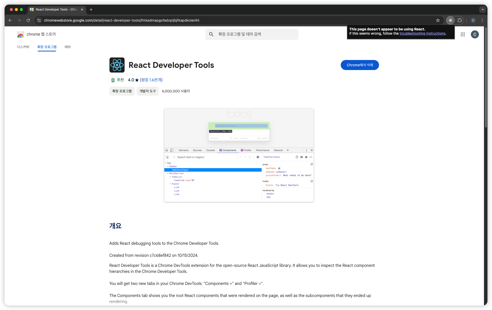

# 6.2 리액트 개발 도구 설치

- 설치 경로: https://chromewebstore.google.com/detail/react-developer-tools/fmkadmapgofadopljbjfkapdkoienihi
- 리액트를 사용하는 페이지라면, 브라우저 우상단에 주황색 또는 파란색으로 아이콘이 표시된다.

- 배포 버전은 파란색 아이콘이다.

- 개발 버전은 주황색 아이콘이다.

- 리액트를 사용하고 있지 않으면 불이 들어오지 않는다.
