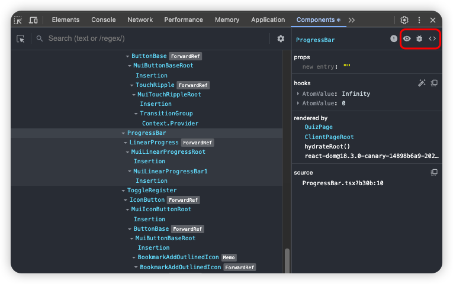

# 6.3 리액트 개발 도구 활용하기

## Components 탭

- 리액트 애플리케이션 컴포넌트 트리의 **현재 상태를** 알기 위해 사용한다.
- e.g. 컴포넌트 간의 구조, 컴포넌트 내의 정보(props, hooks) 등

### displayName

- displayName을 잘 설정하면 디버깅하는데 도움이 된다.
- 빌드 이후에는 terser 등의 압축 도구가 컴포넌트명을 난수화할 수도 있고, displayName 코드 자체를 삭제할 수도 있기 때문에 확인이 어려울 수 있다.
- 따라서, 개발 환경에서만 제한적으로 참고하는 것이 좋다.

### 도구 모음

- 선택된 컴포넌트에 대한 자세한 정보를 얻을 수 있다.
- 빨간 경고 이모티콘이 있는 경우, strict mode로 렌더링되지 않았다는 뜻이다.

- 1. 눈 아이콘

- 선택된 컴포넌트의 Elements 탭에서의 위치로 이동한다.

- 2. 벌레 아이콘

- 선택된 컴포넌트의 정보를 Console 탭에서 자세하게 확인할 수 있다.

- 3. 소스 코드 아이콘

- 선택된 컴포넌트의 소스 코드를 Sources 탭에서 확인할 수 있다.

### hooks

- 훅에 전달된 콜백 함수가 표시되는데, 기명 함수로 작성한다면 더 직관적으로 확인이 가능하다.

## Profiler 탭

- 리액트 애플리케이션가 **렌더링했던 과정을** 알기 위해 사용한다.
- e.g. 렌더링 경과 시간, 횟수 등
- 프로덕션 빌드 애플리케이션에서는 사용할 수 없다.
- `Highlight updates when components render.`
  - 렌더링되는 요소를 브라우저 화면에서 표시해준다.
  - 불필요하게 렌더링되는 컴포넌트를 찾을 수 있다.
  - 평소에 켜두면 오히려 방해가 돼서 꺼둔다. 최적화 작업이나 문제가 발생했을 때만 켜는 편이다.
- `Hide logs during second render in Strict Mode.`
  - strict mode에서 로그가 두 번 출력되는 것을 막고, 한 번만 출력한다.
  - 프로덕션 모드에서는 설정과 상관없이 한 번만 출력된다.
- `Record why each component rendered while profiling`
  - why did this render? 라는 항목이 생겨서 어떤 props 혹은 어떤 훅 때문에 리렌더링이 발생했는지 추적해준다.

### Flamegraph

- 렌더 커밋별로 컴포넌트 트리 구조대로 정렬한 그래프이다.
- (리)렌더링되지 않은 컴포넌트에 대한 정보도 얻을 수 있다. (리)렌더링이 발생한 컴포넌트는 컬러로, 발생하지 않은 컴포넌트는 흑백으로 표시된다.
- 메모이제이션이 제대로 작동하고 있는지 확인하기 편하다.

### Ranked

- 렌더 커밋별로 컴포넌트의 렌더링 시간 순서대로 정렬한 그래프이다.
- (리)렌더링이 발생한 컴포넌트만 보여준다는 점에서 차이가 있다.

### Timeline

- 시간 순서대로 발생한 이벤트를 확인할 수 있다.
- 리액트 v18 이상의 환경에서만 사용 가능하다.

### 예제

- `<input>` 태그 입력 이벤트가 발생할 때마다 인해 App 컴포넌트가 렌더링되는 문제
  - Flamegraph의 렌더 커밋에서 연속적으로 App 컴포넌트가 컬러로 표시되었다.
  - `<input>` 태그를 InputText 컴포넌트로 분리하였다.
- InputText 컴포넌트 내의 컴포넌트가 리렌더링되는 문제
  - memo를 이용하여 리렌더링되지 않게 처리하였다.

## 정리

- 애플리케이션을 개발하면서 틈틈이 react-dev-tools를 이용하여 원하는 대로 렌더링되고 있는지, 최적화는 잘 되고 있는지 확인해보자.
