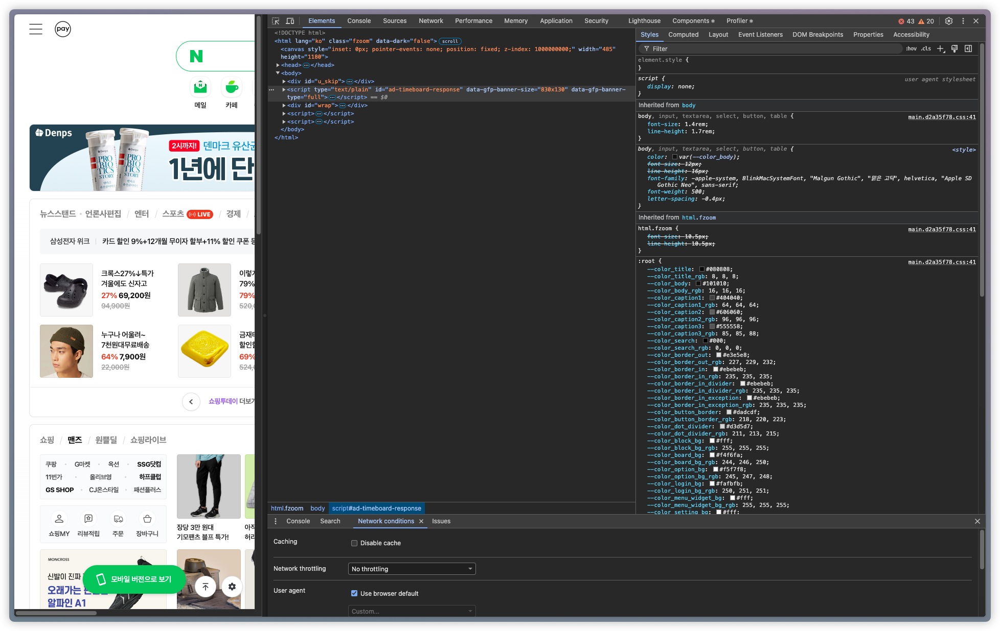
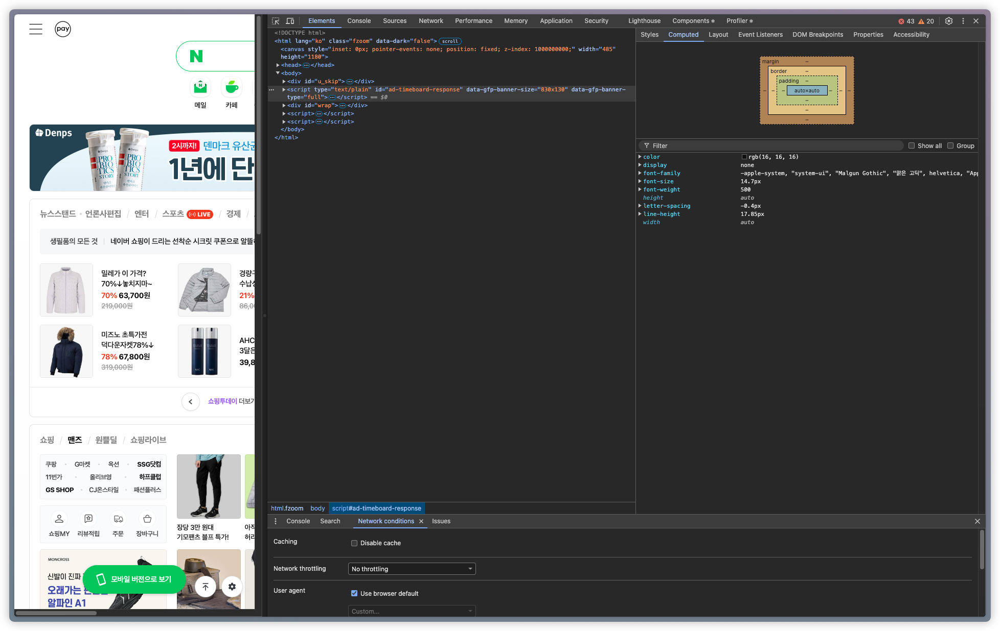
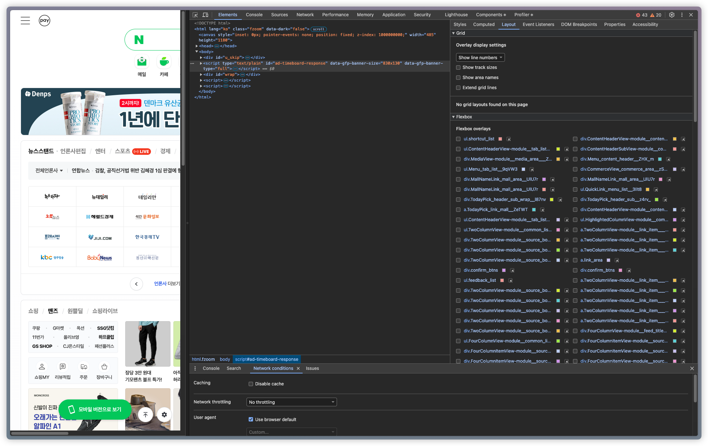
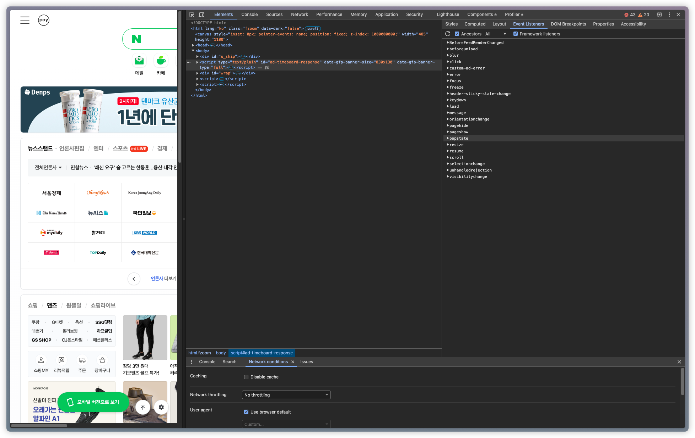
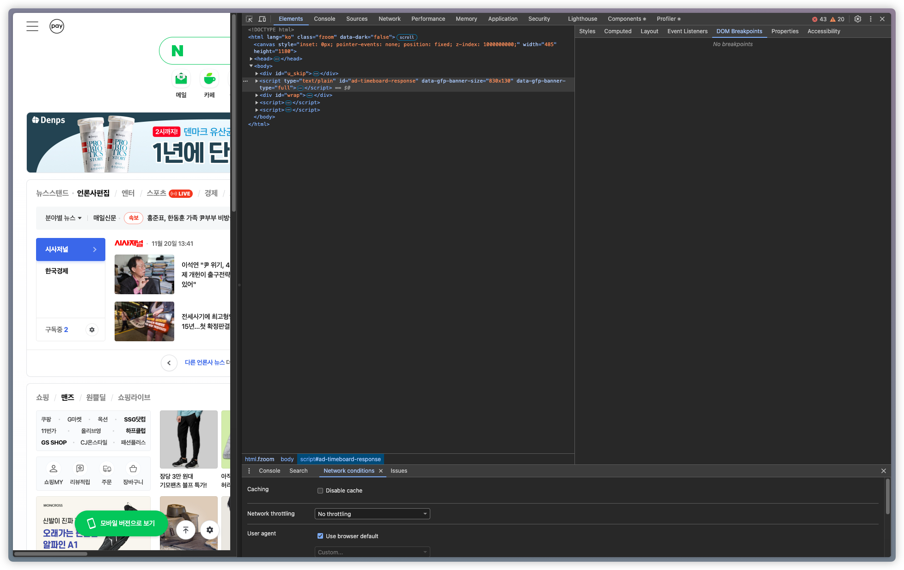
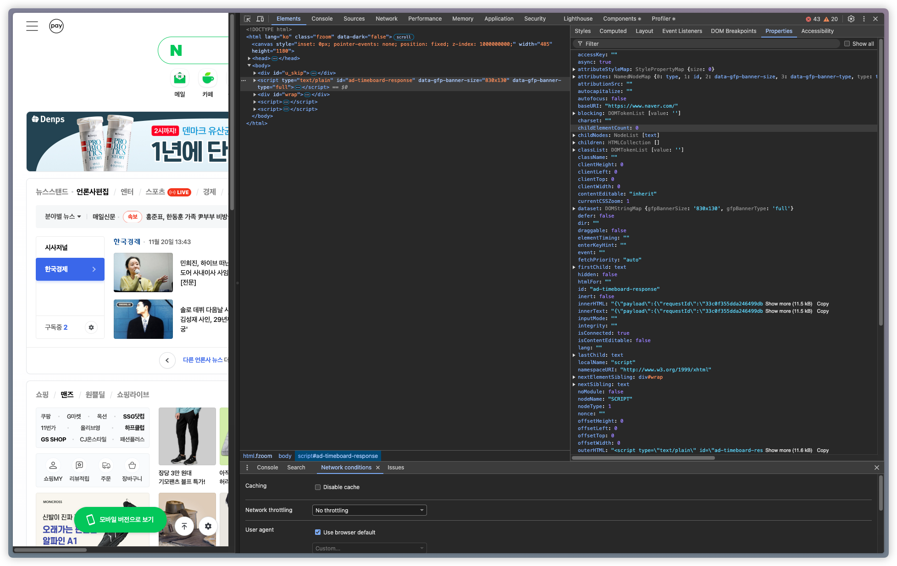
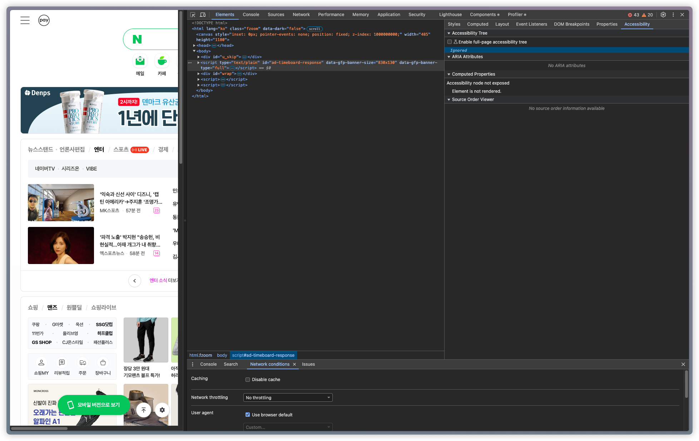

# 7.2 요소 탭

- 현재 웹 페이지를 구성하고 있는 HTML, CSS 정보를 확인할 수 있다.

## 요소 화면(왼쪽 단)

- 직접 HTML을 수정할 수 있다. 리액트 코드를 직접 수정하지 않더라도 미리 확인할 수 있어 빠른 작업이 가능하다.
- 요소를 특정하여 중단 위치(하위트리 수정, 속성 수정, 노드 삭제)를 설정하면 해당 작업이 발생하면 렌더링을 중단한다.

## 요소 정보(오른쪽 단)

- 스타일 탭: class, id 등으로 매핑된 스타일을 확인 및 수정하여 바로 확인할 수 있다.(자주 사용)
  
- 계산됨 탭: padding, border, margin 등이 적용된 결과를 확인할 수 있다.
  
- 레이아웃 탭: grid, layout 관련된 정보를 확인할 수 있다.
  
- 이벤트 리스너 탭: 요소에 부착된 이벤트 리스너를 확인할 수 있다. 이벤트 버블링으로 이벤트를 발생시키는 경우에는 확인할 수 없다.
  
- DOM 중단점 탭: 설정한 중단점을 확인할 수 있다.
  
- 속성 탭: 요소가 가지고 있는 모든 속성을 보여준다.
  
- 접근성 탭: 스크린리더기 등이 활용하는 값을 포함하고 있다.
  
